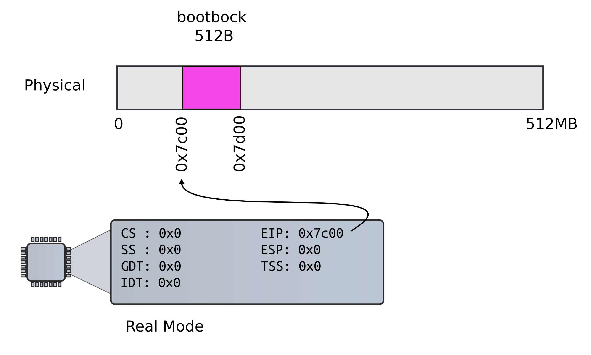
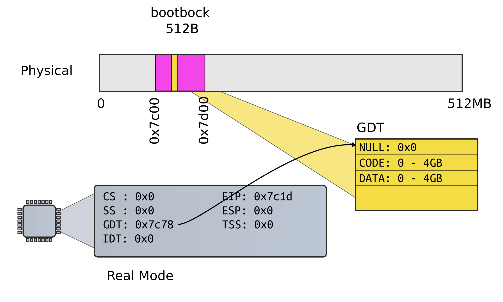
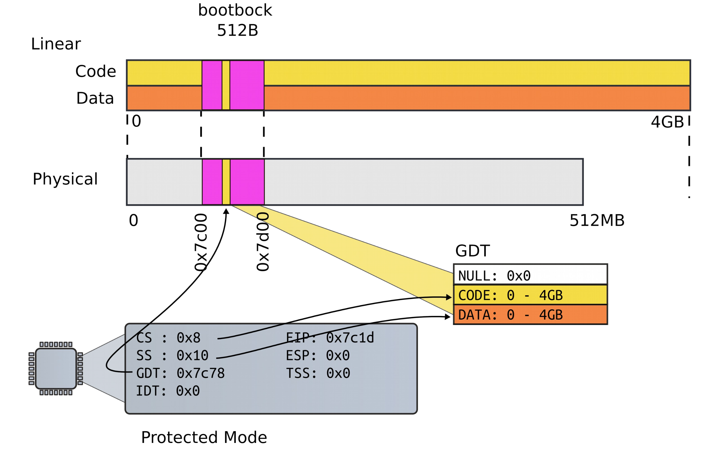
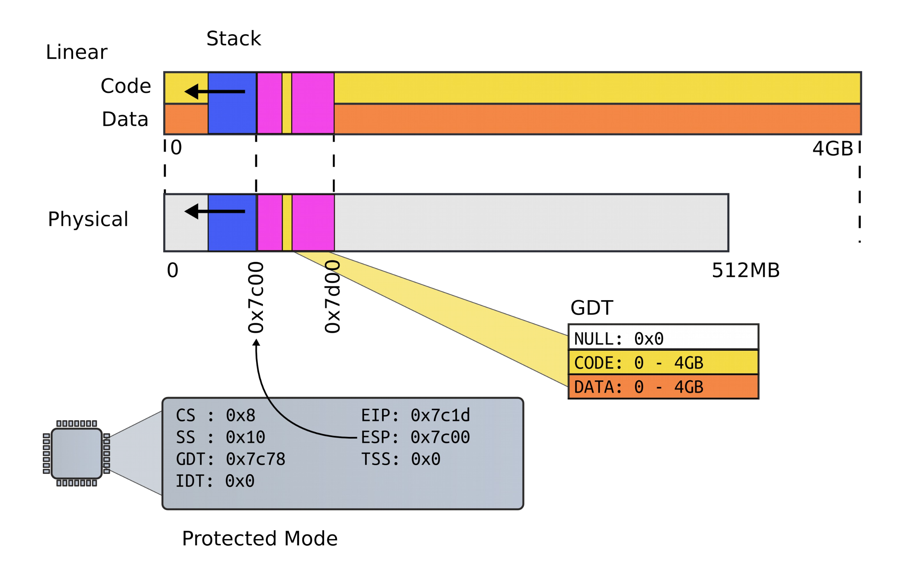
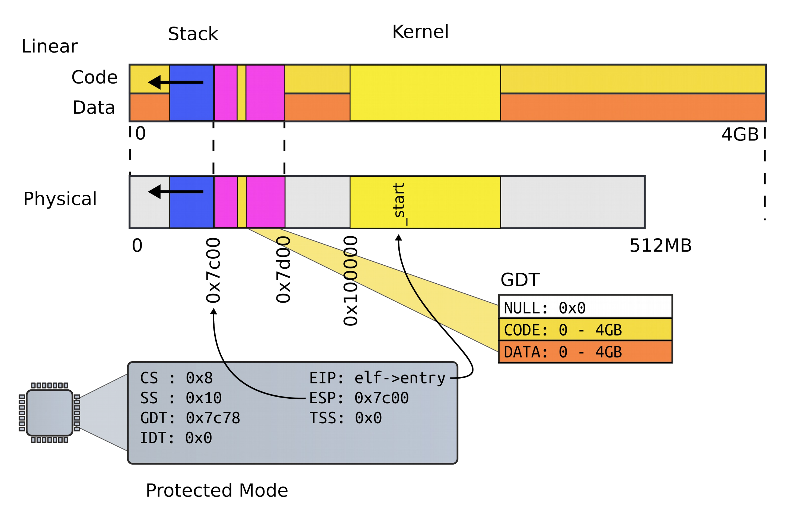
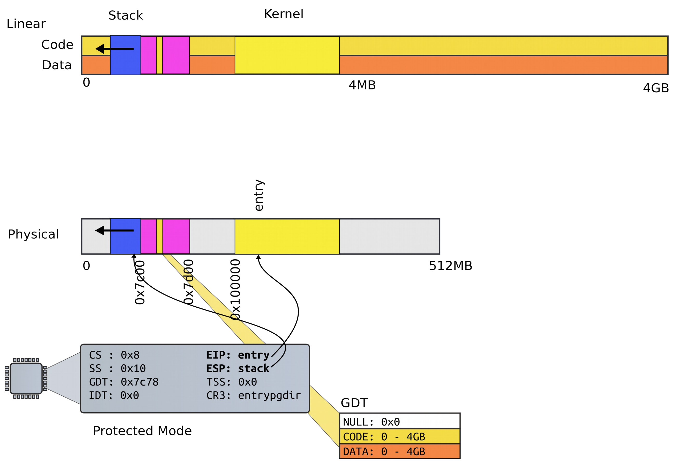
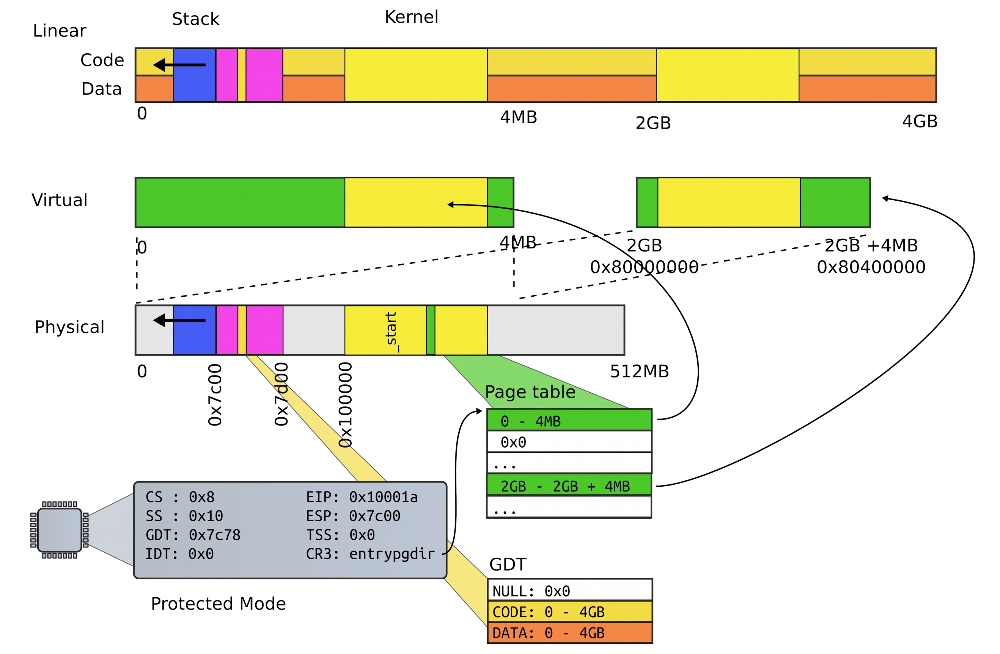
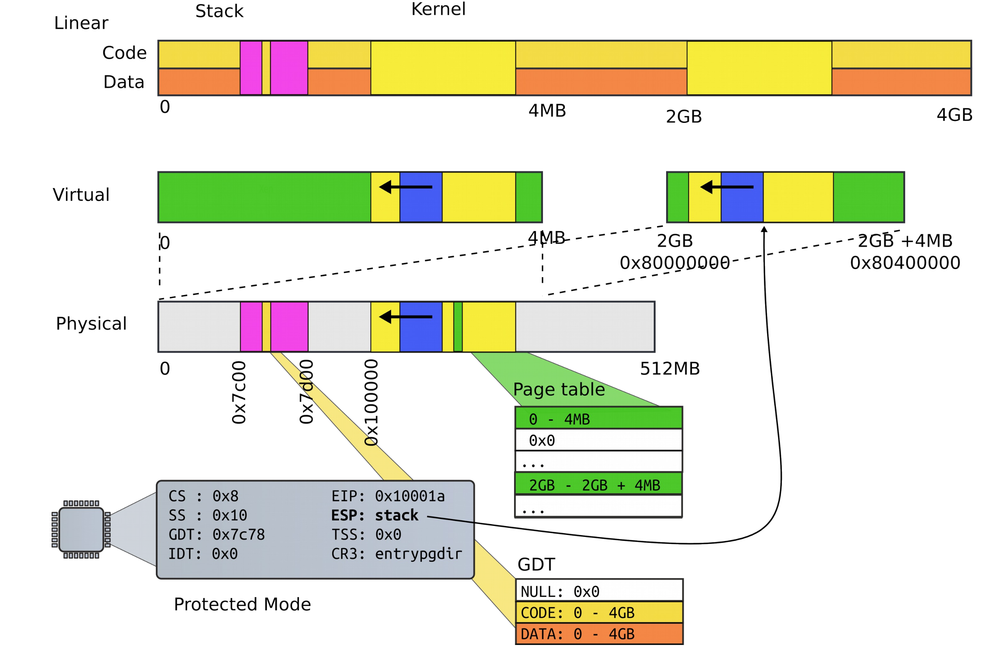

# System boot

## Turn on the power

### What happens

- It's quite complicated actually
- At a high level a sequence of software pieces initializes the platform
    - Management engine
    - Microcode
    - Firmware
    - BIOS
    - Bootloader
- The most important thing: **the OS is not the only software running on the machine**
    - It is also not the most privileged
- Today, at least two layers sit underneath the OS/hypervisor
    - System management mode (ring -2)
    - Intel management engine an dintel innovation engine (ring -3)

### Intel management engine

- Full-feature computer
    - An intel Quark x86-based 32 bit CPU
    - Has an internal RAM of about 1.7MB
    - Can access all DRAM via DMA
    - Can control the boot chain
    - Can access network interface on the motherboard
        - Has it's own MAC and IP address
        - Via system management bus
        - Or an ATM compatible NIC
    - Connected to the power supply: stays on as long as power is provided to power supply
- Theft prevention use case
    - Cannot access DRAM when computer is off
    - Can still utilize its internal memory
    - ME can disable a stolen laptop equipped with cellular modem remotely
        - As long as power is connected
        - And cell network has signal
- Prevalence
    - All modern motherboard chips contain a management engine
    - Part of active management technology (AMT)
    - Convenient way for administrators to fix your machine remotely
    - Obviously a huge opportunity for an attack

### Bootstrap processor

- One of the logical processors is chosen as a bootstrap processor
- Others become application processors
- Reading the BIOS
    - Executes instructions stored in the BIOS chip
    - Bootstrap processor actually starts with DRAM disabled (no stack to call functions)
    - Must write custom assembly code that used no stack or use a ROMCC compiler (Generates code form C that uses no stack)
- Cache as RAM
    - Uses the CPU's caches as temporary replacement for RAME
    - Helps initialize DRAM
    - Copies the BIOS firmware into DRAM and continues
- BIOS firmware
    - Established interrupt controllers
    - Prepares devices for use
- System management mode
    - Another compartment that runs underneath your OS or a hypervisor
    - Initialized by the BIOS
    - Protected with hardware memory mechanisms (OS cannot access this region of memory)
    - Runs under your OS or the hypervisor
        - Receives interrupts periodically, can take over the entire system at any time
        - Impossible to disable
- Loading the boot loader
    - BIOS ends by loading a boot loader
    - Modern BIOSes can load the boot loader from a variety of sources
    - Default way is to load the first sector (512 bytes) from disk into memory location at `0x7c00`
    - BIOS then starts executing instructions at address `0x7c00`
        - This is exactly what we see when we run xv6 under QUMU
        - QEMU emulates hardware: runs BIOS and follows the same protocol



## Boot loader starts

```asm
start:
    cli # BIOS enabled interrupts; disable

    # Zero data segment registers DS, ES, and SS
    xorw %ax, %ax # Set %as to zero
    movw %as, %ds # -> Data segment
    movw %ax, %es # -> Extra segment
    movw %as, %ss # -> Stack segment
```

### Linking the boot block code

```Makefile
bootblock: bootasm.S bootmain.c
    $(CC) $(CFLAGS) -fno-pic -O -nostdinc -I. -c bootmain.c
    $(CC) $(CFLAGS) -fno-pic -nostdinc -I. -c bootasm.S
    $(LD) $(LDFLAGS) -N -e start -Ttext 0x7C00 -o bootblock.o bootasm.o bootmain.o
    $(OBJDUMP) -S bootblock.o > bootblock.asm
    $(OBJCOPY) -S -O binary -j .text bootblock.o bootblock
    ./sign.pl bootblock
```

### Switch to protected mode

- Switch from real mode to protected mode
- Use a bootstrap GDT that makes virtual addresses map directly to physical addresses so that the effective memory map doesn't change during transition

```asm
lgdt gdtdesc
movl %cr0, %eax
orl $CRO_PE, %eax
movl %eax, %cr0
```

#### Loading the GDT



```asm
.p2align 2 # force 4 byte alignment
gdt:
    SEG_MULLASM # null seg
    SEG_ASM(STA_X|STA_R, 0x0, 0xffffffff) # code segment
    SEG_ASM(STA_W, 0x0, 0xffffffff) # data segment

gdtdesc:
    .word (gdtdesc - dgt - 1) # sizeof(gdt) - 1
    .long gdt
```

#### The actual switch

- Use long jump to change code segment

```asm
ljmp $(SEG_KCODE<<3), $start32
```

- Explicitly specify code segment, and address
- Segment is `0b1000` (`0x8`)

### Segments

```asm
.code32 # Tell assembler to generate 32 bit code now
start32:
    # Set up the protected-mode data segment registers
    movw $(SEG_KDATA<<3), %ax # Out data segment selector
    movw %ax, %ds # -> DS: Data Segment
    movw %ax, %es # -> EX: Extra Segment
    movw %ax, %ss # -> SS: Stack Segment
    movw $0, %ax # Zero segments not ready for use
    movw %ax, %fs # -> FS
    movw %ax, %gs # -> GS
```



#### The first stack

- Needed stack to use C
    - Function invocations
    - Note that there were no stack instructions before

```asm
movl $start, %esp
call bootmain
```



#### Running C code

- Invoke the first C function
- In xv6, it is called `bootmain`

### Read kernel from disk

```C
// Read a single sector at offset into dst
void
readsect(void *dst, unsigned int offset) {
    // Issue command
    waitdisk();
    outb(0x1F2, 1); // count = 1
    outb(0x1F3, offset);
    outb(0x1F4, offset >> 8);
    outb(0x1F5, offset >> 16);
    outb(0x1F6, (offset >> 24) | 0xE0);
    outb(0x1F7, 0x20); // cmd 0x20 - read sectors

    // Read data
    waitdisk();
    insl(0x1F0, dst, SECTSIZE/4);
}
```

```C
void
waitdisk(void) {
    // Wait for disk ready.
    while((inb(0x1F7) & 0xC0) != 0x40);
}
```

### Calling the kernel entry

```C
void
bootmain(void) {
    struct elfhdr *elf;
    struct proghdr *ph, *eph;
    void (*entry)(void);
    uchar* pa;

    elf = (struct elfhdr*)0x10000; // scratch space

    // Read 1st page off disk
    readseg((uchar*)elf, 4096, 0);

    // Is this an ELF executable?
    if (elf->magic != ELF_MAGIC)
        return; // let bootasm.S handle error

    // Load each program segment (ignores ph flags)
    ph = (struct proghdr*)((uchar*)elf + elf->phoff);
    eph = ph + elf->phnum;
    for(; ph < eph; ph++) {
        pa = (uchar*)ph->paddr;
        readseg(pa, ph->filesz, ph->off);
        if (ph->memsz > ph->filesz)
            stosb(pa + ph->filesz, 0, ph->memsz - ph->filesz);
    }

    // Call the entry point from the ELF header
    // Does not return!
    entry = (void(*)(void))(elf->entry);
    entry();
}
```


```asm
.global entry
# By convention, the _start symbol specifies the ELF entry point.
# Since we haven't set up virtual memory yet, our entry point is
# the physical address of 'entry'
.globl _start
_start =  V2P_W0(entry)

# Entering xv6 on boot processor, with paging off
.globl entry
entry:
# Turn on page size extension for 4Mbyte pages
    movel %cr4, %eax
    orl $(CR4_PSE), %eax
    movl %eax, %cr4
```

## Kernel takes over



### Setup page directory

```asm
# Set page directory
movl $(V2P_W0(entrypdgir)), %eax
movl %eax, %cr3
```



### The first page table

- Goal is to map the first 4GB of virtual memory
    - First 2GB is user-memory
    - Last 2GB is kernel memory
- Create two 4MB entries (large pages)
    - Entry #0: 0 - 4MB -> `0x0:0x400000`
    - Entry #512: 0 - 4MD -> `0x8000000:0x80400000`

```C
#define NPDENTIRES 1024
// The boot page table used in entry.S and entryother.S
// Page directories (and page tables) must start on page boundaries,
// hence the __aligned__ attribute.
// PTE_PS in a page directory entry enables 4Mbytes pages

__attribute__((__aligned__(PGSIZE)))
pde_t entrypdgir[NPDENTRIES] = {
    // Map VA's [0, 4MB) to PA's [0, 4MB)
    [0] = (0) | PTE_P | PTE_W | PTE_PS,
    // MAP VA's [KERNBASE, KERNBASE+4MB] to PA's [0, 4MB)
    [KERNBASE>>PDXSHIFT] = (0) | PTE_P | PTE_W | PTE_PS,
};
```



### Turning on paging

```asm
# Turn on paging.
movl %cr0, %eax
orl $(CR0_PG|CRO_WP), %eax
movl %eax, %cr0
```

### The high address stack

```C
#define KSTACKSIZE 4096 // size of per-process kernel stack
```

```asm
# Set up the stack pointer.
movl $(stack + KSTACKSIZE), %esp

.comm stack, KSTACKSIZE
```



### Jump to `main()`

```asm
# Jump to main(), and switch to executing at
# high addresses. The indirect call is needed because
# the assembler produces a PC-relative instruction
# for a direct jump
mov $main, %eax
jmp *%eax

```

### Running in `main()`

```C
// Bootstrap processor starts running C code here
// Allocate a real stack and switch to it, first
// doing some setup required for memory allocator to work
int
main(void) {
    kinit1(end, P2V(4*1024*1024)); // phys page allocator
    kvmalloc(); // kernel page table
    mpinit(); // detect other processors
    lapicinit(); // interrupt controller
    seginit(); // segment descriptors
    cprintf("\ncpu%d: starting xv6\n\n", cpunum());
}
```