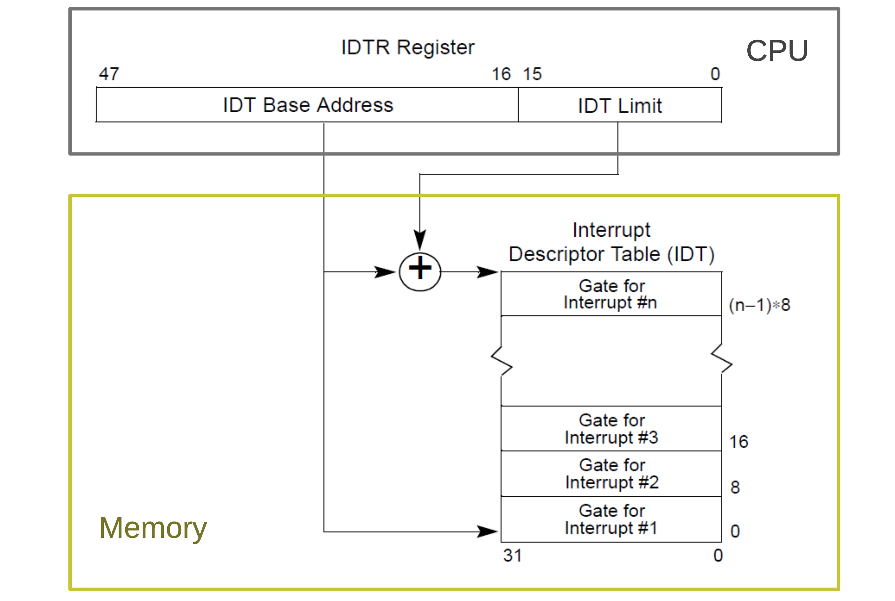
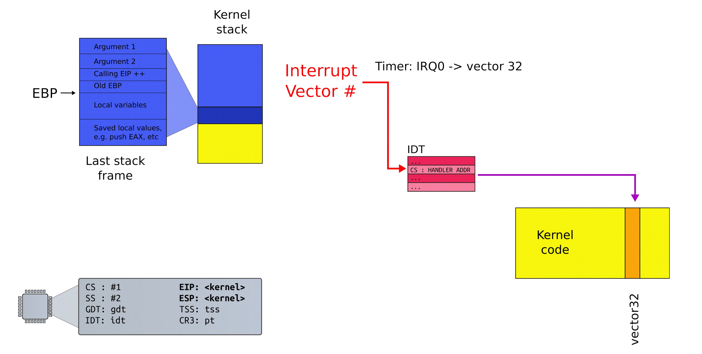
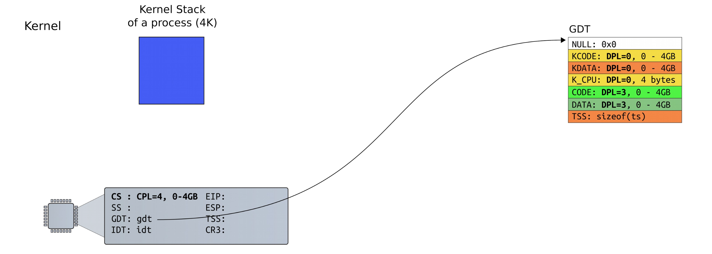
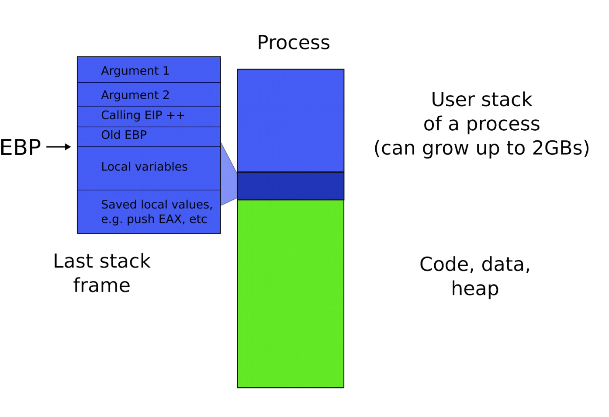
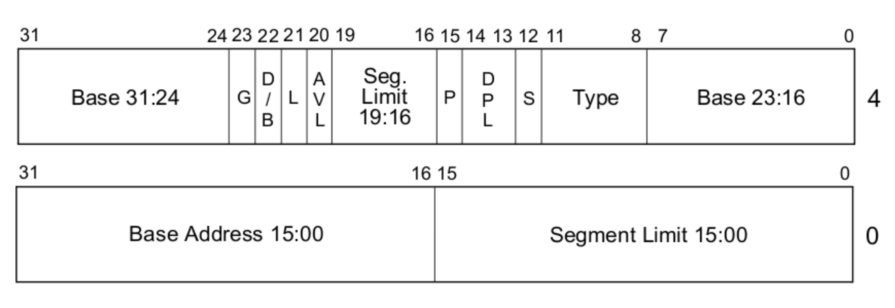
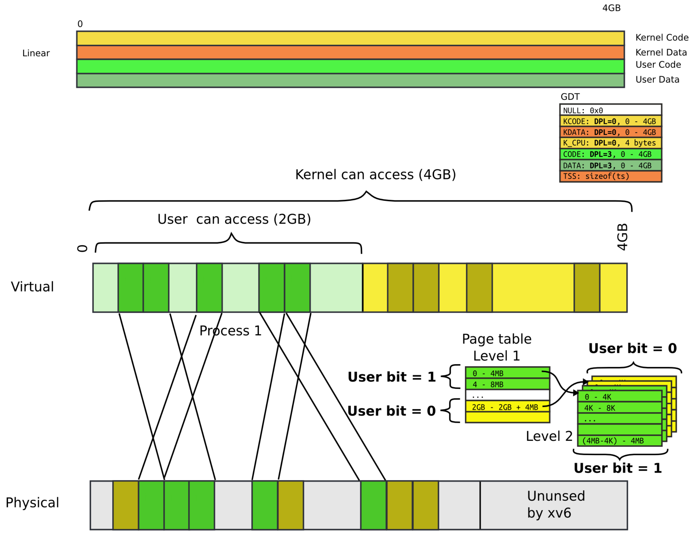
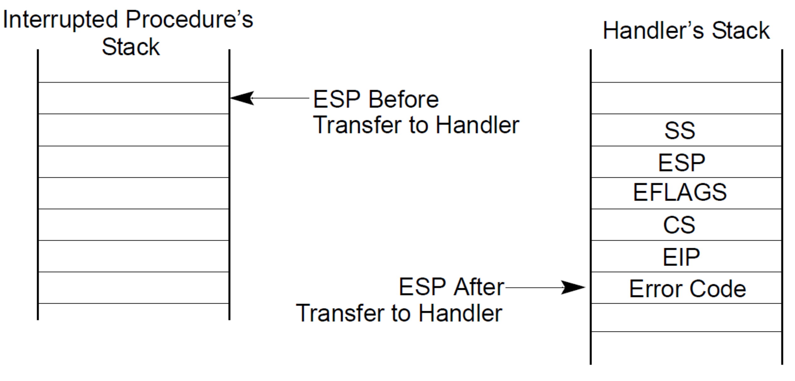
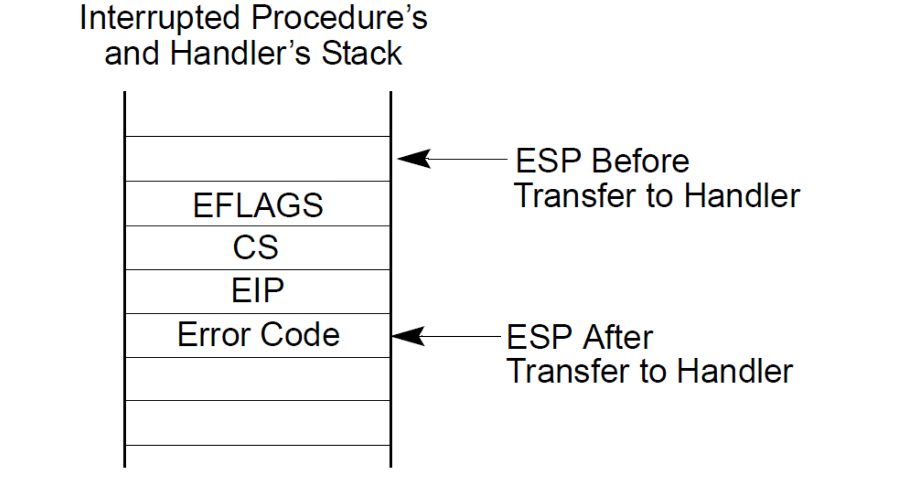
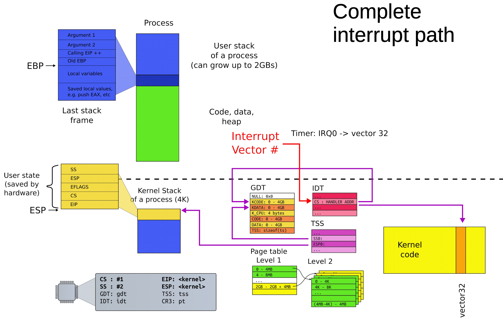

# Interrupts (part 1)

```C
void
main(void) {
    kinit1(end, P2V(4*1024*1024)); // phys page allocator
    kvmalloc();      // kernel page table
    mpinit();        // detect other processors
    lapicinit();     // interrupt controller
    seginit();       // segment descriptors
    picinit();       // disable pic
    ioapicinit();    // another interrupt controller
    consoleinit();   // console hardware
    uartinit();      // serial port
    pinit();         // process table
    tvinit();        // trap vectors
    binit();         // buffer cache
    fileinit();      // file table
    ideinit();       // disk 
    startothers();   // start other processors
    kinit2(P2V(4*1024*1024), P2V(PHYSTOP)); // must come after startothers()
    userinit();      // first user process
    mpmain();        // finish this processor's setup
}
```

## Why interrupts are needed?

- Remember: hardware interface is designed to help the OS
- Two main use cases
    - Synchronous: something bad happened and OS needs to fix it (program tries to access unmapped page)
    - Asynchronous: notifications from external devices (arrival of network packet or timer interrupt)
- A third, special, use-case
    - Used as a mechanism to transfer control control flow from user-level to kernel in a secure manner
    - Helps implement system calls

### Handling interrupts and exceptions

- In both synchronous and asynchronous cases the CPU follows the **same procedure**
    1) Stop execution of the current program
    2) Start execution of a handler
    3) Processor accesses the handler through an entry in the interrupt descriptor table (IDT)
- Each interrupt is defined by a number
    - 14 is page fault
    - 3 is debug
    - This number is an index into the interrupt table
- Interrupt requires **no change** of privilege level
    - CPU runs in kernel code when
        - A time interrupt arrives
        - Kernel tries to access an unmapped page
- Interrupt **changes** privilege level
    - CPU runs *user* code when
        - A time interrupt arrives
        - User code tries to access an unmapped page

### Interrupt handlers

- Each interrupt is associated with a number that is an index into the interrupt descriptor table
- The IDT is pointed by the `IDTR` register as a virtual address
- OS configures the value and loads it into the register during boot



- Each gate contains an offset that acts as a pointer to an interrupt handler
- The handler is just plain code in the kernel
- The IDT stores a pointer to the correct handler routine

### Processing of interrupts (same privilege level)

1) Push the current contents of `EFLAGS`, `CS`, and `EIP` registers (in that order) on the stack
2) Push an error code (if appropriate) on the stack
3) Load the segment selector for the new code segment and the new instruction pointer (from the interrupt gate or trap gate) into the `CS` and `EIP` registers
4) If the call is through an **interrupt gate**, clear the `IF` flag in `EFLAGS` to *disable further interrupts*
5) Begin execution of the handler



### Returning from an interrupt

Interrupt handlers conclude with a `iret` instruction

1) Restore the `CS` and `EIP` registers to their values prior to the interrupt or exception
2) Restore `EFLAGS`
3) Restore `SS` and `ESP` to their values prior to interrupt (resulting in a stack switch)
4) Resume execution of interrupted procedure

## Privilege levels

- Each segment has a privilege level
    - Called the descriptor privilege level (DPL)
    - Occupies bits 13-14 of the segment descriptor
    - Can be one of 4 privilege levels ranging from 0 to 3
- Currently running code also has a privilege level
    - Known as the current privilege level (CPL)
    - Saved in the `%cs` register
    - Loaded there when the descriptor for the currently running code was loaded int `%cs`

### Changing privilege levels

- CPL can only access less privileged segments
    - Privilege level 0 can access all segments
    - Privilege level 1 can access all segments except segments with privilege level 0
    - Privilege level 3 can only segments with privilege level 3
- Some instructions are "privileged"
    - Can only be invoked at CPL = 0
    - Loading the GDT or moving a value into a control register

### Running in the kernel



### Running in user space



## The first GDT

### `seginit(void)`

```C
// Setup up CPU's kernel segment descriptors
// Run once on entry on each CPU
void
seginit(void) {
    struct cpu *c;

    // Map "logical" addresses to virtual addresses using identity map
    // Cannot share a CODE descriptor for both kernel and user
    // because it would have to have DPL_USER, but the CPU forbids
    // an interrupt from CPL=0 to DPL=3
    c = &cpus[cupid()];
    c->gdt[SEG_KCODE] = SEG(STA_X|STA_R, 0, 0xffffffff, 0);
    c->gdt[SEG_KDATA] = SEG(STA_W, 0, 0xffffffff, 0);
    c->gdt[SEG_UCODE] = SEG(STA_X|STA_R, 0, 0xffffffff, DPL_USER);
    c->gdt[SEG_UDATA] = SEG(STA_W, 0, 0xffffffff, DPL_USER);
    lgdt(c->gdt, sizeof(c->gdt));
}
```

### `struct cpu`

```C
// Per-CPU state
struct cpu {
    unsigned char apicid;             // Local APIC ID
    struct context *scheduler;        // swtch() here to enter scheduler
    struct taskstate ts;              // Used by x86 to find stack for interrupt
    struct segdesc gdt[NSEGS];        // x86 global descriptor table
    volatile unsigned int started;    // Has the CPU started?
    int ncli;                         // Depth of pushcli nesting
    int intena;                       // Were interrupts enabled before pushcli?
    struct proc *proc                 // The process running on this CPU or null
};

extern struct cpu cpus[NCPU];
```

### Segment descriptors



| Part | Purpose |
|:----:| ------- |
| L | 64 bit code segment (IA-32e mode only) |
| AVL | Available for use by system software |
| BASE | Segment base address |
| D/B | Default operation size (0 = 16-bit segment; 1 = 32-bit segment) |
| DPL | Descriptor privilege level
| G | Granularity |
| LIMIT | Segment limit |
| P | Segment present |
| S | Descriptor type (0 = system; 1 = code or data) |
| TYPE | Segment type |

```C
// Segment Descriptor
struct segdesc {
    unsigned int lim_15_0 : 16;     // Low bits of segment limit
    unsigned int base_15_0 : 16;    // Low bits of segment base address
    unsigned int base_23_16 : 8;    // Middle bits of segment base address
    unsigned int type : 4;          // Segment type (see STS_ constants)
    unsigned int s : 1;             // 0 = system, 1 = application
    unsigned int dpl : 2;           // Descriptor privilege level
    unsigned int p : 1;             // Present
    unsigned int lim_19_16 : 4;     // High bits of segment limit
    unsigned int avl : 1;           // Unused (available for software use)
    unsigned int rsv1 : 1;          // Reserved
    unsigned int db : 1;            // Granularity: limit scaled by 4K when set
    unsigned int base_31_24 : 8;    // High bits of segment base address
};
```

### Page table user bit

- Each entry (both level 1 and level 2) has a bit
    - If set, code at privilege level 3 can access
    - If not, only levels 0-2 can access
- Note that their are only 2 levels, unlike the 4 for segment descriptors
- All kernel code is mapped with the user bit clear
    - This protects user-level code from accessing the kernel



## Processing interrupts (different privilege level)

- Assume that we are at CPL = 3 or user space
- Interrupt is allowed only if the current privilege level (CPL) is less or equal to descriptor privilege level (DPL)
- The kernel protects device interrupts from user
- Note that new segment can be more privileged, this is how user-code transitions into kernel code

### Task state segment

> Can we continue to use the same stack?

- Would make maintaining the user stack very difficult
- The kernel has its own process stack, but need to switch to it somehow
- The **t**ask **s**tate **s**egment (TSS) is another table accessible from the GDT
    - Contains lots of fields for rarely-used features
    - A feature we care about in a modern OS: location of the kernel stack
        - Knows the stack segment selector
        - Has the location of the stack in that segment

### Stack usage

#### Privilege level changed



#### Privilege level not changed



### Interrupt path



1) Save `ESP` and `SS` in a CPU internal register
2) Load `SS` and `ESP` from TSS
3) Push user `SS`, user `ESP`, user `EFLAGS`, user `CS`, user `EIP` onto new stack (the kernel stack)
4) Set `CS` and `EIP` from IDT descriptor's segment selector and offset
5) If the call is through an interrupt gate clear interrupts enabled `EFLAGS` bit
6) Begin execution of handler