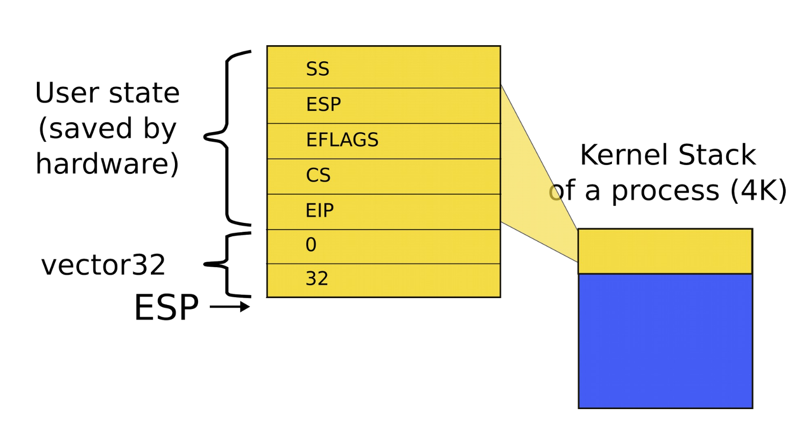
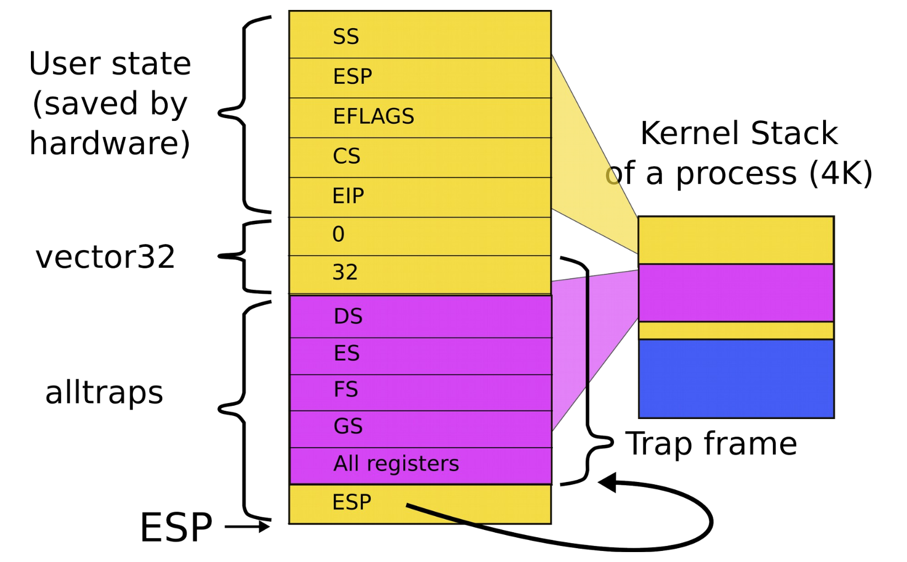
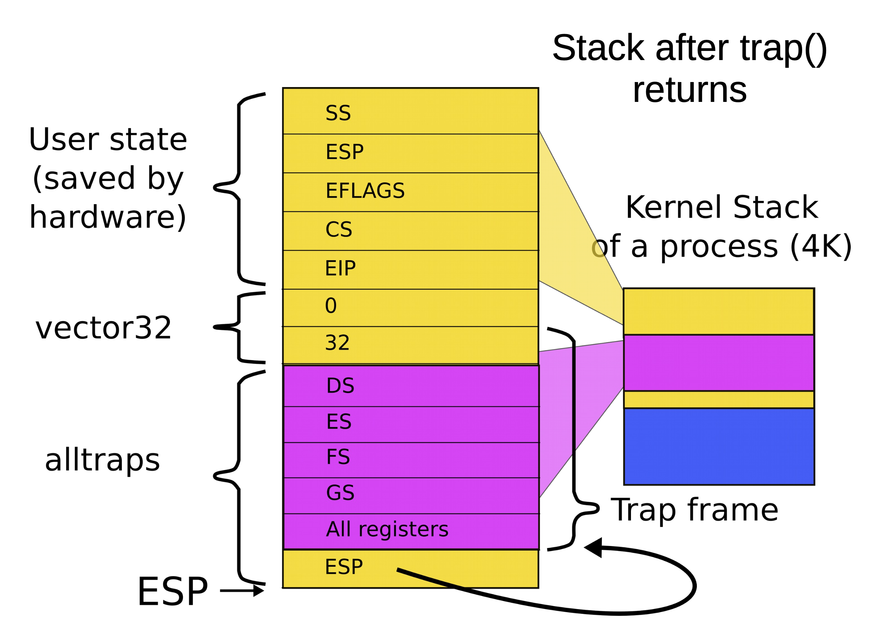

# Interrupts (part 2)

## The interrupt descriptor table (IDT)

### x86 interrupt descriptor table

| Vector Number | Mnemonic | Description | Source |
|:-------------:| -------- | ----------- | ------ |
| 0 | `#DE` | Divide error | `DIV` and `IDIV` instruction |
| 1 | `#DB` | Debug | Any code or data reference |
| 2 | | NMI interrupts | Non-maskable externel interrupt |
| 3 | `#BP` | Breakpoint | `INT 3` instruction |
| 4 | `#OF` | Overflow | `INTO` instruction |
| 5 | `#BR` | BOUND range exceeded | `BOUND` instruction |
| 6 | `#UD` | Invalid opcode (undefined opcode) | `UD2` instruction or reserved opcode |
| 7 | `#NM` | Device not available (no math coprocessor) | Floating-point or `WAIT`/`FWAIT` instruction |
| 8 | `#DF` | Double fault | Any instruction that can generate an exception, an NMI, or an `INTR` |
| 9 | `#MF` | Coprocessor segment overrun (reserved) | Floating-point instruction |
| 10 | `#TS` | Invalid TSS | Task switch of TSS access |
| 11 | `#NP` | Segment not present | Loading segment registers or accessing system segments |
| 12 | `#SS` | Stack segment fault | Stack operations and `SS` register loads |
| 13 | `#GP` | General protection | Any memory reference and other protection checks |
| 14 | `#PF` | Page fault | Any memory reference |
| 15 | | Reserved | |
| 16 | `#MF` | Floating point error (math fault) | Floating point or `WAIT`/`FWAIT` instruction |
| 17 | `#AC` | Alignment check | Any data reference in memory |
| 18 | `#MC` | Machine check | Error codes (if any) and source are model dependent |
| 19 | `#XM` | SIMD floating point exception | `SIMD` floating point instruction |
| 20 - 31 | | Reserved | |
| 32 - 255 | | Maskable interrupts | External interrupt from `INTR` pin or `INT n` instruction |

### Interrupts

- Each type of interrupt is assigned an index from 0 - 255
    - 0 - 31 are for processor interrupts fixed by Intel
    - For instance, 14 is always for page faults
- 32 - 255 are software configured
    - 32 - 47 are often used for device interrupts
    - Most device IRQ lines can be configured
    - Look up APICs fro more info
        - Linux uses `0x80` for system calls
        - Xv6 uses `0x40` for system calls

### Disabling interrupts

- Delivery of interrupts can be disabled with `IF` (interrupt flag) in `EFLAGS` register
- The following *cannot* be disabled
    - Synchronous interrupts
    - Non-maskable interrupts

### Non-maskable interrupts (NMI)

- Delivered even if `IF` in `EFLAGS` is cleared
    - CPU blocks subsequent NMI interrupts until `IRET`
- Sources
    - External hardware asserts the NMI pin
    - Processor receives a message on the system bus, or the APIC serial bus with NMI delivery mode

## Implementing the IDT

### `tvinit`

```C
void
tvinit(void) {
    int i;

    for(i = 0; i < 256; i++) {
        SETGATE(idt[i], 0, SEG_KCODE<<3, vectors[i], 0);
        SETGATE(idt[T_SYSCALL], 1, SEG_KCODE<<3, vectors[T_SYSCALL], DPL_USER);
    }

    initlock(&tickslock, "time");
}
```

- Called from `main()`
- System call interrupt is `vector(T_SYSCALL)`
- Generally user code cannot invoke `int <int>`
    - User code can't issue `int 14` (a page fault)
    - OS configures the IDT in such a manner that invocation of all `int X` instructions besides `0x40` triggers a general protection fault exception
- Only `int T_SYSCALL` can be called from user-level
- `Syscall` is a "trap" -- doesn't disable interrupts

```asm
vector32:
    pushl $0    // error code
    pushl $32   // vector #
    jmp alltraps
```

- Interrupts begin by pushing the error code and the interrupt vector number
- This data is pushed onto the kernel stack *before* the user state



### `alltraps`

```asm
alltraps:
    # Build trap frame.
    pushl %ds
    pushl %es
    pushl %fs
    pushl %gs
    pushal                    # Assembler instruction that saves all registers on the stack

    # Set up data segments
    movw $(SEG_KDATA<<3), %ax
    movw %ax, %ds
    movw %ax, %es

    # Call trap(tf), where tf=%esp
    pushl %esp
    call trap
```



### `trap`

```C
void
trap(struct trapframe *tf) {
    ...
    switch(tf->trapno) {
        case T_IRQ0 + IRQ_TIMER:
            if(cpu->id == 0) {
                acquire(&tickslock);
                ticks++;
                wakeup(&ticks);
                release(&tickslock);
            }
        break;
    }
    ...
    if(proc && proc->state == RUNNING && tf->trapno == T_IRQ0 + IRQ_TIMER)
        yield(); 
}
```

### Exit from `alltraps`

```asm
alltraps:
    ...
    addl $4, %esp

    # Return falls through to trapret
.globl trapret
trapret:
    popal
    popl %gs
    popl %fs
    popl %es
    popl %ds
    addl $0x8, %esp # trapno and errcode
    iret
```

- Restore all registers
- Exit into user space with `iret`



### Return from interrupt

1) Restore the `CS` and `EIP` registers to their values prior to the interrupt or exception
2) Restore `EFLAGS`
3) Restore `SS` and `ESP` to their values prior to interrupt (resulting in stack switch)
4) Resume execution of interrupted procedure

## System calls

### Software interrupts

- The `int N` instruction provides a secure mechanism for kernel invocation
    - User can enter the kernel
    - But through a well-defined entry point (system call handler)
- Xv6 uses vector `0x40` or `64`
    - You can choose any other unused vector
    - For instance, linux uses `0x80`
    - The `sysenter` instruction provides a faster method to enter the kernel

### IDT entry 64

```asm
vector64:
    pushl $0
    pushl $64
    jmp alltraps
```

- Processing  in `alltraps` is exactly the same as all other interrupts
- Differs slightly in `trap`

### System call handling inside `trap`

```C
void
trap(struct trapframe *tf) {
    if(tp->trapno == T_SYSCALL) {
        if(proc->killed)
            exit();
        proc->tf = tf;
        syscall();
        if(proc->killed)
            exit();
        return;
    }
    ...
}
```

### Syscall number

- System call number is passed in the `%eax` register
- To distinguish which syscall to invoke they are prefixed with `sys_`
- `alltraps()` saves it along with all other registers

### `sycall`

```C
void
syscall(void) {
    int num;

    num = proc->tf->eax;
    if(num > 0 && num < NELEM(syscalls) && syscalls[num]) {
        proc->tf->eax = syscalls[num]();
    } else {
        cprintf(
            "%d %s: unknown sys call %d\n",
            proc->pid,
            proc->name,
            num
        );
        proc->tf->eax = -1;
    }
}
```

### System call table

```C
static int (*syscalls[])(void) = {
    [SYS_fork] sys_fork,
    [SYS_exit] sys_exit,
    [SYS_wait] sys_wait,
    [SYS_pipe] sys_pipe,
    [SYS_read] sys_read,
    [SYS_kill] sys_kill,
    [SYS_exec] sys_exec,
    [SYS_fstat] sys_fstat,
    [SYS_chdir] sys_chdir,
    [SYS_dup] sys_dup,
    [SYS_getpid] sys_getpid,
    [SYS_sbrk] sys_sbrk,
    [SYS_sleep] sys_sleep,
    [SYS_uptime] sys_uptime,
    [SYS_open] sys_open,
    [SYS_write] sys_write,
    [SYS_mknod] sys_mknod,
    [SYS_unlink] sys_unlink,
    [SYS_link] sys_link,
    [SYS_mkdir] sys_mkdir,
    [SYS_close] sys_close,
};
```

### Accessing system calls

- It would be weird to write

```asm
pushl $argv
pushl $init
pushl $0  // where caller pc would be
movl $SYS_exec, %eax
int $T_SYSCALL
```

- Every time we want to invoke a system call
- Instead we use a header file `user.h` to define system call prototypes
- Compiler can then generate correct system call stacks

```C
// system calls
int fork(void);
int exit(void) __attribute__((noreturn));
int wait(void);
int pipe(int*)
int write(int, void*, int);
int read(int, void*, int);
int clase(int);
int kill(int);
int exec(char*, char**);
int open(char*, int);
int mknod(char*, short, short);
int unlink(char*);
int fstat(int fd, struct stat*);
int link(char*, char*);
```

- This header file allows compiler to generate a call side invocation
- System itself is invoked through a macro

```C
#include "syscall.h"
#include "traps.h"

#define SYSCALL(name) \
    .globl name; \
    name: \
        movl $SYS_ ## name, %eax; \
        int $T_SYSCALL; \
        ret

SYSCALL(fork)
SYSCALL(exit)
SYSCALL(wait)
SYSCALL(pipe)
SYSCALL(read)
...
```

### System call arguments

- System calls run with the kernel's stack
- Kernel can access system call arguments through the trap frame
- Note: system call arguments come from *user space*
    - The kernel cannot explicitly trust them
    - Must perform sanity checks on each argument

#### `argint`

```C
// Fetch the nth 32-bit system call argument
int
argint(int n, int *ip) {
    return fetchint(proc->tf->esp + 4 + 4*n, ip);
}
```

- Start with the address where current user stack is
- Skip return `EIP`
- Fetch the nth argument

#### `fetchint`

```C
// Fetch the int at addr from the current process.
int
fetchint(unsigned int addr, int *ip) {
    if(addr >= proc->sz || addr + 4 > proc->sz)
        return -1;
    *ip = *(int*)(addr);
    return 0;
}

```

#### `argptr`

```C
// Fetch the nth word-sized system call argument as a pointer
// to a block of memory of size n bytes. Check that the pointer
// lies within the process address space
int
argptr(int n, char **pp, int size) {
    int i;

    if (argint(n, &i) < 0) // Check that the pointer to the buffer is sound
        return -1;
    if ((unsigned int)i >= proc->sz || (unsigned int)i + size > proc->sz) // Check buffer is in user memory
        return -1;
    *pp = (char*)i;
    return 0;
}
```