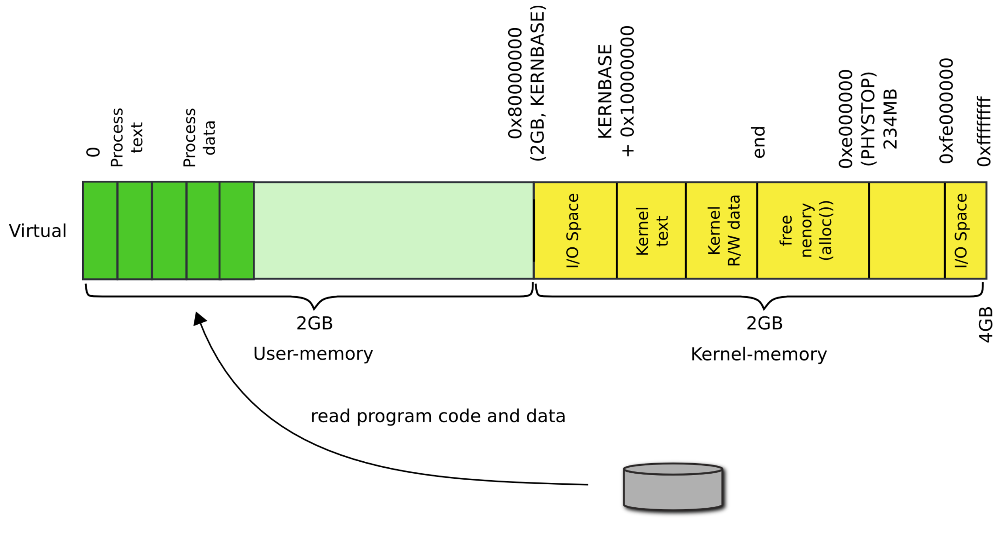
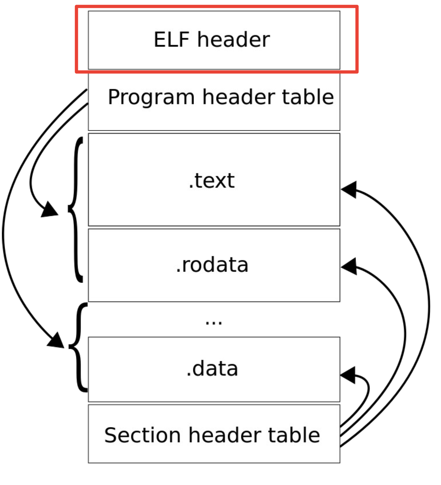

# Creating processes (part 1)

## How does the kernel make new processes?

1) Read process binary from disk
2) Create process address space
3) Load program into memory
4) Allocate program stack
5) Push program arguments on the stack
6) Switch page tables

### `exec()`: a high-level outline

- Load program from disk
    - Locate a file that contains process binary
        - `namei()` takes a file path (`"/bin/ls"`) as an argument
        - Returns an inode
    - Read the file block by block
        - `readi()` reads the inode (file data) into memory
    - To read file in memory we need to construct the process address space
        - A page table specifically for the process
- Create the user stack
- Run!

### `exec()`: locate inode

```C
int
exec(char *path, char **argv) {
    ...
    if ((ip = nami(path)) == 0) {
        end_op();
        return -1;
    }
    ...
}
```

### `exec()`: check ELF header

```C
int
exec(char *path, char **argv) {
    ...
    // Check ELF header
    if(readi(ip, (char*)&elf, 0, sizeof(elf)) < sizeof(elf))
        goto bad;
    if(elf.magic != ELF_MAGIC)
        goto bad;
    ...
}
```

## Creating the process address space

1) Create the kernel part of the address space
2) Create the user part of the address space

### `exec()`: setup kernel address space

```C
int
exec(char *path, char **argv) {
    ...
    if((pgdir = setupkvm()) == 0)
        goto bad;
    ...
}
```

- This happens exactly like the way the kernel initializes its own page tables
    1) Allocate the page table directory
    2) Map the first page of kernel memory
    3) Move on the the next page

### `exec()`: setup user address space

- The goal is to fill in the page table entries
    - This can be naturally combined with loading the program from disk into memory
- At a high level iterate in a loop
    1) Allocate user-level pages for the program
    2) Map them by filling in the page table entries
    3) Read data from the inode into that memory



#### ELF object file



#### Program loading loop

```C
int
exec(char *path, char **argv) {
    int sz, i, off;
    ...
    // Load program into memory
    sz = 0;
    for(i = 0, off=elf.phoff; i<elf.phnum; i++, off+=sizeof(ph)) {
        if(readi(ip, (char*)&ph, off, sizeof(ph)) != sizeof(ph))
            goto bad;
        ...
        if((sz = allocuvm(pgdir, sz, ph.vaddr + ph.memsz)) == 0)
            goto bad;
        if(ph.vaddr % PGSIZE != 0)
            goto bad;
        if (loaduvm(pgdir, (char*)ph.vaddr, ip, ph.off, ph.filesz) < 0)
            goto bad;
    }
}
```

- Loop over all program headers
- Start at the beginning of the program header table `off = elf.phoff`
- Read one program header entry at a time
- Each time a header is read, increment the offset by the size of the program header
- Allocate pages for the program section in `allocuvm`
    - Size of user address space tracked in `sz` variable
    - New address space determine by sum of program header virtual address and memory size
- Program section loaded to disk in `loaduvm`
