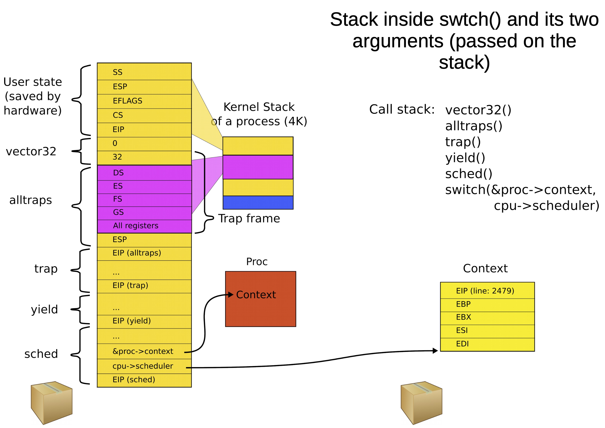
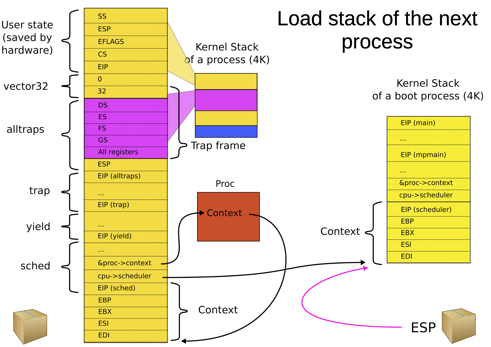

# Context switching (part 1)

## Preparing to context switch

- Timer interrupt preempts the current process
- A process enters the kernel with a system call and has to wait on some resource
- The process voluntarily yields CPU with the `yield` system call

### Yielding the CPU

```C
void
trap(struct trapframe *tf) {
    ...
    if (proc && proc->state == RUNNING && tf->trapno == T_IRQ0+IRQ_TIMER)
        yield(); // Yield the processor
    ...
}
```

### Invoking the scheduler

```C
void
yield(void) {
    acquire(&ptable.lock);
    proc->state = RUNNABLE;
    sched(); // Enter the scheduler
    release(&ptable.lock);
}
```

### Scheduler task

```C
void
sched(void) {
    ...
    swtch(&proc->context, cpu->scheduler);
    ...
}
```

### Processes as boxes

- Structure of a process

```C
struct proc {
    unsigned int sz; // Size of process memory (bytes)
    pde_t* pgdir; // Page table
    char *kstack; // Bottom of kernel stack for this process
    enum procstate state; // Process state
    volatile int pid; // Process ID
    struct proc *parent; // Parent process
    struct trapframe *tf; // Trap frame
    struct context *context; // swtch() here to run
    void *chan; // If non-zero, sleeping on chan
    int killed; // If non-zero, have been killed
    struct file *ofile[NOFILE]; // Open files
    struct inode *cwd; // Current directory
    char name[16]; // Process name (debugging)
};
```

- Process also has a registers at `yield` time. Saved on the stack with the `context` data structure

```C
struct context {
    unsigned int edi;
    unsigned int esi;
    unsigned int ebx;
    unsigned int ebp;
    unsigned int eip;
};
```

## Starting the context switch

### Preserving the old process

- Start in user mode with two stacks
- Timer interrupt triggers interrupt path as discussed week 7
- If we are context switching, `trap` calls `yield` to invoke the scheduler
- Scheduler invokes `swtch` to perform the context switch




### Switching with `swtch()`

> The context switch function should pack everything what is left in the box and switch stacks

- The only thing not saved by this procedure in callee-saved registers
- They are saved by `swtch`

```asm
swtch:
    movl 4(%esp), %eax
    movl 8(%exp), %edx

    # Save old callee-save register
    pushl %ebp
    pushl %ebx
    pushl %esi
    pushl %edi

    # Switch stacks
    movl %esp, (%eax)
    movl %edx, %esp
```

## Finishing the context switch

### Unpacking the context

```asm
swtch:
    ...
    # Load new callee-save registers
    popl %edi
    popl %esi
    popl %ebx
    popl %ebp
    ret
```

- Simply load the new context from the new stack and return on that new stack
- The context is *always* saved on the top of a stack

### Exiting from `swtch()`

