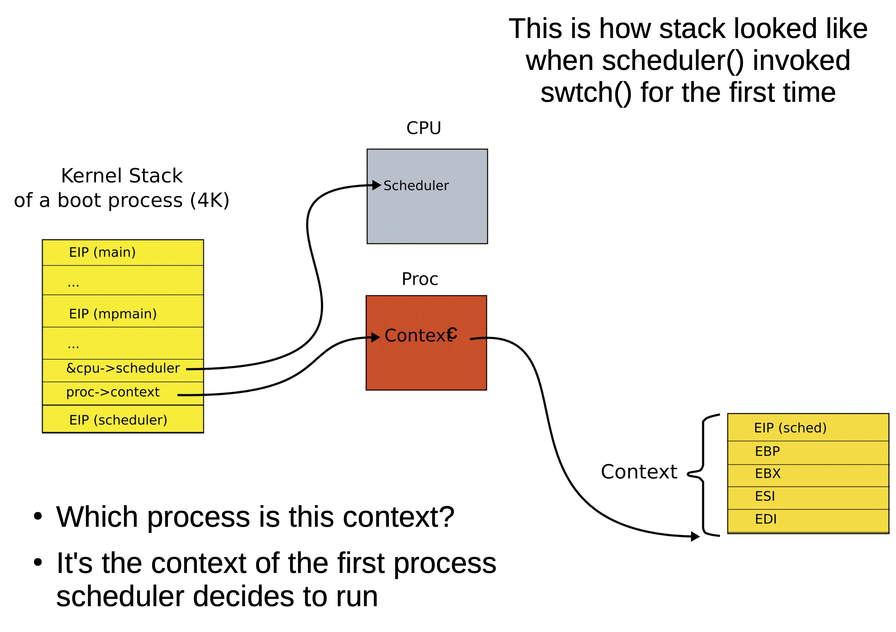
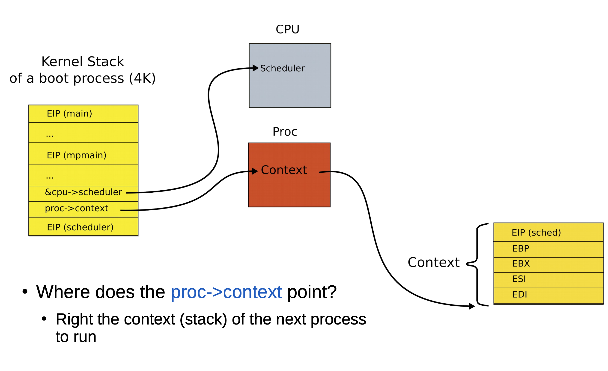

# Context switching (part 2)

## Returning from `swtch()`?

### Context configuration

- The contents of the `context` data structure are *always* placed on the top of the stack
- It is the **last** data pushed on the stack before stacks are switched
- Once switched, `context` can reliably be popped off the **new** stack

### The first context switch

- System boot concludes by starting the scheduler



- Context is the top of some stack
    - This configuration is guaranteed as part of creating a new process in `allocproc()`
- Initially, it was the stack of `mpenter()` (on which scheduler started)
- Then the first process ... then the scheduler again ... and the next process
    - Save the current context into `&cpu->scheduler`
    - Restore the context of the first process from `proc->context`
- This means the `swtch()` returns to `scheduler`

## The scheduler

- The return point of `swtch`
    1) Started with a time interrupt
    2) Entered the kernel
    3) Entered `schedule()`
    4) Entered `swtch()`
- The only difference is that the stacks are *different*

### What does it do?

- Selects the next process to run
- Switches to it

```C
void
scheduler(void) {
    for(;;) {
        for(p = ptable.proc; p < &ptable.proc[NPROC]; p++) {
            if(p->state != RUNNABLE)
                continue;
            proc = p;
            switchuvm(p);
            p->state = RUNNING;
            swtch(&cpu->scheduler, proc->context);
            switchkvm();
            proc = 0;
        }
    }
}
```

> This is where a production operating system differs 
> Such operating systems select processes in a much more complex way than in xv6

### Invoking `swtch()`



- We save the context of the scheduler
- Restore the context of the next process
- When we return from `swtch`, we are running on a *different* stack with the new process's context on top

### Exiting back to user-level

- Returns as usual all the way to `alltraps()`
- When the interrupt is handled, we're back where we started, but running in a *new* process