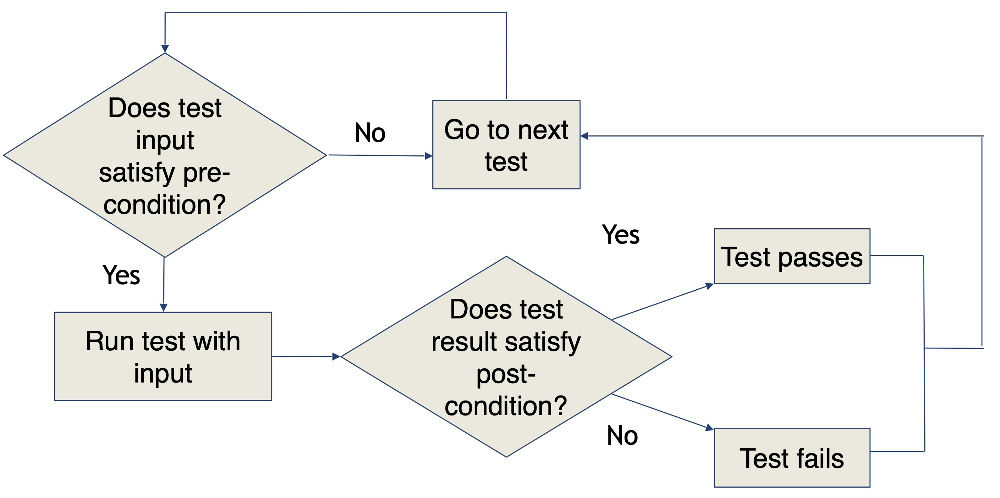
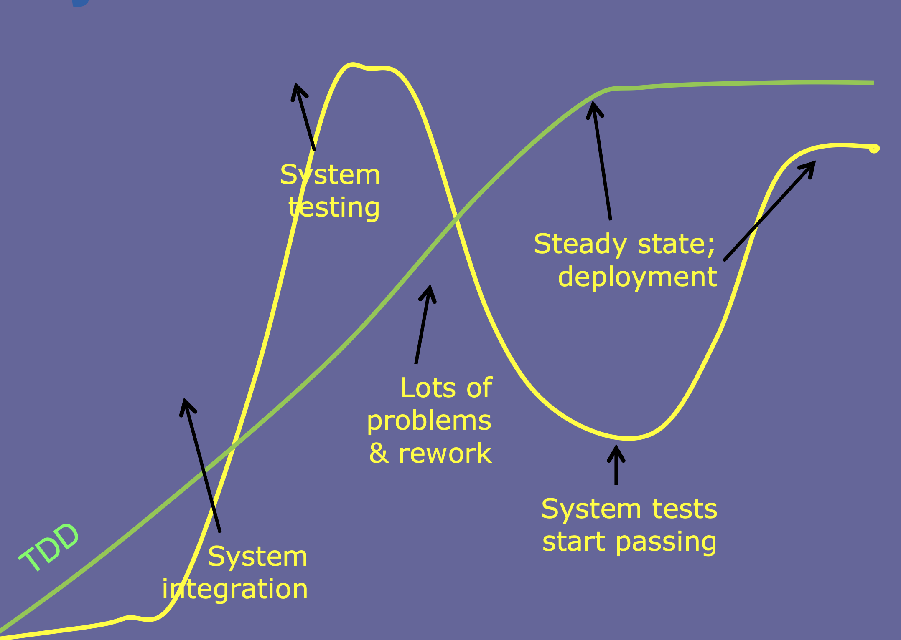
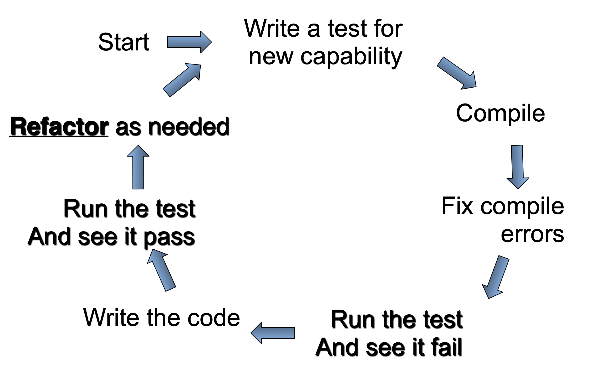

# Lecture 4

## Components of a test case

- A test case is a multipart artifact with a definite structure
- Test case values: the input values needed to complete an execution of the software under test
- Expected results: the result that will be produced by the test if the software behaves as expected
- A test oracle uses expected results to decide whether a test passed or failed

### Using pre- and post-conditions

- Doesn't help write tests, but helps run them



### Pre-conditions

Consider the following Java function

```Java
int foo(int[] A, int[] B) {
	int r = 0;
	for (int i = 0; i < A.length; i++) {
		r += A[i] * B[i];
	}
	return r;
}
```

 A pre-condition that prevents any in-built exceptions from being thrown

```Java
A != null && B != null && A.length <= B.length
```

### Post-conditions

> Consider a sorting function in Java which takes a non-null integer array `A` and returns an integer array `B`

Possible post-conditions

- `B` is non-null
- `B` has the same length as `A`
- The elements of `B` are a permutation of the elements of `A`
- The elements of `B` are in sorted order

### Test artifacts

- The test design activity produces
	- The test coverage items -- items that the test data must exercise
	- The test cases and test data (identifiers, values for input data, and expected results)
- The test code activity produces the test implementation
- The test results are produced by executing the test implementation producing a test log

## Test-driven development (TDD)

- Is a programming practice
- Unit tests are written before the code
- Steps
	1) Write a test that fails
	2) Write code to make the test pass
	3) Refactor (and repeat)
- Unit tests and refactoring are the tools of TDD

### System readiness



### First round `Calc`

#### Test

```Java
import org.junit.Test;
import static org.junit.Assert.*;

public class CalcTest {
	@Test
	public void testAdd() {
		assertTrue("Calc sum incorrect", 5 == Calc.add(2, 3));
	}
}
```

- The test suite will test a class called `Calc`
- It will have a method `add` that takes in 2 integer parameters
- **STOP**: code will not compile, so let's write the *minimal* code to make it compile

#### Implement

```Java
public class Calc {
	static public int add(int a, int b) {
		return 5;
	}
}
```

- Code complies and test runs correctly
- Why `return 5`?
	- It is the minimal amount of code needed to make the test work
	- May seem silly, but that is the process

### Second round `Calc`

#### Test

```Java
import org.junit.Test;
import static org.junit.Assert.*;

public class CalcTest {
	@Test
	public void testAdd() {
		assertTrue("Calc sum incorrect", 5 == Calc.add(2, 3));
	}

	@Test
	public void testAddB() {
		assertTrue("Calc sum incorrect", 7 == Calc.add(3, 4))
	}
}
```

- The `return 5` hardcoded value won't work in the second test case
- Test fails, so we have to modify the `Calc` class

#### Implement

```Java
public class Calc {
	static public int add(int a, int b) {
		return a + b;
	}
}
```

- Compiles and *all* tests run successfully

### Third round `Calc`

#### Test

```Java
import org.junit.Test;
import static org.junit.Assert.*;

public class CalcTest {
	@Test
	public void testAdd() {
		assertTrue("Calc sum incorrect", 5 == Calc.add(2, 3));
	}

	@Test
	public void testAddB() {
		assertTrue("Calc sum incorrect", 7 == Calc.add(3, 4))
	}

	@Test
	public void testSubtract() {
		assertTrue("Calc difference incorrect", 5 == Calc.substract(10, 5))
	}
}
```

#### Implement

```Java
public class Calc {
	static public int add(int a, int b) {
		return a + b;
	}

	static public int subtract(int a, int b) {
		return a - b;
	}
}
```

### Expected benefits



- Program always works as expected (relative to current tests)
- Decisions are made when needed
	- Not weeks or months early
	- Decisions are more likely to be correct
- End result is more reliable
- Future modifications
	- Are cheaper
	- Are easier
	- Are less frequent

### Tools

- Unit tests
	- Test specific aspects of a functionality
	- Execute rapidly
	- Independent of each other
	- Independent of the surrounding environment
	- Independent of execution order
	- Automated
- Refactoring
	- Changes the internal structure of the code without changing it's external behavior
	- Explored in [IN4MATX 122](../../../winter-2023/in4matx-122/syllabus.md)

## TDD concepts

### Test doubles

- A test double is an object "stand-in"
	- Looks like the real thing from the outside
	- Executes faster
	- Is easier to develop and maintain
- Test doubles are used for two types of testing
	- State-based testing
	- Interaction based testing
 
#### Test double types

- Stubs: an object that holds predefined data and uses it to answer calls during tests. Useful when we cannot or don't want to involve objects that would answer with real data
- Fakes: more sophisticated than a stub (an alternative, simpler implementation)
- Mocks: more sophisticated than a fake. Can contain
	- Assertions
	- The ability to return hard coded values
	- A fake implementation of the logic
 
#### Why test doubles?

- Can test an object without writing all its environment
- Allows a stepwise implementation as we successively replace more and more doubles with real implementations
- When something is wrong, we can be almost sure that the problem is in the new object and nots in its environment

### Assertions

- The most important unit test patterns are assertion patterns

| Assertion | Meaning |
|:---------:|:-------:|
| `assertFalse` | Check that the condition is false |
| `assertTrue` | Check that the condition is true |
| `assertEquals` | Check that two parameters are equal |
| `assertNotEquals` | Check that two parameters are not equal |
| `assertNotSame` | Check that two objects do not refer to the same object |
| `fail` | Fail a test |

- These are just a few of the most common, check the docs for your unit test framework for all available assertions

#### Resulting state assertions

- Execute some functionality
- Check that the resulting state is as expected using one ore more assertions

#### Guard assertion

- Used to check that our assumptions of what the status is before executing the new code is correct
- Useful for representing pre-conditions in a programmatic fashion

#### Delta assertion

- Say we have some test variable with an initial value: `test_var_1 = init_value`
- New code comes along and increases the current value by `x`
- After new code is executed, use an assertion to check if the expected change took place

#### Custom assertion

- As conditions in tests get more complex, there are two alternatives
	1) Split up the assertion into multiple statements
	2) Use a custom assertion that abstracts the complexity of the necessary assertions

#### Keep or throw away?

- When code moves to production, should we keep or remove the assertions
	- Pro: will quickly diagnose new errors
	- Con: may need updates when the code is changed
- The decision may vary depending on the assertion pattern used

### Legacy code

- Much of the development done is changing an existing code base
- TDD assumes that we write tests, then write code and then run the tests
	- Cannot use TDD directly on an existing code base
- The following process should be used instead
	1) Identify the change point in the legacy code
	2) Cover the identified change point
		- Break internal dependencies
		- Break external dependencies
		- Write tests
	3) Make changes
	4) Refactor covered code *if needed*
- As we change the legacy code
	- New code tests check that our changes have the intended effect
	- Tests to check that we do not break any of the behavior that we want to keep