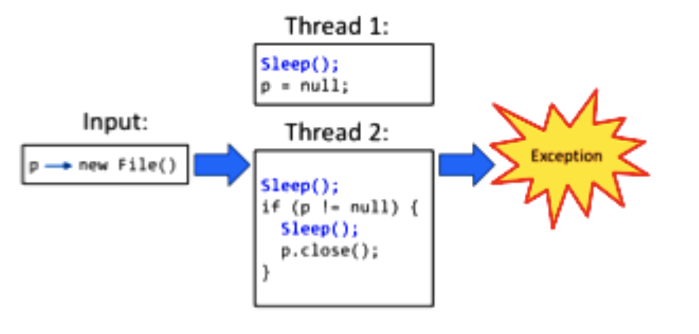

# Lecture 9

## Soak testing

- Problem: a system may behave exactly as expected under artificially limited execution conditions
- Test the system with a significant load over a significant period of time
- Checks the reaction of subject under test under a possible simulated environment

## Sequential program testing

- Bugs are triggered under a specific program input
- Testing such programs is concerned with finding such inputs

```Java
...
p.close(); // if p = null, EXCEPTION!
...
```

## Concurrency testing

- Bugs triggered *not only* under a specific input, but also under a specific **thread schedule**
- Thread schedules are non-determinisitic across different runs, even on the same input

```Java
// Thread 1
p = null;


// Thread 2
if (p != null) {
	...
	p.close(); // EXCEPTION!
}

// Input
p = new File();
```

- Bug triggered if
	1) Non-null check in thread 2 executed first
	2) Followed by assignment of null to `p` in thread 1
	3) Followed by the `p.close()` statement in thread 2
- Bug not triggered if
	1) Thread 2 executes in its entirety first
	2) `p` is assigned null in thread 1
 
### Fuzzing the thread schedule

- Introduce random delays with calls to `sleep` to try to create differing thread schedules
- Can automated this by systematically inserting calls before each statement in the program
	- Less error-prone that letting a human choose
	- Less tedious for testers



### Depth of concurrency bugs

- The number of *ordering constraints* that a thread schedule has to satisfy in order for a bug to be triggered

```Java
// Thread 1
...
T t = new T();
...

// Thread 2
...
if (t.state == 1) {
	...
}
...
```

- The statement in thread 1 should be executed before the statement in thread 2
- Since this is the only constraint, the depth of this concurrency bug is 1
- Bug depth only counts order dependencies across different threads
- The greater the depth, the more constraints on program execution needed in order to find the bug
- This means that more things have to happen "just right" to trigger the bug

## Fuzz testing

- A method of finding software holes by feeding purposely invalid data as input to a program
- Generally an automated process
- Finds many problems related to reliability, many of which are potential security holes
- Programs and frameworks that are used to create fuzz tests or perform fuzz testing are called **fuzzers**
- Reveals if unexpected inputs cause unexpected results

### Fuzzing process


### Types of fuzz testing

- Black-box: randomly generated data is fed to a program as input to see if it crashes
	- Does not require knowledge of the program source code/deep code inspection
	- A quick way to find defects without knowing details of the application
- White-box: creates test cases considering the target program's logical constraints and data structure
	- Require knowledge of the system and how it used the data
	- Deeper penetration into the program
- Application fuzzing: attack vectors are within I/O
- Protocol fuzzing: sending forged packets to the application
- File format fuzzing: generates multiple malformed samples, and opens them sequentially

### Approaches to fuzz testing

- Generic: crude, random corruption of valid data without any regard to the data format
- Pattern-based: modify random data to conform to particular patterns
- Intelligent: uses semi-valid data that may pass a parser/sanity checker's initial line of defense; requires understanding of underlying data format
- Large volume: fuzz testing at scale
- Exploit variant: vary a known exploitative input to take advantage of the same attack vector with a different input; good for evaluating the quality of a security patch
- Evolutionary: generate inputs based on response from the program
- Mutation based
	- Mutates existing data samples to create test data
	- Takes a well formed input and randomly perturb
	- Little or no knowledge of the structure of inputs required
	- Anomalies are added to existing valid inputs
	- Anomalies may be completely random or follow some heuristics
	- Strengths
		- Easy to setup and automate
		- Little to no protocol knowledge required
	- Weaknesses
		- Limited by initial corpus
		- May fail for protocols with checksums or those which depend on challenge response
- Generation based
	- Define new tests based on models of the input
	- Test cases are generated from some description of the format
	- Anomalies are added to each possible spot in the inputs
	- Knowledge of protocol should give better results than random fuzzing
	- Strengths
		- Completeness
		- Can deal with complex dependencies
	- Weaknesses
		- Have to have a specification of the protocol
		- Writing generator can be labor intensive for complex protocols
### Bug detection

- See if the program crashed
- Run program under dynamic memory error detector
	- Pointer/array errors/invalid/out of boundary data
- See if the program lacks up (deadlock)
	- Race conditions
 - Not checking return codes
 - Data corruption
 - Undocumented features

### How much is enough fuzz?

- Mutation based fuzzers may generate an infinite number of test cases
- Generation based fuzzers may generate a finite number of test cases
- Answer lie in **code coverage**
	- Determines how much code has been executed
	- Data can be obtained using profiling tools

### Fuzzing rules of thumb

- Protocol specific knowledge is very helpful
- More fuzzers is better
- Longer runs reveal more bugs
- Best results come from guiding the process
- Code coverage is useful for guiding the process

## Chaos monkey

- A Netflix infrastructure testing system
- "Malicious" programs randomly trample on components, network, data-centers, AWS instances, etc.
	- Chaos monkey disables production instances at random
	- Other monkeys perform fuzz testing at the infrastructure level
	- **Chaos gorilla** simulates an outage of an entire AWS availability zone
	- Force failure of components to make sure the system architecture is resilient to unplaned/random outages
- Netflix has open-sourced their chaos monkey code