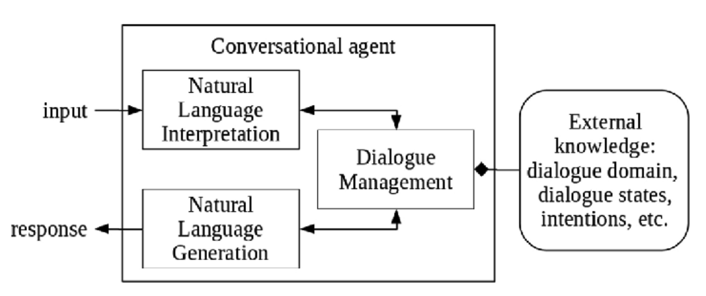

# Lecture 12

## Conversational agents

- A request-response interaction (like HTTP)
- Requests follow natural language structures
- Responses also follow natural language structures

### Types

- **Rule based**: agents answer questions based on some rules on which it is trained on. The rules defined can be very simple to very complex
- **AI based**: agents come with their own brains and ability to continuously learn on their own based on the conversations they had in the past. They are implemented using deep learning algorithms and natural language processing techniques

### Overview

## Alexa

- **Alexa** is an intelligent personal assistant developed by Amazon
- It is capable of 
	- Voice interaction
	- Music playback
	- Making to-do lists
	- Setting alarms
	- Streaming podcasts
	- Playing audiobooks
	- Providing weather, traffic, and other real time information, such as news
- Alexa can also control several smart devices using itself as a home automation system

### Skills

- Alexa skills are like apps
- Skills can be enabled and disabled through the Alexa app
- Skills are voice-driven Alexa capabilities
- Alexa Skills Kit (ASK) is a collection of self-service APIs, tools, documentation, and code samples
- ASK can be used to
	- Create a skill
	- Define intents
	- Define slots
	- Connect to a program

### Intents and slots

- Intents: actions that the user wants the system to perform
- Slots: possible types of actions
- Sample utterances: a set of likely spoken phrases mapped to intents

## Building skills

1) Goal
2) Set up the skill
3) Build the interaction model
	- Developer console
	- JSON for the interaction model
4) Write and test the code for you skill

### Amazon developer portal

1) Go to [Amazon Developer Portal](https://developer.amazon.com/alexa/console/ask?exa). In the top-right corner of the screen, click the "sign in" button. (Create an account if you don't have one)
2) Once signed in, navigate to the "developer console" menu and select the "skill" link
3) From the **Alexa Skills Console**, select the "create skill" near the top-right of the list of your Alexa skills
4) Give your new skill a name
5) Select the "custom" model button to add it to your skill, and select the "create skill" button
6) Choose "start from scratch"

- Building a skill has two parts
	- An interface
	- Skill service (backend)
- Use intents and entities to train the model by writing different utterances
- Use sample Alexa projects
	1) Choose `hello-world` repository
	2) Go to the "models" and choose `en-US.json` (which is the interaction model)
	3) Click  "save model"
	4) Click "build model"

### Setting up a lambda function with AWS

1) Sign into the [AWS console](https://aws/amazon.com)
2) Click "services" at the top of the screen, and type "lambda" in the search box
3) Check your AWS region and verify it is "US East (N. Virginia)"
4) Click the orange "create function" button
5) Click the radio button in the box title "serverless application"
6) Search for the application repository name `hello-world`
7) Click the "deploy" button at the bottom of the page
8) A banner should appear at the top saying "application successfully deployed"

### Testing your skill

#### Interface

- Go back [Amazon developer portal](https://developer.amazon.com/alexa/console/ask?exa) and select your skill from the list
- Access the **Alexa simulator**, by selecting the "test" link from the top navigation
- Enabling testing by activating the "test is disabled for this skill" slider
- Invoke your skill from the **Alexa simulator**
- Type "open" followed by the invocation name of your skill

#### AWS lambda test event

1) Enter an utterance in the service simulator, and copy the generated lambda request (JSON input)
2) Open your lambda function in AWS, open -> open the "actions" menu -> select "configure test events"
3) Select "create new test event". Choose "Alexa start session" as the event template from the dropdown list
4) Type in an **event name** into the corresponding field. Delete the contents of the code editor and past the lambda request from earlier
5) Click the "create" button -> click the "test" button

- The response is listed in "execution results"
- It shows a summary of stats for the request and any log outputs (from `console.log()` statements)