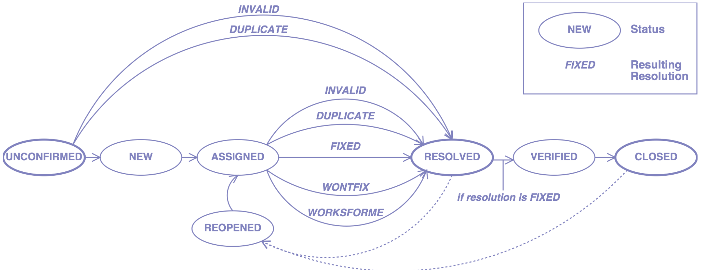
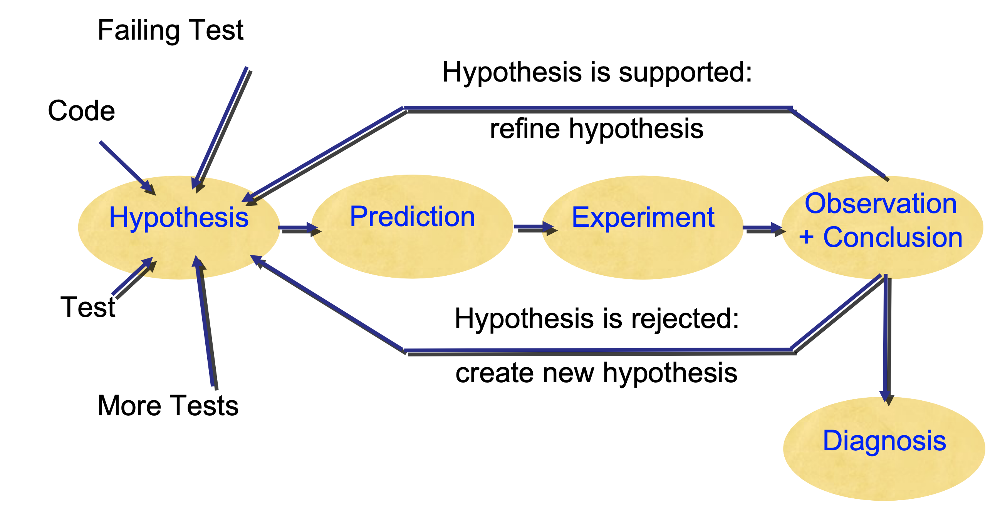

# Lecture 13

## Bug life cycle

- The user informs the vendor about some problem
- The vendor/developer
	1) Reproduces the problem
	2) Isolates the circumstances
	3) Locates and fixes the defect
	4) Delivers the fix to the user

### Developer challenges

- How do I organize this lifecycle?
- Which problems are currently open?
- Which are the most severe problems?
- Did similar problems occur in the past?

### User challenges


### Problem reports

- A problem comes to life with a problem report
- A problem report includes all the information the vendor needs to fix the problem
- Also known as change request or bug report

#### Product release

- Typically, some version number or otherwise unique identifier
- Required to reproduce the exact version

```
Perfect Publishing Program 1.1 (Build 7E47)
```

- Generalize: does the problem occur only in this release?

#### Operating environment

- Typically, version information about the operating system
- Can be simple ("Windows 11") or complex ("Debian Linux 'Sarge' with the following packages...")
- Generalize: in which environments does the problem occur?

#### Problem history

- Steps needed to reproduce the problem
- If the problem cannot be reproduced, it is unlikely to be fixed
- Simplify: which steps are relevant?

#### Expected and experience behavior

- What should have happened according to the user?
- Reality check: what's the understanding of the user?
- The *symptoms* of the problem -- in contrast to the *expected* behavior

```
The program crashed with the following information

*** STACK DUMP OF CRASH (LemonyOS)

Back chain  ISA  Caller
00000000    SPC  0BA8E574
03EADF80    SPC  0B742428
03EADF30    SPC  0B50FDDC  PrintThePage+072FC
SnicketPC unmapped memory exception at
		0B512BD0 PrintThePage+05F50
```

#### A one-line summary

> Captures the essential of the problem

#### Things to avoid

- Humor
- Sarcasm
- Attacks

## Classifying problems

### Severity

- **Enhancement**: a desired feature
- **Trivial**: cosmetic problem
- **Minor**: problem with easy workaround
- **Normal**: "standard" problem
- **Major**: major loss of function
- **Critical**: crashes, loss of data or memory
- **Showstopper**: blocks development

### Priority

- Every new problem gets a *priority*
- The higher the priority, the sooner the problem will be addressed
- Priority is independent of severity
- Prioritizing problems is the main tool to control development and problem solving

### Identifier

- Every new problem gets an *identifier*
- The identifier is used in all documents during the debugging process

```
Subject: PR #3427 is fixed?
```

### Comments

- Every developer can attach comments to a problem

> I have a patch for this. It's just an uninitialized variable but I still need a review

- Comments may also includes files, documents, etc.

### Notification

- Developers can attach an email address to a problem report
- They will be notified every time the report changes
- Users can do so, too

## The problem lifecycle



- **Unconfirmed**: the problem report has just been entered into the database
- **New**: the report is *valid* and not a *duplicate*
- **Assigned**: the problem is assigned to a developer
- **Resolution**
	- `FIXED`: the problem is fixed
	- `INVALID`: the problem is not a problem
	- `DUPLICATE`: the problem already exists
	- `WONTFIX`: will never be fixed (for instance, because the problem is a feature)
	- `WORKSFORME`: could not be reproduced
- **Resolved**: the problem report has been processed
- **Verified problem**: the problem is fixed; the fix has been successful
- **Closed problem**: a new version with the fix has been released
- **Reopened problem**: oops -- here we go again :(

## Debugging

### Scientific debugging



### Automated observation

| **WHAT** to observe | **WHEN** to observe | **WHAT** to expect |
| --- | --- | --- |
| State checked in assertion | Location of assertion | Checked property of program state |

### Assertions

```C
if (divisor == 0) {
	printf("Division by zero!");
	abort();
}
```

```C
assert(divisor != 0)
```

### Implementation

```C
void assert (int x) {
	if (!x) {
		printf("Assertion failed!\n");
		abort();
	}
}
```

### Ensuring sanity

```C++
class Time {
public:
	int hour();        // 0..23
	int minutes();     // 0..59
	int seconds();     // 0..60 (incl. leap seconds)

	void set_hour(int h);
}
```

> Any time from `00:00:00` to `23:59:60` is valid

```C++
void Time::set_hour(int h) {
	// precondition
	assert (0 <= hour() && hour() <= 23);
	assert (0 <= minutes() && minutes() <= 59);
	assert (0 <= seconds() && seconds() <= 60);
	...
	// postcondition
	assert (0 <= hour() && hour() <= 23);
	assert (0 <= minutes() && minutes() <= 59);
	assert (0 <= seconds() && seconds() <= 60);
}
```

### Locating infections

- Precondition failure = infection *before* method
- Postcondition failure = infection *within* method
- All assertions pass = no infection

```C++
void Time::set_hour(int h) {
	assert (sane()); // precondition
	...
	assert (sane()); // postcondition
}
```

### Relative debugging

- Rather than checking a spec, we can also compare against a *reference* run
	- The environment has changed (ports or new interpreters)
	- The code has changed
	- The program has been reimplemented

### Relative assertions

- We compare tho program runs
- A relative assertion compares variable values across the two runs

```Java
assert \ p1::perimeter@polygon.java:65 == \ p0::perimeter@polygon.java:65
```

- Specifies when and what to compare

## Debuggers

- Let you "take over" a program and run it under more control than usual
- Command line and visual debuggers are both popular and widely used
- Major features
	- Single step through a program line at a time
	- Inspect memory locations/values
	- Set breakpoints -- places to stop execution (can be conditional)
	- Set watchpoints -- events to watch for in execution
	- Change values in memory
	- Can also "run a program backwards"

### How it works?

- Records a trace of the entire execution history
- Events recorded in a strict order and assigned timestamps
- Every variable has a know value (possibly "not-yet-set") at every timestamp and everything in the debugger window is always updated to show the proper data every time you revert the debugger to a different time
- Slows down programs by a factor of 10
- Records about 100 MB/s
- Now available in commercial tools

### "Why did" questions

- Takes the dynamic slice of the variable
- Follow at most two dependencies
- If programmer wants, follow dependencies transitively

> What did `s = 2` in line 15?

```C
n = read(); // n = 2
a = read(); // a = 0
x = 1;
b = a + x;
a = a + 1;
i = 1;
s = 0;
while (i <= n) {
	if (b > 0) {
		if (a > 1) {
			x = 2;
		}
	}
	s = s + x;
	i = i + 1;
}
write(s); // Because s = 1 and i = 2
```

### "Why didn't" questions

- Follow back control dependencies to closest controlling statement(s)
- Do a "why did" question on each
- Again, follow at most two dependencies