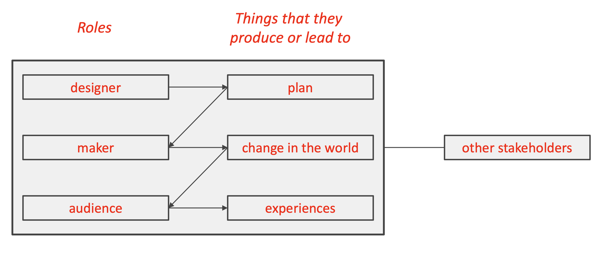

# Lecture 3

## Design Roles

| Roles | Things that they produce or lead to |
| ----- | ----------------------------------- |
| Designer | Plan |
| Maker | Change in the world |
| Audience | Experiences |

> Stakeholders = audience + other stakeholders

## Design fields

- Engineering fields
    - Architecture design
    - Chip design
    - Car design
- Experience fields
    - Graphic design
    - Fashion design
    - Game design
    - Product design
- Societal fields
    - Urban design
    - Interior design
- Arts
    - Writing
    - Painting
    - Sculpting
    - Music composition

> It is more about "levels of design"