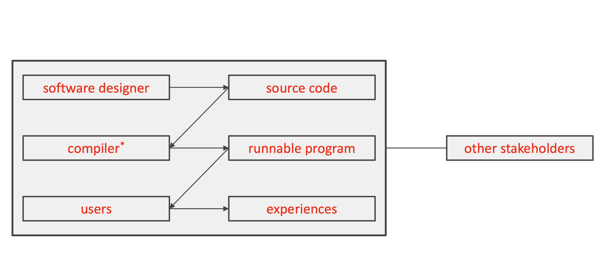

# Lecture 4

## Defining *software* design

| Roles | Things or products they lead to |
| ----- | ------------------------------- |
| Software designer | Source code |
| Compiler | Runnable program |
| Users | Experiences |

## Challenges of software design

### Nature of software

- Complexity: software is among the most complex people-made artifacts
- Conformity: software has no laws of nature that simplify its existence; rather, it lives in a world of designed artifacts to which it must conform
    - It must consider the imperfect world where it lives, to perform the perfect tasks it is created to do
- Changeability: software is subject to continuous pressure to change
- Invisibility: because the reality of software is not embedded into space, it is inherently not visualizable

### Nature of people

- Diversity: people differ in how they experience the world
- Indiscernibility: experiences are distinctly mental in nature, with tangible reactions and signs not always matching the actual experience
- Familiarity: people tend to be risk averse, sticking to role, organizational, and societal norms and values
- Volatility: with every new exposure, people reinterpret and modify their opinions and expectations