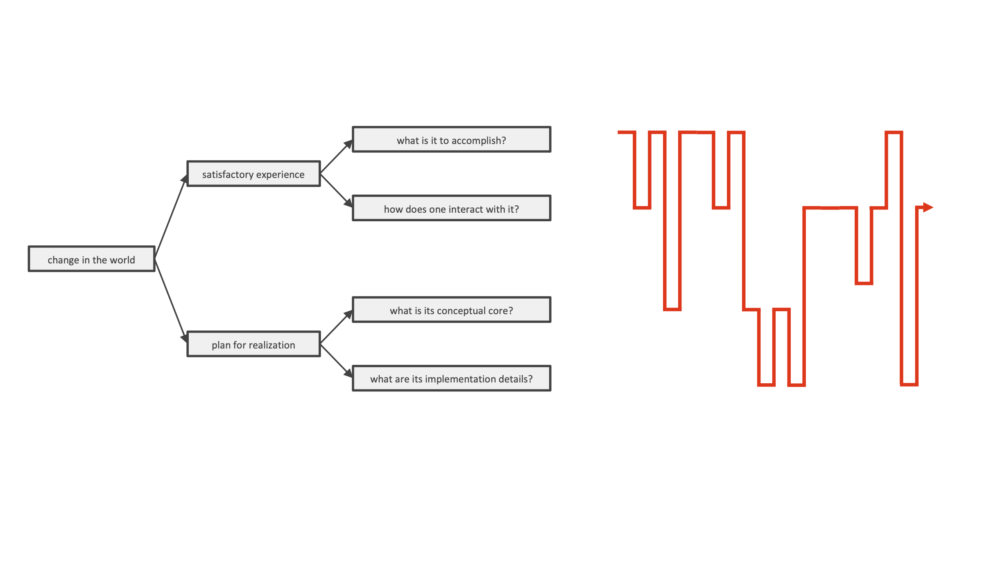
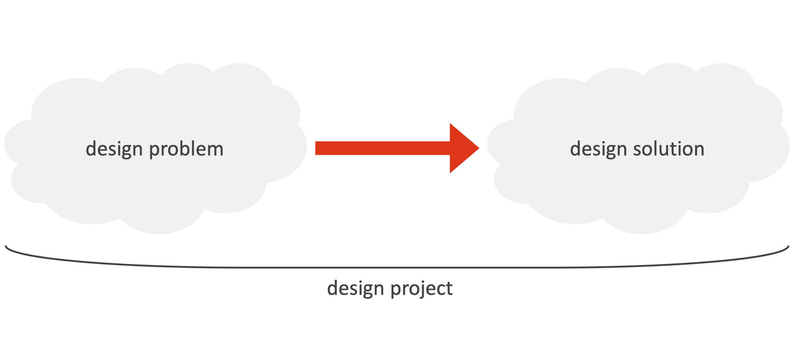

# Lecture 24

## Questions answered by this course

- What is (software) design?
- How to engage in good software design?
- What are the habits of professional software designers?

> To decide upon a plan for a novel change in the world that, when realized, satisfies stakeholders

## From software life cycles to design methods

> Which set of design methods is appropriate to use, when, to successfully complete a design project?

## Summary

- Understand all of the design activities that take place in software engineering
- Significant shift to this kind of overall approach to software development (innovation, creativity, design)
- If you just pick up one method, at one moment in time, and it helps you, that would be an important result
- Design methods are much more broadly applicable than the specific "box" in which they are placed

> You start **thinking like expert designers do** and reflect upon your own practice in terms of what is known about expert design behavior