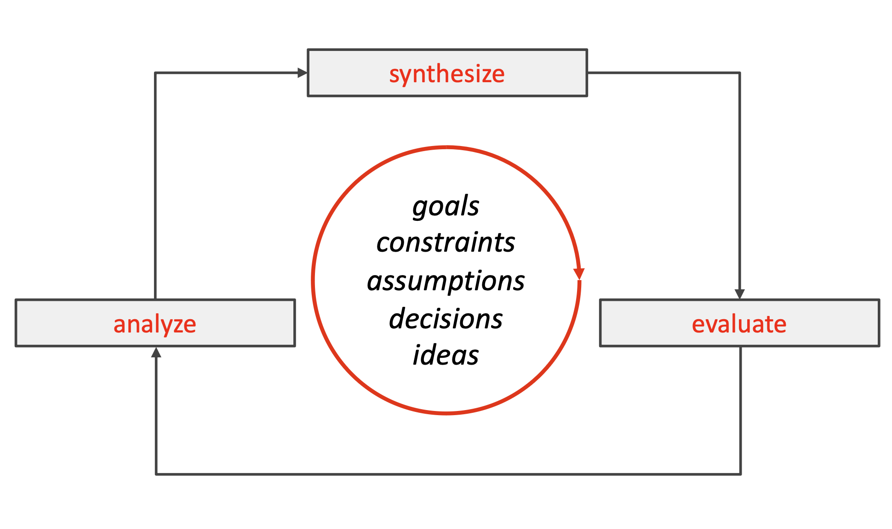

# Lecture 8

## Expert behaviors

### Focus on the essence

- Figure out what the hard part first
- Focus efforts to solve this part first
- Makes solving other parts easier

### Prefer solutions that you know work

- Take inspiration from other places
- Don't be afraid to use resources available to you
- If no such resource exist, create it

### Address knowledge deficiencies

- Figure out what you do not know
- Leaving gaps in knowledge makes building software difficult

### Generate alternatives

- Generate ideas
- Iterate and evolve from them

### Be skeptical

- Synthesize ideas
- Evaluate outcomes
- Analyze progress

## The design cycle

### Goals

> A goal represents an explicit acknowledgement of a desired result that the eventual design solution must achieve

- Goals may be suggests by any of the stakeholders
    - Clients
    - Other stakeholders
    - Audience
    - Designer
- Goals change over time, and may or may not be (partially) addressed by the current state of the design solution

### Constraints

> A constraint represents an explicit acknowledgement of a condition that restricts the design project

- Constraints may be suggested by any of the stakeholders
    - Client
    - Other stakeholders
    - Audience
    - Designer
- Constraints change over time, and may or may not be (partially) met by the current state of the design project

### Assumptions

> An assumption represents a fact that is taken for granted, may or may not be true, and influences the design project

- Assumptions may be made by any of the stakeholders
    - Client
    - Other stakeholders
    - Audience
    - Designer
- Assumptions change over time, and may or may not be (partially) fulfilled by the current state of the design project

### Decisions

> A decision represents a specific choice of how to further the design solution, typically after some amount of consideration

- Decisions are the sole responsibility of the designer, though they can be (heavily) influenced by other stakeholders
- Decisions change over time, and new decisions may or may not (partially) align with the current state of the design project

### Ideas

> An idea represents a thought or opinion, ranging from highly unformed to fully formed, that potentially shapes the design solution

- Ideas typically are the sole responsibility of the designer, though they may be inspired by many different sources
- Ideas change over time, and new ideas may or may not (partially) align with the current state of the design project