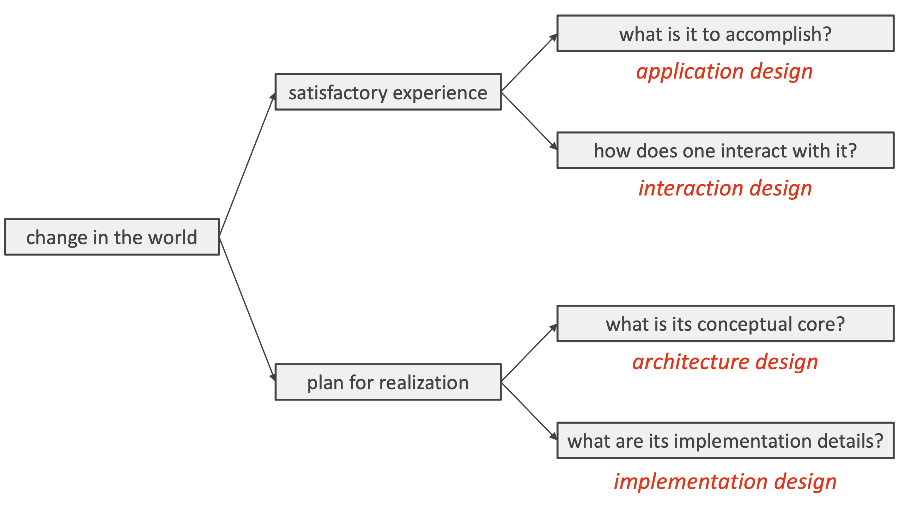

# Lecture 9

## Feasibility and desirability

- Feasibility: can we actually make that change in the world?
- Desirability: will people be happy with the change?

> We want to design things that are both feasible and desirable

- Desirable designs
    - What is it to accomplish?
    - How does one interact with it?
- Feasible designs
    - What is its conceptual core?
    - What are its implementation details?

## 4 types of software design

