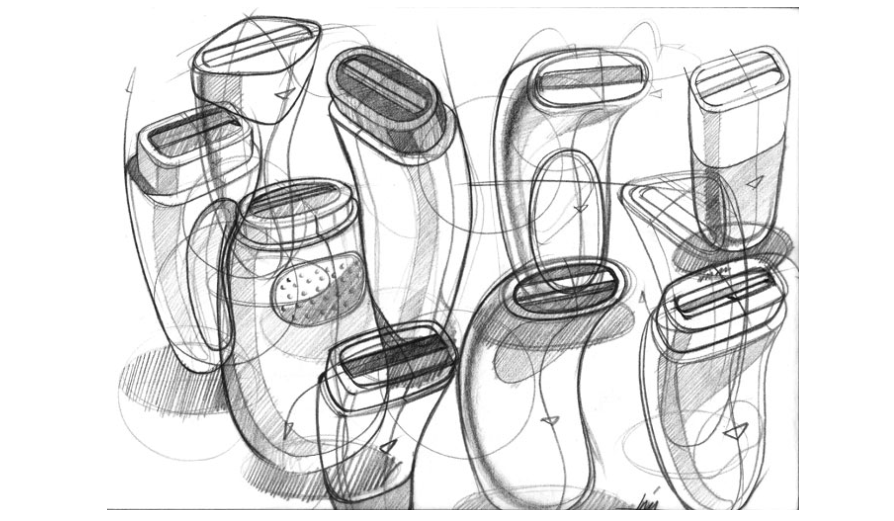
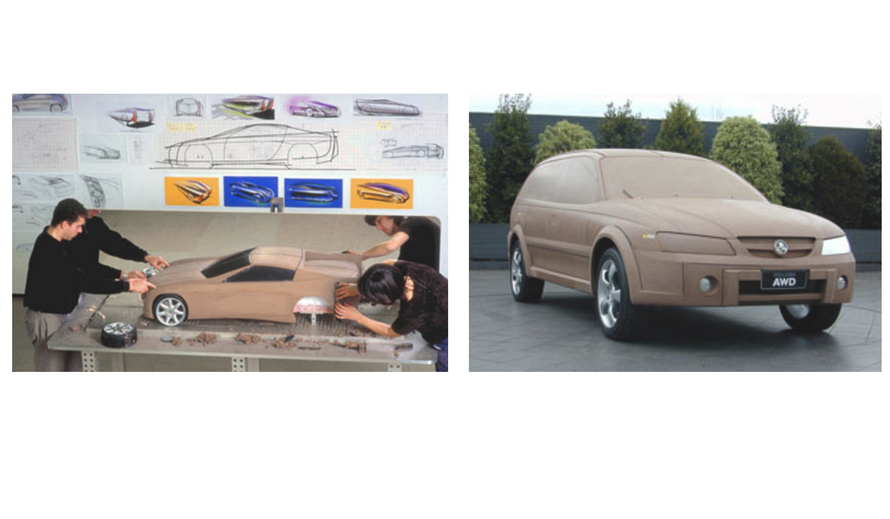
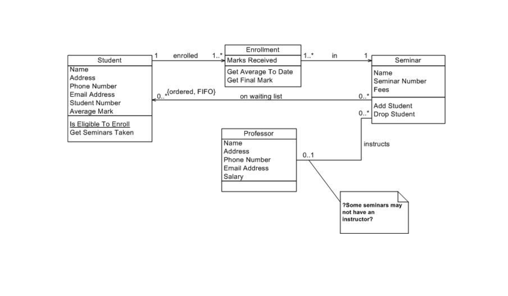

# Lecture 10

## Design artifacts

> An externalized representation used to further a design project

- Represents goals, constraints, assumptions, ideas, decisions
- Depicts design problems, solutions, or both
- Can be partial or complete
- Can be fluid or frozen

## Purpose of design artifacts

- Design artifacts to *think*
    - Sketches
    - Wireframes
- Design artifacts to *talk*
    - Prototypes
    - Scale models
- Design artifacts to *prescribe*
    - Blueprints
    - Product specifications