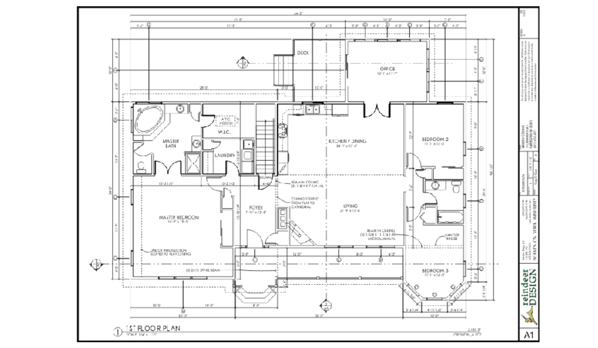
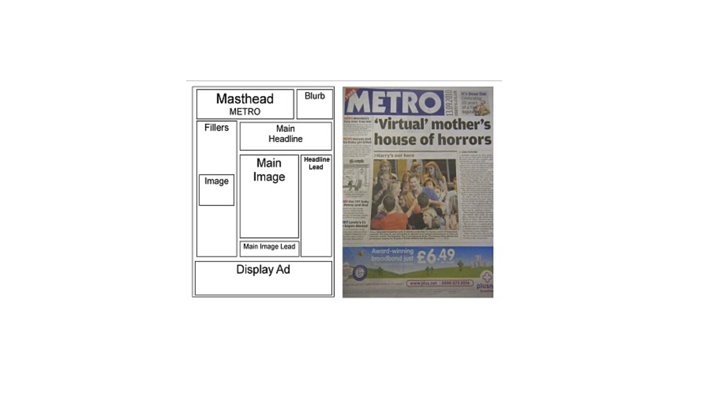
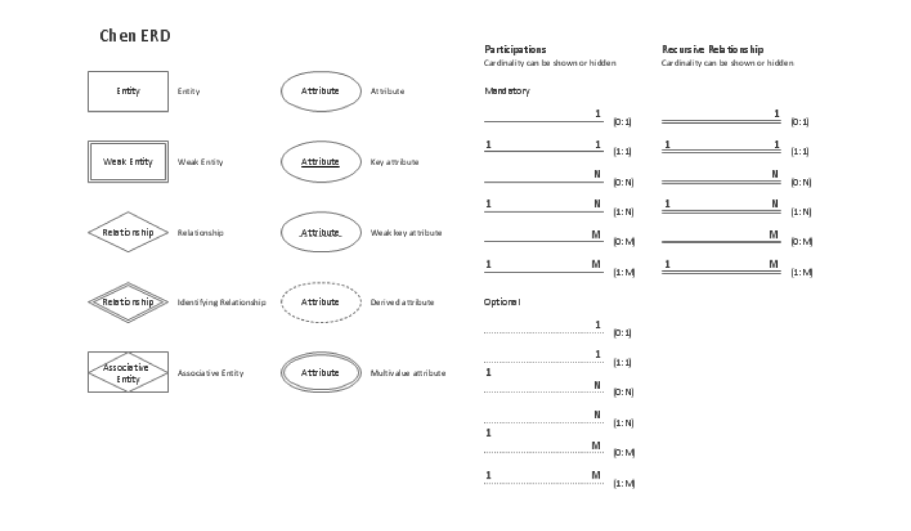
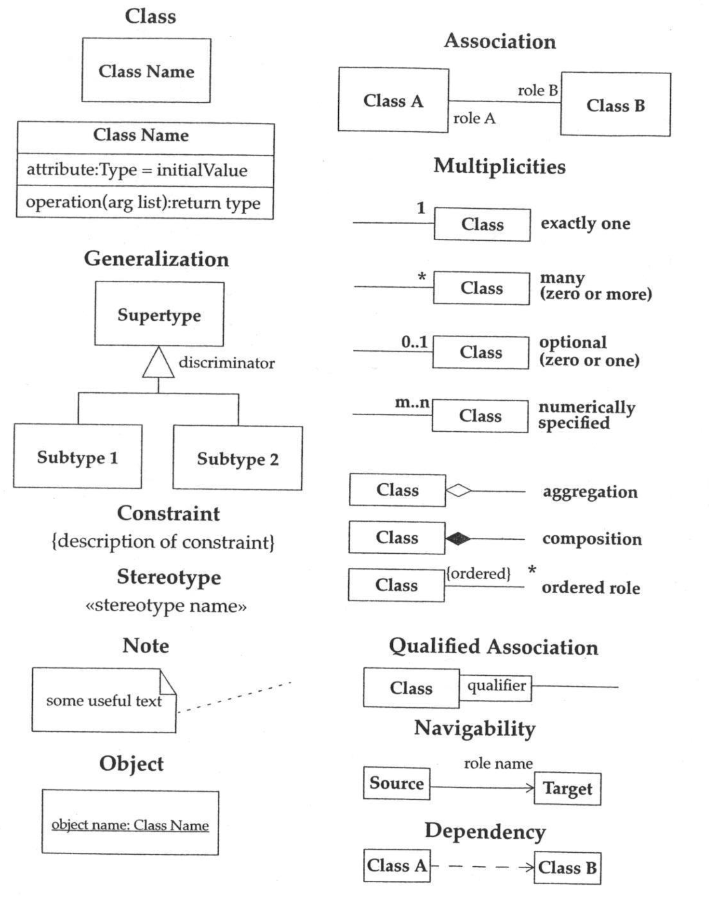

# Lecture 11

## Abstractions

- An abstraction is formed by reducing the information content of a concept or an observable phenomenon, typically to retain only information which is relevant for a particular purpose
    - Choice of what to include
    - Choice of what not to include
- Each abstraction makes some information readily available at the expense of obscuring or removing other information

- Hides away many details of the house
- Provides a top-down view of the house *only*

- Outlines structure of page
- Does not consider details of content that fill the page

## Design notations

- A design notation offers a language for specifying certain aspects of a design artifacts
    - Textual and/or graphical vocabulary for specifying individual and composite elements
    - Rules governing how individual elements can be combined into composite elements
    - Implicit and/or explicit semantics for giving meaing
- Each design notation is typically suited for a particular domain and a particular purpose
- Every design notation invariable introduces abstraction

