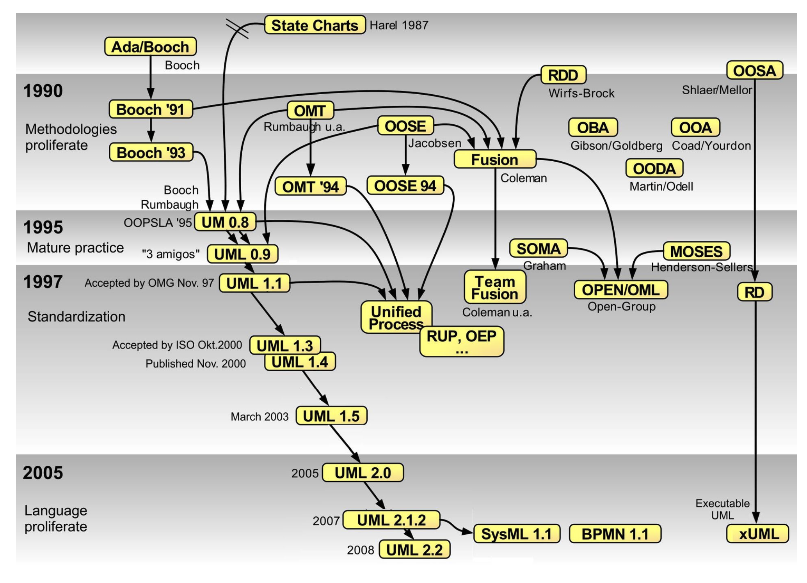

# Lecture 13

## A few more expert behaviors

### Solve simpler problems first

- Any complex problem can be broken down into simpler subproblems
- Solve the simpler subproblem first
- Add layers of complexity and adapt the solution as needed

### Draw problems as much as the solution

- Visualizing the problem helps generate solution
- Visualizing solutions helps communicate ideas

### Move among levels of abstraction

- Design around the system level
- Design around the protocol level
- Design around everything in between

### Go as deep as needed

- Unmask as match detail as needed
- Communicate with others to get feedback

### Simulate continually

- Simulate the problem throughout the design process
- Ask if the software is working before it existed

### Be alert to evidence that challenges their theory

- Ignoring warnings leads to bugs and faults
- Catch issues before they are embedded in code

### Think about what you are not designing

- What is missing from the design?
- Think that some feature may exist someday

### Invest time now to save it later

- Think hard about design now
- Save time later for adding features
- Don't invest in future features, but invest for extendibility

## Introduction to UML

### History

- Notations for
    - Thinking
    - Talking
    - Prescribing
- Software
    - Choose a notation to prescribe
    - Choose a notation to talk
    - Choose a notation to think

### Basics

- Classes represent entities in software
    - Can be just a name
    - Can include attributes and operations later
    - Generalizations help model inheritance in OOP
- Express relationship between classes
    - Associations
    - Multiplicities
    - Aggregation
    - Composition
    - Ordered role
    - Qualified association
    - Navigability
    - Dependencies