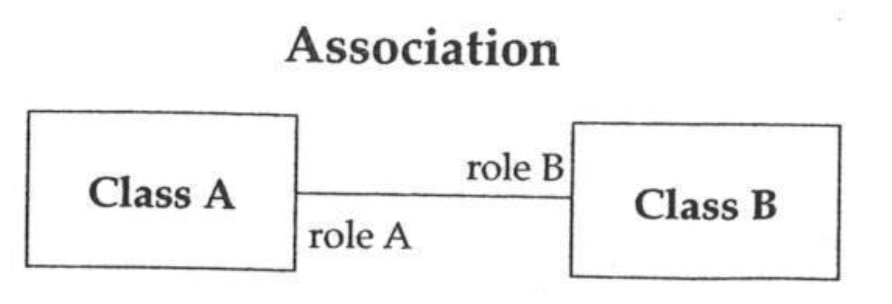
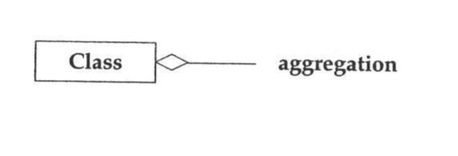
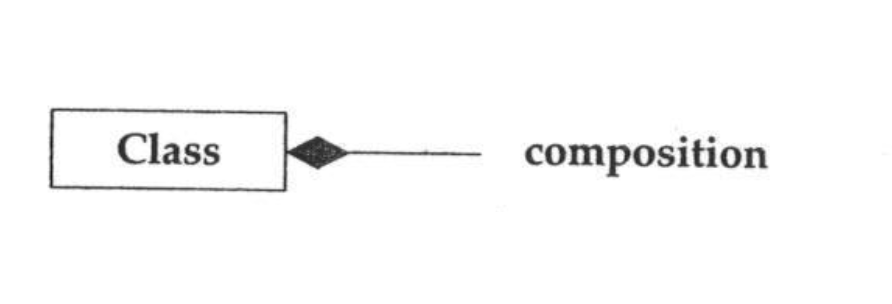

# Lecture 13

## UML association

- Most general kind of relationship

## UML aggregation

- More specific kind of relationship
- *Has-a* relationship or *is-a-part-of* relationship
- Child **can exist independently** of the parent

## UML Composition

- Even more specific kind of relationship
- *Consists-of* relationship or *contains* relationship
- Child **cannot exist independently** of the parent

