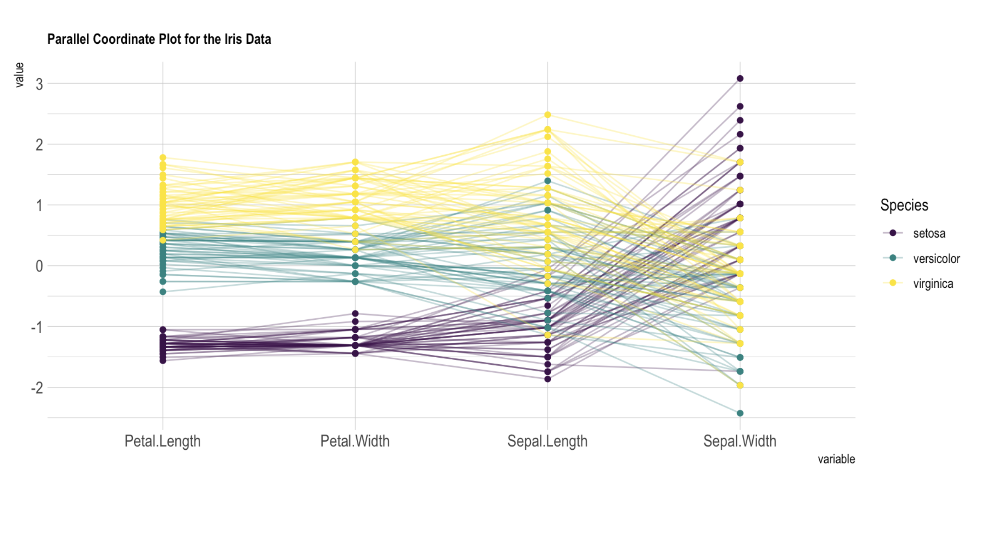

# Lecture 16

## Feature comparison

> Feature comparison is the process of conducting research to learn about the features of competing products

### Procedure

1) Identify **competitors** and their products
2) Establish **dimensions** for comparison
3) Conduct **research**
4) Analyze **results**

### Result analysis

#### Comparison matrix

#### Radar chart

#### Parallel coordinates chart

### Criteria for successful use

- Direct or indirect **access to the specifications** of the competing products
- Creation of a meaningful set of **dimensions** for comparison
- Choice of an appropriate **metric** for comparison
- **Appropriate depth of analysis**

### Strengths and weaknesses

| Strengths | Weaknesses |
| --------- | ---------- |
| Helps identify key competitors | Focuses on the present, not what competing products might look like in the (near) future |
| Creates a detailed account of competing products | Reinforces existing boundaries, perhaps stifling creativity |
| Builds an understanding of the full landscape as it exists today | *Lightweight design method* |
| *Lightweight design method* | |

## Competitive testing

> Similar to feature comparison, **but you are actually going to use the other product**

1) Identify competitors and their products and **get access to them**
2) Establish dimensions for comparison
3) Conduct research **by using the products**
4) Analyze results