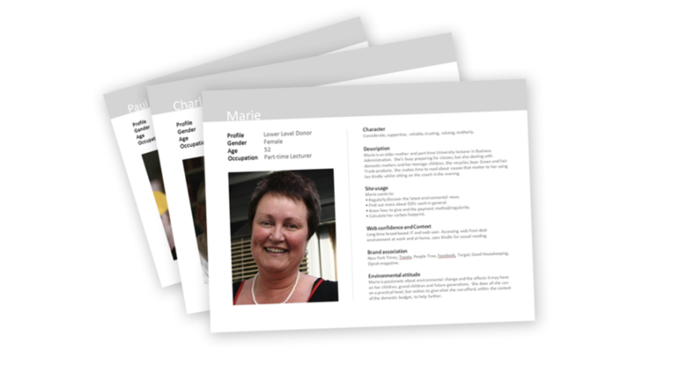
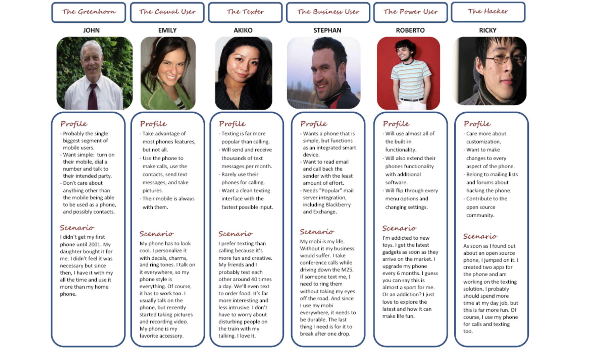

# Lecture 20

## Personas

> Personas is the process of **developing** meaningful and relatable **user profiles** that capture **common behaviors**

## Procedure

1) Collect data through field research
    - Observations
    - Interviews
    - Ethnography (lite)
2) Segment the users into archetypes
    - Organize the individual users into **groups**
        - Affinity diagramming
        - Informal clustering
    - Typically repeated multiple times to explore different user characteristics
    - **Recombine characteristics into hypothetical users** who are both representative of a larger group and different amongst each other
3) Create the personas
    - Name the archetype and associate an image
    - Briefly introduce their life situation
    - Briefly describe their goals
    - Briefly describe their characteristic behaviors
    - **Usually, between 3 and 5 personas** are created, at most one page each

### Typical notation

#### Cards

#### Table

### Criteria for successful use

- Must create personas that maximize variety
- Must be based on actual, in-depth field research
- Must **focus on key differentiating characteristics** that might influence the design project

### Strengths and weaknesses

| Strengths | Weaknesses |
| --------- | ---------- |
| Explicitly brings users into the design process | Might distance the designer from actual users and **overly focus on the personas** |
| Builds a **shared understanding of the audience among the design team members** | Might distance the designer from **atypical users** |
| Provides an **implicit test for future** design ideas | Tends to work less well for design projects involving complex work practices |
| Helps focus on essence | |