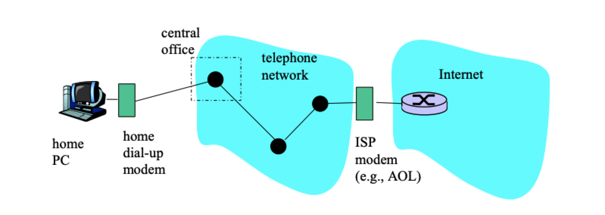
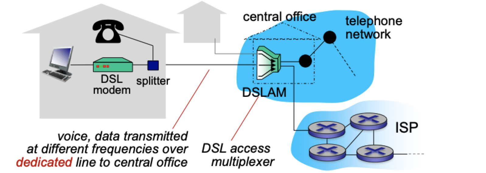
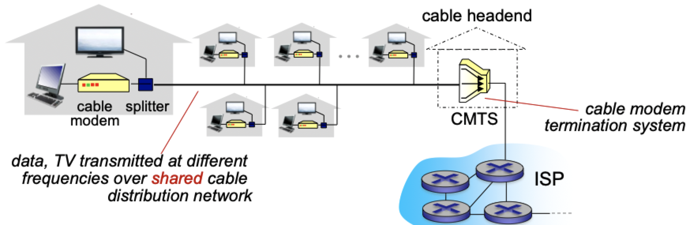
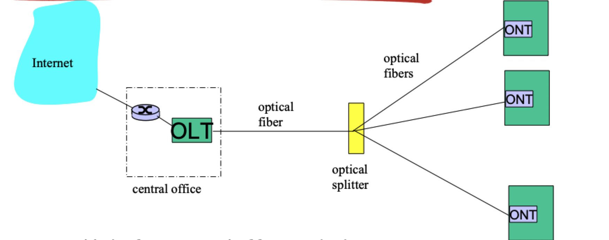
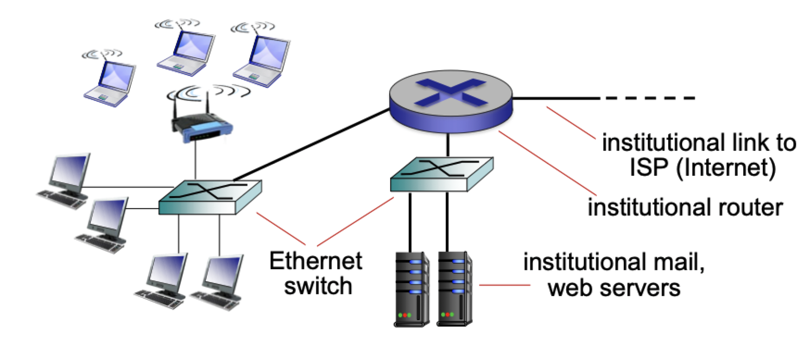
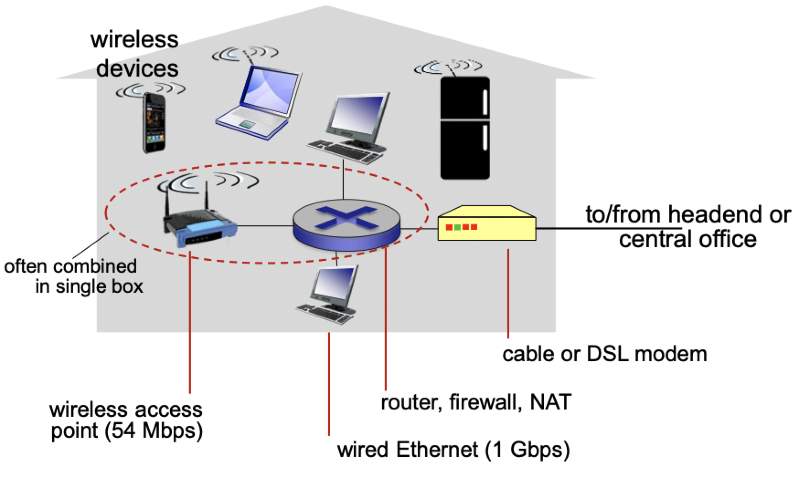
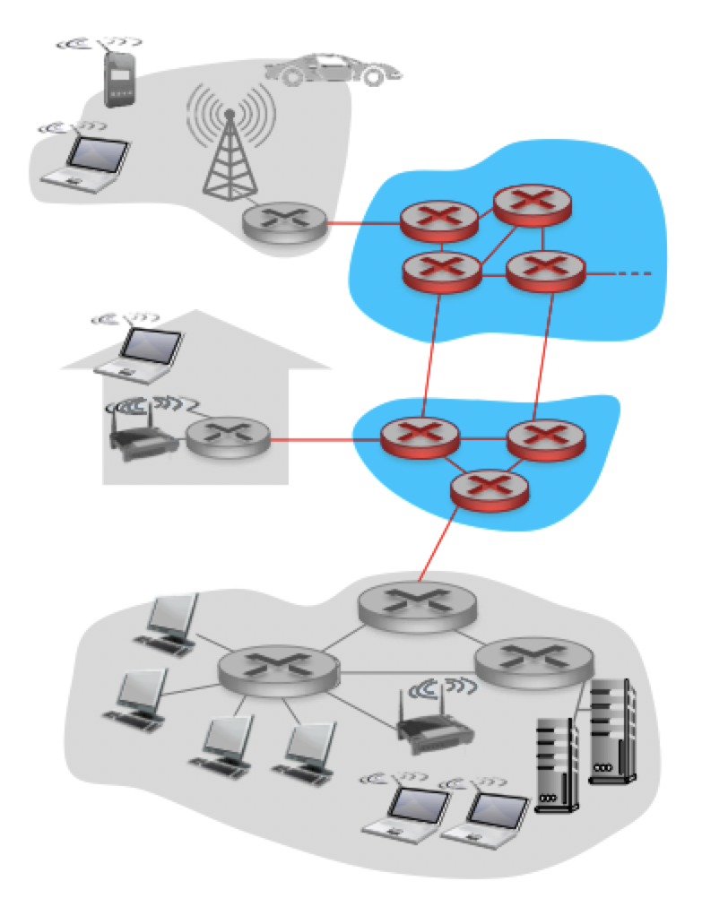
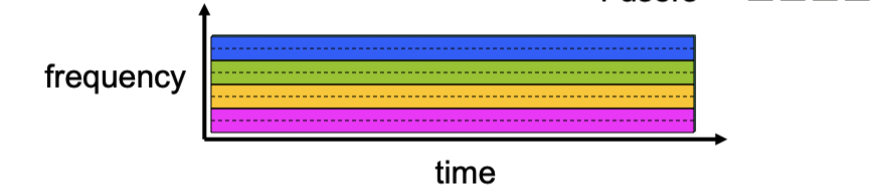
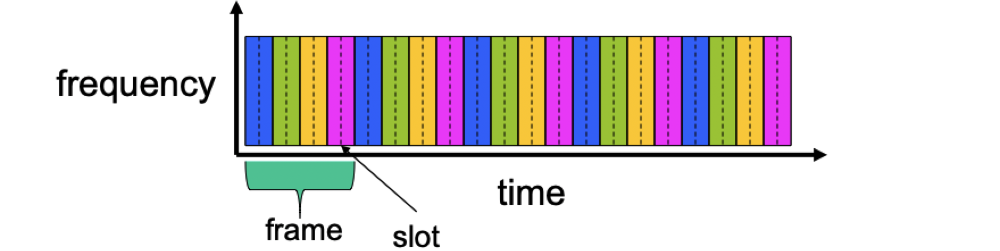
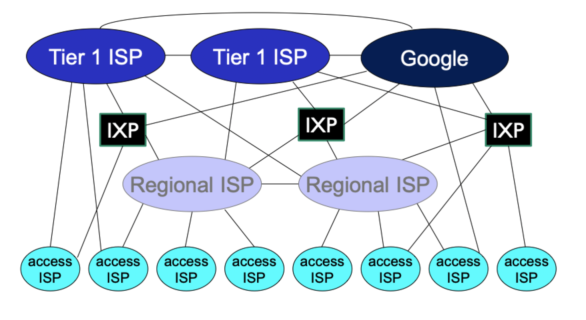

# Internet infrastructure

## Access networks

- Residential access nets
- Institutional access networks (school or company)
- Mobile access networks

### Dial-up modem

- Uses *existing* telephone infrastructure
	- Twisted pair, convert digital to analog
	- Home directly-connected to *central office*
- Less than 56 kbps direct to router
	- Data on the wire restricted to a band of about 4000Hz
	- 8000 samples/second; 8 bits. per sample (1 bit for control) = 56,000 bits/second = 56 kbps
- Couldn't surf and phone at the same time: not "**always on**"

### DSL (Digital Subscriber Line)

- Use *existing* telephone line to central office DSLAM
	- Data over DSL phone does to internet
	- Voice over DSL phone goes to telephone net
- Splitter used to overcome sharing phone and internet
	- Typically less than 1Mbps upstream
	- Typically less than 10Mbps downstream

### Cable network

- FDM: different channels transmitted in different frequency bands
- HFC: hybrid fiber coax
	- Home - (coaxial cable) -> neighborhood junction - (fiber optics) -> cable headend
	- Asymmetric: up to 30Mbps download, but only 2Mbps upload
	- Homes *share access network* to cable headend

### FTTH (Fiber to the home)

- Optical links from central office to the home
	- ONT: optical network terminator
	- OLT: optical line terminator
- Much higher rates; fiber also carries television and phone services

### Ethernet

- Computing devices only (no TV or telephone)
- Uses a wired connection to router; switches allow for multiple devices to connect
- Typically used in companies, universities, etc.
- Much faster transmission rates (Up to 10Gbps)
- End systems typically connect into ethernet switch

### Wireless

- Shared *wireless* access network connects end system to router
	- via base station or "access point"
- Wireless LANs
	- Within building (100ft)
	- 802.11 b/g/n (WiFi)
- Wide area wireless access
	- Provided by telco (cellular) operator (3G, 4G, LTE)
	- Extends tens of kilometers

## Physical media

- Bit: propagates between transmitter/receiver pairs
- Physical link: what lies between transmitter and receiver
- Guided media: signals propagate in solid media (sopper, fiber, coax)
- Unguided media: signals propagate freely (radio)
- Twisted pair: two insulated copper wires
- Coaxial cable: two concentric copper conductors (multiple channels on cable)
- Fiber optic cable
	- Glass fiber carrying light pulses, each pulse a bit
	- High speed point-to-point transmission
	- Low error rate: immune to electromagnetic noise
- Radio: signal carried in electromagnetic spectrum

## The network core

- Away from devices and access network
- Simpler, only routers and links
- Mesh of **interconnected packet switches**
	- Can be network-layer routers or link-layer switches
- Runs packet-switching
	- Hosts break application-layer messages into *packets*
	- Forward packets from one router to the next
	- Each packet transmitted at full link capacity

### Packet switching

#### Host: send *packets* of data

- Takes application message
- Breaks into *packets* of length $L$ bits
- Transmits packet into access network *transmission rate* $R$

$$
	\text{packet transmission delay} = \frac{L \text{ (bits)}}{R \text{ (bits/sec)}}
$$

#### Router: transmits the packets

- *Store and forward*: entire packet must arrive at router before it can be transmitted on next link
- *Queuing and loss*: if arrival rate (in bits) to link exceeds transmission rate of link for a period of time
	- Packet will queue, wait to be transmitted on link
	- Packets can be dropped (lost) if memory (buffer) fill up

#### Within the router

- *Routing*: determines source-destination route taken by packets
- *Forwarding*: move packets from router's input to appropriate router output
- Routing algorithm
	1) Find the shortest path to destination
	2) Extract header value
	3) Look for header value in forwarding table
	4) Decides which output link to send output

### Circuit switching

- End-to-end resources allocated to, reserved for "call" between source and destination
- Dedicated resources: no sharing
	- Circuit like (guaranteed) performance
- Circuit segment idle if not used by call
- Commonly used in traditional telephone networks

#### Multiplexing

- FDM (frequency-division multiplexing)
	- Divides frequency space
	- User use a fixed frequency band
	- Still has idle segments when not it use

- TDM (time-division multiplexing)
	- Dives by frames for $n$ users
	- Each user gets full frequency space for a set amount of time
	- Time frames advance in a fair manner (round robin)

### Packet switching vs. circuit switching

> Packet switching allows more users to use the network

- Circuit switching has a fixed number of users
- Packet switching can accommodate more users at one time

### Network structure

- On top of routers, there are **Internet Service Providers** (ISPs)
- End systems connect to internet via **access ISPs**
- The interconnection between ISPs keeps evolving
	1) Access ISPs -> a single global transit ISP
	2) Access ISPs -> multiple global transit ISPs
	3) Access ISPs -> regional ISPs -> Tier-1 (global) ISPs
	4) Access ISPs -> regional ISPs -> **Internet Exchange Points** (IXP) -> Tier-1 (global) ISPs
	5) Access ISPs -> regional ISPs -> Internet exchange points (IXP) -> Tier-1 (global) ISPs / content-provider networks
- Internet exchange point (IXP)
	- A pair of nearby ISPs can *peer*, so their networks are directly connected, and the traffic doesn't need to go to upper-layer ISPs
	- They don't need to pay the upper-layer ISPs to obtain global internet interconnectivity
	- *Settlement-free* between the peers (they don't pay to the other)
	- More than 400 IXPs nowadays
- Content-provider networks
	- *Private* network that connects its data centers ti Internet, often bypassing tier-1 and regional ISPs

