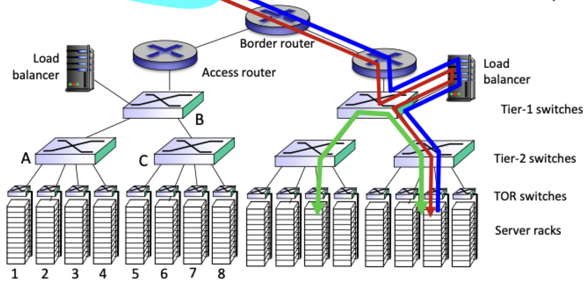

# VLAN and data centers

## VLAN

- Motivation: physical host moves, but want to connect to specific switch
- Single broadcast domain
	- All layer-2 broadcast traffic must cross entire LAN
	- Security and privacy issues emerge
- VLAN: virtual local area network
- Switches support VLAN can be configured to define multiple VLAN over a single physical LAN
	- Traffic isolation
	- Dynamic membership
	- Forwarding between VLANs
		- Via routing
		- Integrated by the switch
- Port-based LAN: switch ports grouped by switch management software
	- A single physical switch operates as multiple virtual switch

## Data center networks

- 10s - 1000s of thousands of hosts, often closely coupled
	- Ecommerce
	- Content servers
	- Search engines
- Challenges
	- Multiple applications, each serving massive numbers of client
	- Managing/balancing load, avoiding processing, networking, data bottlenecks
- Load balancing
	- Application layer routing
	- Receives external client requests
	- Directs workload within data center
	- Returns results to external clients

- Rich interconnection among switches, racks
- Increased throughput between racks (multiple routing paths possible)
- Increased reliability via redundancy

## A day in the life of a web request

- Journey down protocol stack complete!
	- Application
	- Transport
	- Network
	- Link
- Putting it all together
	- Goal: identify, review, understand protocols (at all layers) involved in seemingly simple scenario: request a webpage
	- Scenario: student attaches **laptop** to campus network, request and receives [google](https://www.google.com) homepage

### Connecting to the internet

- Connecting laptop needs to get its own IP address, address of first-hop router, address of DNS server (use DHCP)
- DHCP request *encapsulated* in UDP, *encapsulated* in IP, *encapsulated* in 802.3 ethernet
- Ethernet frame **broadcast** on LAN, received at router running DHCP server
- Ethernet *demuxed* to IP, *demuxed* to UDP, *demuxed* to DHCP
- DHCP server formulates *DHCP ACK* containing
	- Client's IP address
	- IP address of first-hop router for client
	- Name and IP address of local DNS server
- Encapsulation at DHCP server, frame forwarded (self learning) through LAN, demultiplexing at client
- DHCP client receives DHCP ACK reply
- Client now has
	- IP address
	- Knows name and address of DNS
	- IP address of its first hop router

### ARP (pre DNS and HTTP)

- Before sending *HTTP* request, need the IP address of `www.google.com`
- DNS query created, *encapsulated in UDP*, *encapsulated* in IP, *encapsulated* in ethernet
- To send frame to router, need MAC address of router interface
	- ARP query broadcast, received by router, which replies with ARP reply
	- Client now has MAC address of router interface
- Client can now send frame containing DNS query to router

### Using DNS

- IP datagram containing DNS query forwarded via LAN switch from client first-hop router
- IP datagram forwarded from campus network into Comcast network to DNS server
- Demuxed at DNS server
- DNS server replies to client with IP address of `www.google.com`

### Using TCP

- To send an HTTP request, client opens TCP socket to web server
	- TCP **SYN segment** inter-domain routed to web server
	- Web server responds with **TCP SYNACK**
- TCP connection established

### HTTP request/response

- HTTP request sent into TCP socket opened earlier
- IP datagram containing HTTP request routed to `www.google.com`
- Web server responds with HTTP response (containing the webpage)
- IP datagram containing HTTP response routed back to client
- Webpage **finally** displayed