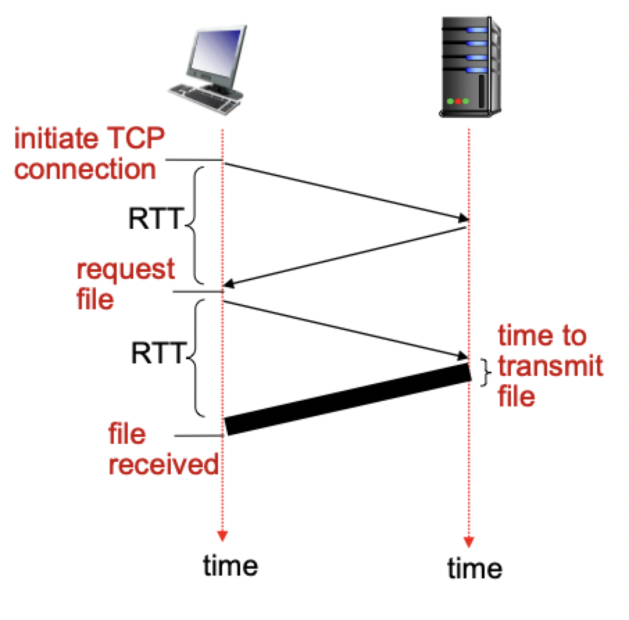
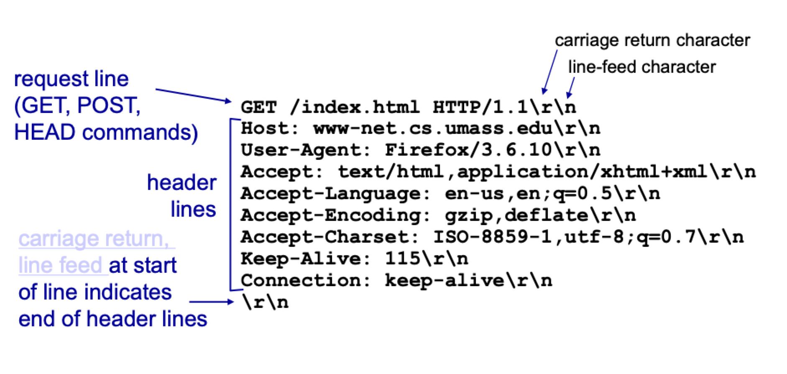
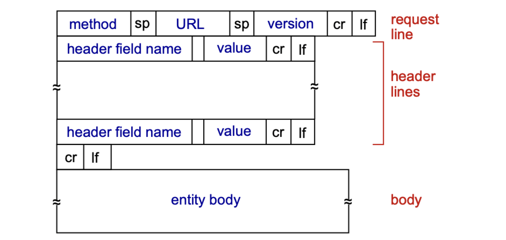
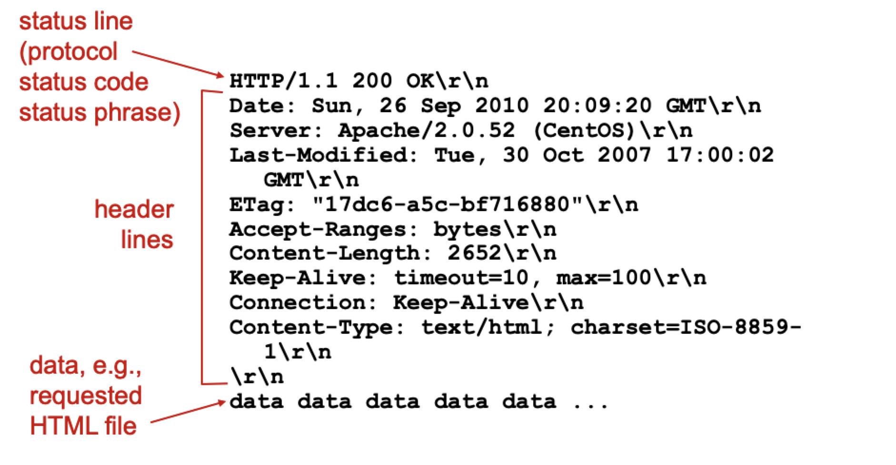
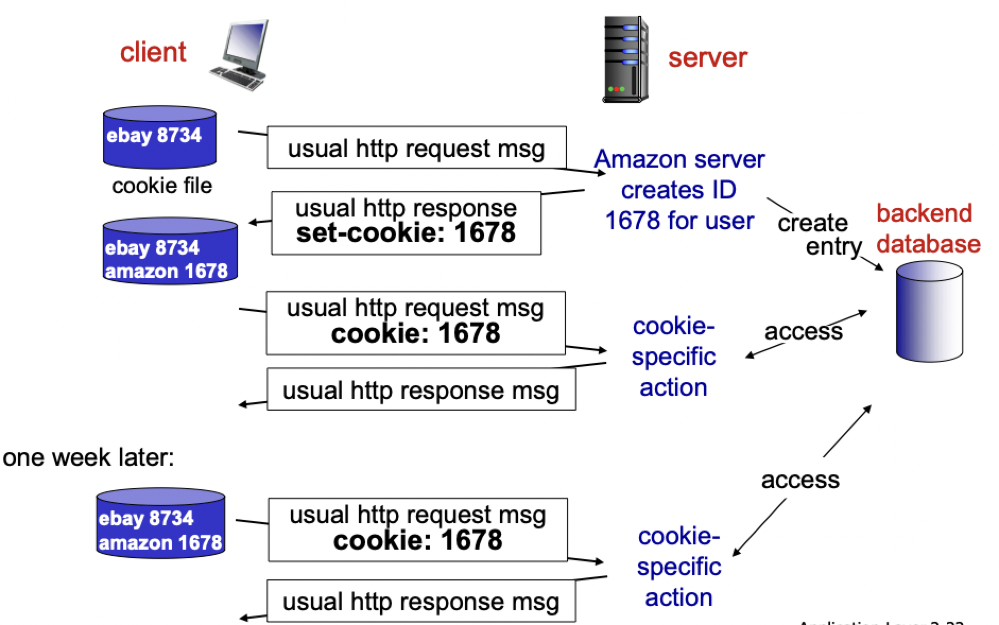

# HTTP and the web

## Web overview

- Web pages consist of *base HTML file* which includes *several referenced objects* (other HTML tags)
- Objects can be HTML files, JPEF images, Java applets, audio files and much more
- Each object is addressable by a *URL*

```
https://www.someschool.edu/somDept/pic.gif
```

| Part | Meaning |
|:----:|:-------:|
| `https` | The protocol |
| `www.someschool.edu` | Domain name |
| `/someDept/pic.gif` | Resource path |

## HTTP overview

- HTTP stands for **H**yper **T**ext **T**ransfer **P**rotocol
- It is a protocol for html based content
- Operates with the client/server model
	- Clients are typically browsers that request, receive and display web objects
	- Servers are typically web servers that send web objects as response to web requests
- Steps
	1) Client initiates a *TCP* connection to port 80 of a server
	2) Server accepts TCP connection from client
	3) HTTP messages exchanged between HTTP client and web server
	4) TCP connection is closed

## HTTP connections

- Persistent connections allow for multiple objects over a single connection
- Non-persistent connections only allow for one object and then the connection is closed

### Response times



- **Round trip time** (RTT): time for a *small* packet to travel from the client to the server and back
- HTTP response times would consist of the following
	- One RTT to initiate TCP connection
	- One RTT for HTTP request and first few bytes of HTTP response to return
	- File transmission time
- Non-persistent connections would require 2 RTTs *per* object
	- Can speed up by opening parallel TCP connections, but would incur OS overhead
- Persistent connections would require *as little as* 1 RTT for any referenced object
	- Can speed up by pipelining requests as soon as a referenced object is encountered

## HTTP requests

- Starts with a request line containing a command
- Any number of header lines is the form `key: value`
- May include a body of plaintext

### Example message



### General format



### Method types

- `GET`
	- Retrieve web content
	- Can be used to upload data in URL field of request line
- `POST`
	- Upload data through **HTML form**
- `HEAD`
	- Asks server to leave requested object out of response
- `PUT`
	- Uploads file in entity body to path specified in URL field
- `DELETE`
	- Deletes file specified in the URL field

## HTTP responses

- Starts with a status line
- Also includes header lines in the form `key: value`
- Data is the request object(s)

### Example message



### Status codes

- Some status codes include
	- `200 OK`: request succeeded, requested object is present later in the message
	- `301 Moved Permanently`: requested object moved, new location specified later in the message
	- `400 Bad Request`: request message not understood by the server
	- `404 Not Found`: request object was not found on the server
	- `505 HTTP Version Not Supported`: HTTP version is use it not compatible
- There are many more status codes that are possible, generally
	- `2XX` cods are successful
	- `4XX` are errors that are the client's fault
	- `5XX` are errors that are the server's fault

## HTTP state

> HTTP is "stateless"

### User state

- The protocol maintains *no information* about past client interactions
- Why not stateful?
	- Stateful protocols are complex
	- Extra storage overhead for history
	- Crashes could yield inconsistent states

### Keeping state

- Can be attached to HTTP request/responses
- Allow skipping of authentication and other useful information



### Web caches

> Goal: satisfy client requests **without** involving the origin server

- Browser sends all HTTP requests to a cache
- Object in cache -> cached object returned
- Object not in cache -> Cache requests its from origin server, caches it, then returns object to client
- Cache server acts as both a client and a server
	- Server for original requesting clients
	- Client to origin server
- Helps reduce response times
- Helps reduce traffic on institution to server link
- Enables "poor" content providers to effectively deliver content

### Conditional `GET`

> Goal: don't send object if cache has up-to-date cached version

- Cache specifies date of cached copy in HTTP request: `If-modified-since: <date>`
- Server response contains no object if cached copy is up-to-date: `HTTP/1.0 304 Not Modified`