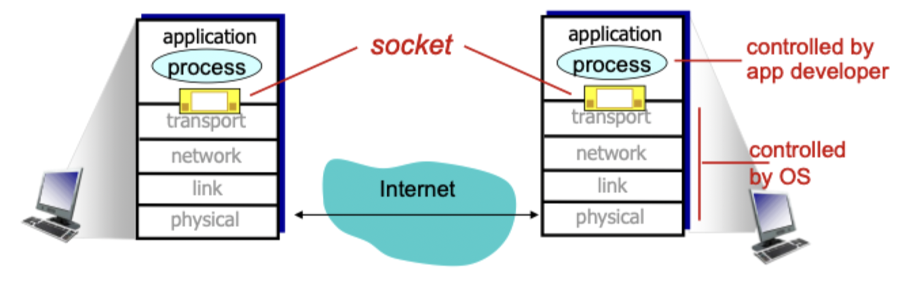

# Network application principles

## What are network apps?

- Run on (different) end systems
- Communicate over a network
- Talk through the application layer because network core devices do not run user applications

## Network application architectures

### Client-server

#### Server

- Always-on host
- Permanent IP address
- Data centers for scaling

#### Client

- Communicate with server
- Do **not** communicate directly with each other
- May have dynamic IP addresses

### P2P

- *No* always-on server
- Peers request service from other peers, provide service in return to other peers
- *Self scalability*: new peers bring new service capacity, as well as new service demands
- Peers are intermittently connected and change IP addresses

### Hybrid

#### Skype

- Voice-over-IP P2P application
- Centralized server: finding address of remote party
- Peer-2-peer connection: direct (not through server)

#### Instant messaging

- Chatting between 2 users is P2P
- Centralized service: client presence detection/location
	- Users registers its IP address with central server when it comes online
	- User contacts central server to find IP addresses of buddies

## Processes communicating

> Process: program running within a host

- Within the same host, two processes communicate using **interprocess communication** defined by the OS
- Processes in different host communicate by exchanging **messages**
- A **client process** *initiates* communication
- A **server process** *waits* to be contacted
- In a peer-to-peer system, the peer processes can be both a server and client process

### Sockets

- Process sends/receives messages to/from its socket
	- Acts as the interface between an app and the internet
	- Like a mailbox

### Addressing

- To receive messages
	- A process must have an *identifier*
	- Host device has a unique 32 bit IP address
	- This is **insufficient** as *many* processes can be running on the same host
- The *identifier* must include
	- An IP address
	- A port number

### App-layer protocols

- A protocol defines
	- Types of messages exchanged
	- Syntax of messages
	- Semantics of messages
	- Rules for when and how processes send and respond to messages
- Open protocols
	- Defined in RFCs (request for comments)
	- Allow for interoperability
- Proprietary protocols
	- Defined internally to an application, not shared
	- Only work for a specific process

## Transport service 

### Requirements

- Data integrity: application requires 100% reliable data transfer
- Timing: applications require low delay to be "effective"
- Throughput: some applications requires a minimum amount of throughput to be "effective" while others work with what they get
- Security: encryption and decryption of data

### Common apps

| Application | Data loss | Throughput | Time sensitive |
|:-----------:|:---------:|:----------:|:--------------:|
| File transfer | No loss | Elastic | No |
| Email | No loss | Elastic | No |
| Web documents | No loss | Elastic | No |
| Real-time audio | Loss tolerant | 5 kb/s - 1 mb/s | yes, 100's msec |
| Real-time video | Loss tolerant | 10 kb/s - 5 mb/s | yes, 100's msec |
| Stored audio/video | - | - | - |
| Interactive games | Loss tolerant | > 1 kb/s | yes, a few seconds |
| Text messaging | No loss | Elastic | yes, 100's msec |

### Protocols

| Application | Application layer protocol | Underlying transport protocol |
|:-----------:|:--------------------------:|:-----------------------------:|
| Email | SMTP | TCP |
| Remote terminal access | Telnet | TCP |
| Web | HTTP | TCP |
| File transfer | FTP | TCP |
| Streaming multimedia | HTTP or RTP | TCP or UDP |
| Internet telephony | SIP, RTP, or proprietary | TCP or UDP |

#### TCP service

- *Reliable transport* between sending and receiving processed
- *Flow and congestion control*: sender won't overwhelm receiver or network
- Connection oriented: setup required between client and server process
- *Does not provide* timing, minimum throughput guarantee, or strong security

#### UDP service

- *Unreliable data transfer* between sending and receiving processes
- *Does not provide* reliability, flow control, congestion control, timing, throughput guarantee, security or connection setup