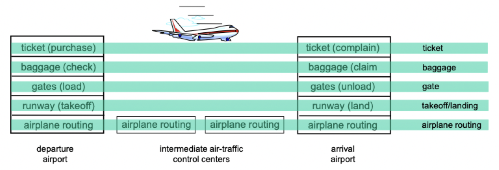
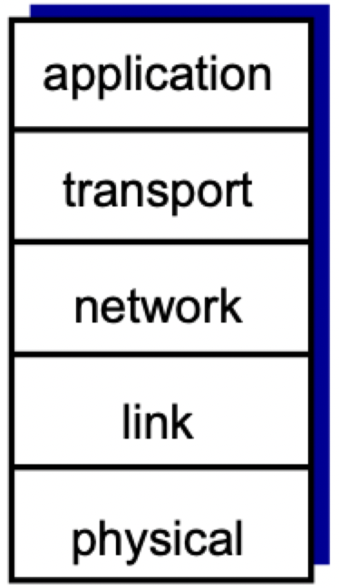
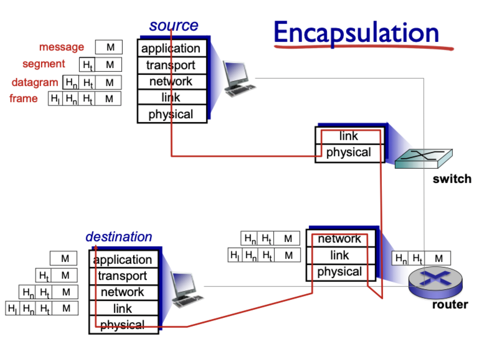

# Performance and protocols

## Delay

### Packet delay

- Defined as the time needed to transmit a packet end-to-end
- End-to-end delay is very complicated
- Instead, we can calculate nodal delay (router-to-router)
	- $d_{\text{proc}}$: processing delay -> check bit errors, determine output
	- $d_{\text{queue}}$: queueing delay -> waiting at output link for transmission
	- $d_{\text{trans}}$: transmission delay -> push all bits into link
	- $d_{\text{prop}}$: propagation delay -> move packets to next node
	- $d_{\text{nodal}} = d_{\text{proc}} + d_{\text{queue}} + d_{\text{trans}} + d_{\text{prop}}$
- Sum all all nodal delays between endpoints can estimate end-to-end delay

### Queueing delay

- $d_{\text{queue}}$ could fluctuate because
	- Packets *queue* in router's buffer
	- Get transmitted in the order they are received
- $d_{\text{queue}}$ consists of the following components
	- $R$ is the link bandwidth (bits/sec)
	- $L$ is the packet length (bits)
	- $a$ is the average arrival rate
- The following are significant values for $d_{\text{queue}} = \frac{La}{R}$
	- Queuing delay is small when the value is about $0$
	- Queuing delay is large when the value approaches $1$
	- Queuing delay is infinite when the value exceeds $1$

### Transmission delay

- $L$: the length of the packet in bits
- $R$: the link bandwidth in bits/second
- $d_{\text{trans}} = \frac{L}{R}$
- Transmission happens before propagation

### Propagation delay

- $d$: length of the physical link
- $s$: propagation speed (typically about the speed of light)
- $d_{\text{prop}} = \frac{d}{s}$

## Loss

- Queue (aka buffer) preceding link in buffer has finite capacity
- Packet arriving to a full queue are dropped (aka lost)
- Lost packets may be retransmitted by previous node, by source end system, or not at all

## Throughput

- The **throughput rate** is the rate at which bits are transferred between a sender and receiver
	- *Instantaneous* rate is given at a specific point of time
	- *Average* rate is given over a specific range of time
- The link on the end-to-end path that constrains throughput is the **bottleneck link**
	- End links tend to be the bottlenecks in throughput

## Organizing the internet

- Networks have many pieces
	- Hosts
	- Routers
	- Links of various media
	- Applications
	- Protocols
	- Hardware and software
- All these pieces make networks extremely complicated

### Airline analogy

- Use layers: each layer implements a service
- Uses its own internal-layer actions
- Rely on services provided by lower layers

### Internet protocol stack

- *Application*: supporting network applications (FTP, SMTP, HTTP)
- *Transport*: process-process data transfer (TCP, UDP)
- *Network*: routing of datagrams from source to destination (IP, routing protocols)
- *Link*: data transfer between neighboring network elements (Ethernet, 802.11, P2P)
- *Physical*: bits on the wire

### ISO/OSI reference model

- *Presentation*: allows applications to interpret meaning of data
- *Session*: synchronization, checkpointing, recovery of data exchange
- Not included in the internet protocol stack; must be implemented in the application layer *if needed*

### Encapsulation

> The internet protocol stack encapsulates the transmission and reception of data between machines on a network

