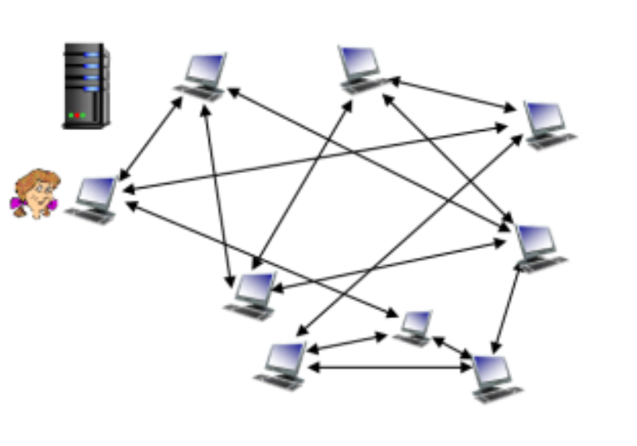
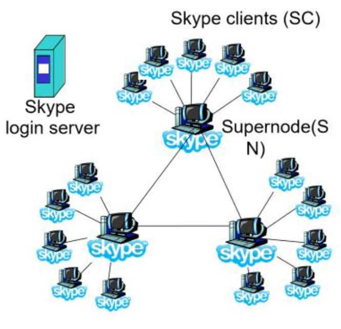
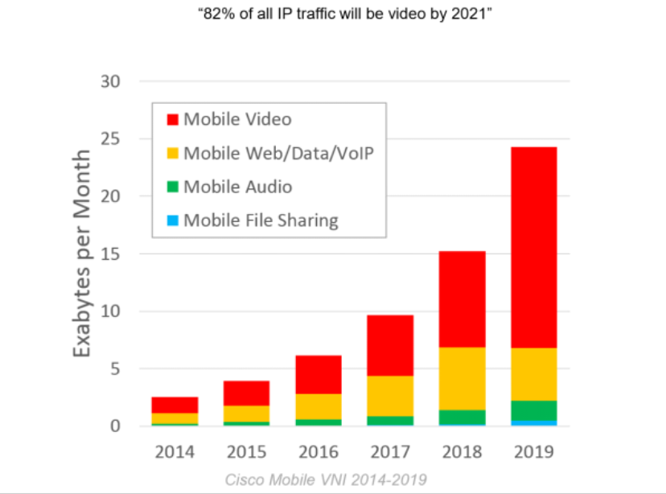

# P2P and CDN

## Peer-2-peer applications

### Pure P2P

- **No** always-on server
- Arbitrary end systems directly communicate
- A peer can be client and server at the same time
- Better scalability compared to traditional client-server architecture

### BitTorrent

#### File distribution

- Files divided into 256Kb chunks
- Peers in torrent send and receive file chunks
- Tracker (with fixed address) tracks peers participating in the torrent
- Torrent is a group of peers exchanging chunks of a file

#### Joining a torrent

- Has no chunks, but will accumulate them over time from peers
- Registers with tracker to get a list of peers, connects to subset of peers

- While downloading chunks, peer uploads chunks to other peers
- Peer may require peers with whom it exchanges chunks
- *churn*: peers may come and go
- Once a peer has the entire file
	- May leave the torrent (selfish)
	- Remain in the torrent (altruistic)

#### Requesting chunks

- At any given time, different peers have different subsets of file chunks
- Periodically peers asks each other for a list of chunks they have
- Peers request missing chunks, starting with the rarest first

#### Sending chunks

- Peers send chunks to the 4 peers currently sending chunks back *at the highest rate*
	- Other peers are chocked off
	- Re-evaluate the top 4 every 10 seconds
- Every 30 seconds, choose a random peer and start sending chunks to them

### Skype

- Inherently P2P: pairs of user communicating
- Proprietary application-layer protocol used
- Hierarchical overlay with supernodes

#### Peers as relays

> Problem: when both Alice and Bob are behind NATs

- NAT prevents an outside peer from initiating a call to inside peer
- Solution
	- Using Alice and Bob's supernodes, a *relay* is chosen
	- Each peer initiates session with a relay
	- Peers can now communicate through NATs via relays

## Content distribution

### Video traffic

#### Video streaming

- Video traffic is a major consumer of internet bandwidth
- Challenges
	- How to reach billions of users
	- How to server users with different capabilities (wired vs mobile)
- Video delivered today: distributed, application level infrastructure

#### Multimedia: video

- Video: sequence of images displayed at a constant rate (24 frames/sec)
- Digital image: array of pixels where each pixel is represented by bits
- Coding: use redundancy *within* and *between* images to decrease number of bits used to encode an image
	- Spatial (within the image)
	- Temporal (From one image to the next)
- CBR (constant bit rate): video encoded at a fixed rate
- VBR (variable bit rate): video rate changes as amount of spatial and temporal codings change

#### Streaming multimedia

> DASH: **D**ynamic **A**daptive **S**treaming over **H**TTP

- Client determines
	- *When* to request a chunk (so that buffer starvation, or overflow does not occur)
	- *What encoding rate* to request (higher quality when more bandwidth is available)
	- *Where* to request chunk (can request from URL server that is "close" to client or has high available bandwidth)

### Content distribution networks (CDNs)

> Problem: how to stream content to hundreds of thousands of *simultaneous* users?

#### Option 1: single, large "mega server"

- Single point of failure
- Point of network congestion
- Long path to distant clients
- Multiple copies of video sent over outgoing links

> Solution does **NOT** scale

#### Option 2: store distributed copies

- Enter deep: push CDN servers deep into many access networks
	- Close to users
	- Requires many servers
- Bring home: smaller number of larger clusters in POPs near (but not within) access networks
	- Fewer servers

