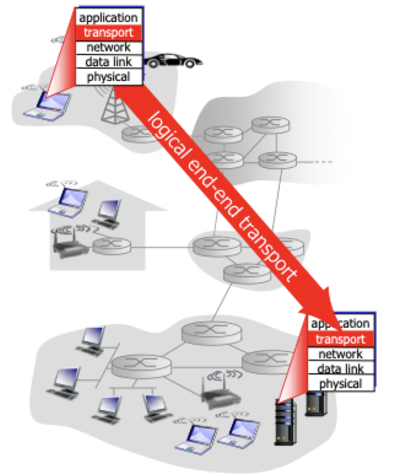
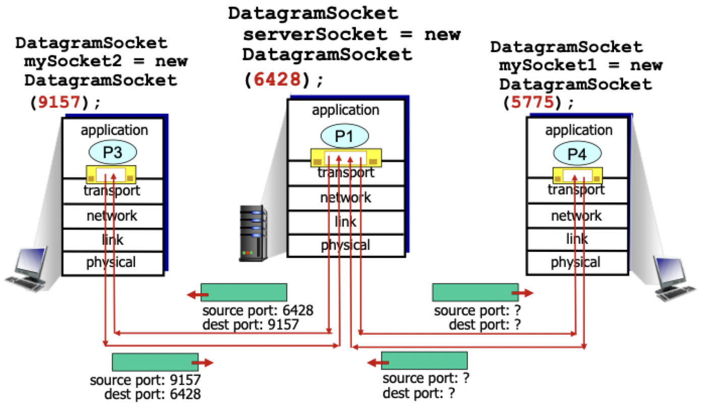
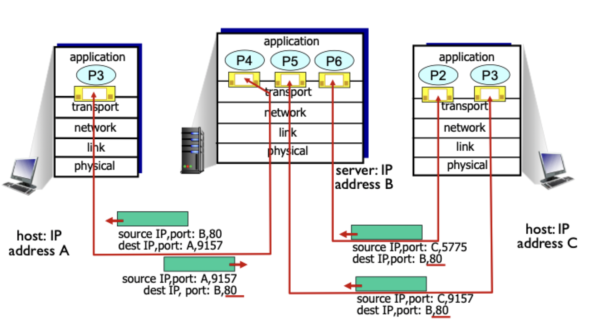

# Transport layer services

## Transport protocols

- Provide *logical communication* between **app processes** running on different hosts
- Transport protocols run in end systems
	- Send side
		1) breaks app messages into *segments* 
		2) passes to network layer
	- Receive side
		1) reassembles segments into messages
		2) passes to app layer



### Transport layer vs network layer

- Transport layer: logical communication between **processes**
- Network layer: logical communication between **hosts**
- Transport layer relies on the network layer

### Internet transport-layer protocols

- Reliable, in-order delivery (TCP)
	- Congestion control
	- Flow control
	- Connection setup
- Unreliable, unordered delivery (UDP)
	- Extension of the "best effort" IP protocol
- Services unavailable
	- Delay guarantees
	- Bandwidth guarantees

## Multiplexing and demultiplexing

- Multiplexing handles data from multiple sockets (occurs at the sender)
- Demultiplexing delivers data to correct sockets (occurs at the receiver)

### UDP demultiplexing

- Local socket has a local port number
- To send data UDP socket must specify
	- Destination IP address
	- Destination port number
- Remote receives UDP segment
	- Checks destination port number in segment
	- Directs UDP segment to socket with that port number



#### Server

- Create the server socket

```Python
serverPort = 6428 #  and knows its own IP address
serverSocket = socket(AF_INET, SOCK_DGRAM)
serverSocket.bind(('', serverPort))
print('The server is ready to receive')
```

- Read datagram from `serverSocket`

```Python
message, clientAddress = serverSocket.recvfrom(2048)
# Client address includes client IP address and port number
```

- Write reply to `serverSocket`

```Python
modifiedMessage = message.decode().upper()
serverSocket.sendto(modifiedMessage.encode(), clientAddress)
# Create response segment, use ip and port from client address
```

- Read another datagram if needed

#### Client

- Create client socket

```Python
clientSocket = socket(AF_INET, SOCK_DGRAM)
# Automatically assigns an available port on the host
```

- Create and send datagram

```Python
clientSocket.sendto(message.encode(), (serverName, serverPort))
```

- Read datagram

```Python
modifiedMessage, serverAddress = clientSocket.recvfrom(2048)
print(modifiedMessage.decode())
```

- Close client socket

```Python
clientSocket.close()
```

### TCP demultiplexing

- TCP socket identified by the following
	- Source IP address
	- Source port number
	- Destination IP address
	- Destination port number
- This allows many simultaneous TCP sockets to be uniquely identified
- Web servers have different sockets for each connecting client
	- Non-persistent HTTP will have different socket for each request



#### Server

- Create socket

```Python
serverPort = 80 # and knows its own IP address
serverSocket = socket(AF_INET, SOCK_STREAM)
serverSocket.bind(('', serverPort))
```

- Wait for incoming connections

```Python
connectionSocket, addr = serverSocket.accept()
```

- Demux to socket

```Python
sentence = connectionSocket.recv(1024).decode()
```

- Write reply

```Python
capitalizedSentence = sentence.upper()
connectionSocket.send(capitalizedSentence.encode())
```

- Repeat for another incoming connection

#### Client

- Create socket

```Python
clientSocket = socket()
```

- Establish connection

```Python
serverName = 'serverName'
serverPort = 80
clientSocket.connect((serverName, serverPort))
```

- Send data

```Python
sentence = raw_input('Input lowercase sentence')
clientSocket.send(sentence.encode())
```

- Demux response

```Python
modifiedSentence = clientSocket.recv()
print('From server:', modifiedSentence.decode())
```

- Close connection

```Python
clientSocket.close()
```

## Connectionless transport: UDP

- No "frills" or "barebones" internet transport protocol
- "Best effort" service from app's point of view
- UDP segments may be
	- Lost
	- Delivered out of order
- *Connectionless*
	- No handshaking between UDP sender and receiver
	- Each UDP segment handled independently of others
- Use case
	- Streaming multimedia apps
	- DNS
- Reliable transfer over UDP
	- Add reliability at the application layer
	- Application specific error recovery

### Segment header

- Source port number and destination port number in first 32 bits
- Length and checksum in second set of 32 bits
- Remainder of segment dedicated to payload
- UDP is useful because
	- No connection state management
	- Header size is relatively small
	- Congestion control is not present allowing data to be sent as fast as desired

### Checksums

> Goal: detect errors (flipped bits) in a transmitted segment

- Sender
	- Treat segment contents including header fields as a sequence of 16 bit integers, call it $X$
	- Checksum: addition (one's complement sum) of segment contents, computed as $f(X)$
	- Checksum value included in UDP checksum field, transmitted as $(X,\, f(X))$
- Receiver
	- Receives segment with checksum value $X', f'$
	- Compute checksum of received segment as $f(X')$
	- If $f' = f(X')$, no error detected, but does not mean segment is error free
	- If $f' \ne f(X')$, an error was detected
