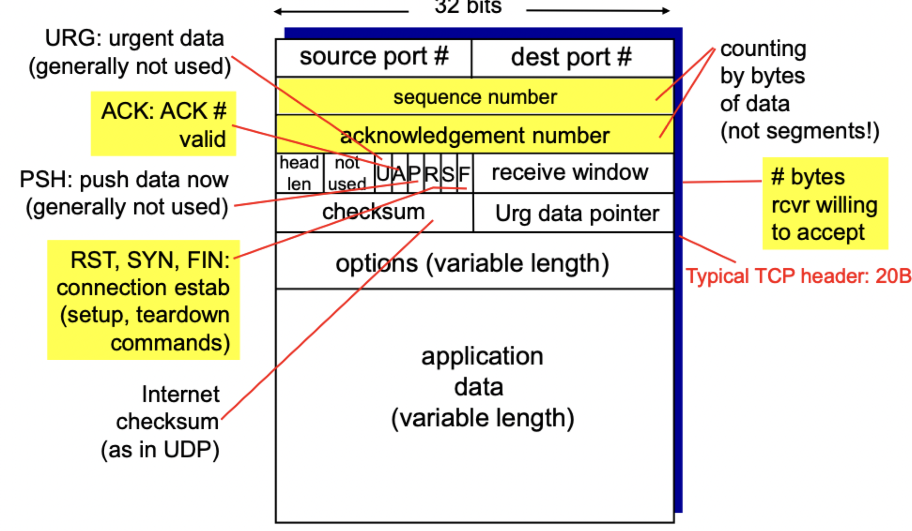
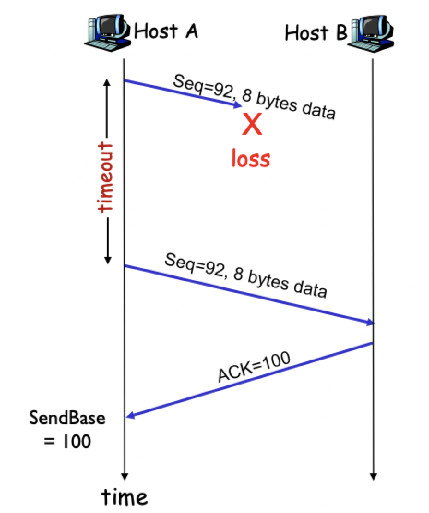
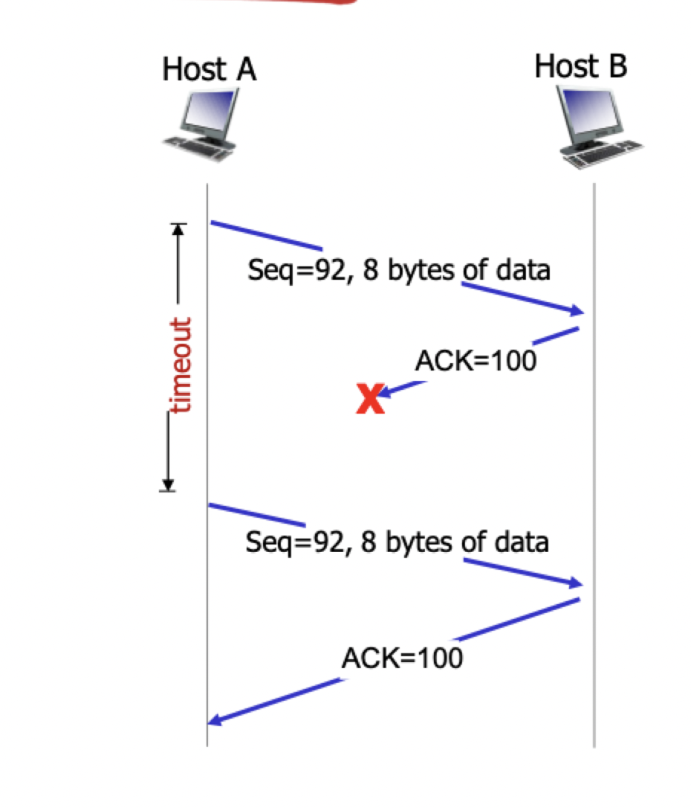
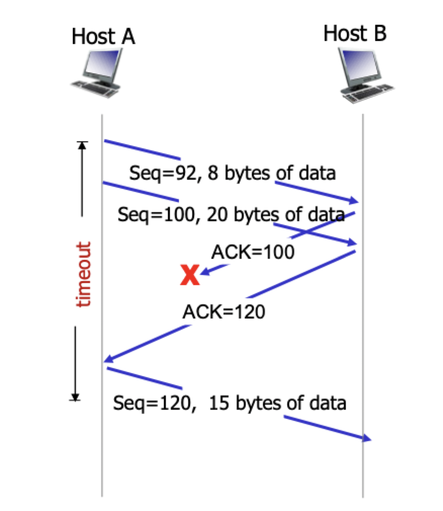
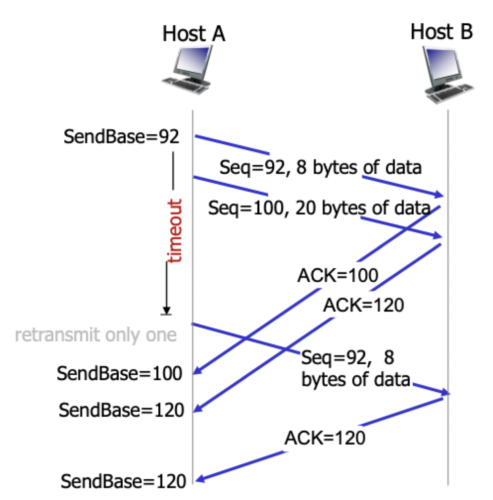
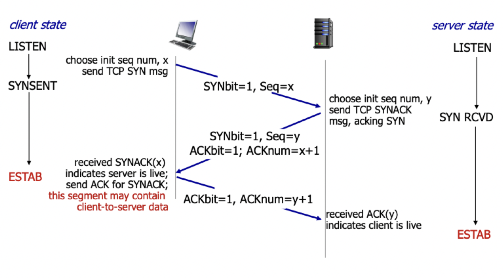
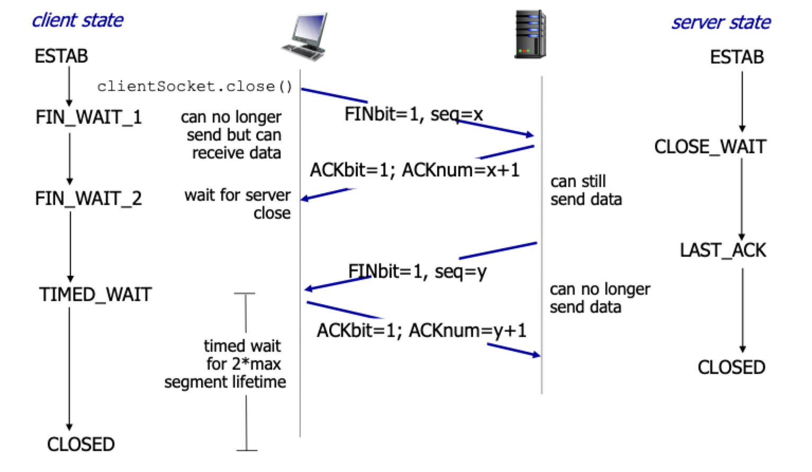

# Connection oriented transport

## TCP reliable data transfer

### Overview

- Point-to-point: one sender and one receiver
- Reliable, in-order *byte stream*
	- No "message boundaries"
- Pipelined
	- TCP congestion and flow control set window size
- Connection oriented
	- Handshaking (exchange of control messages)
	- Initializes sender and receiver states before data exchanging
- Full duplex data
	- Bi-directional data flow in same direction
	- MSS: maximum segment size
- Flow controlled
	- Sender will not overwhelm **receiver**
- Congestion control
	- Sender will not overhelm **network**

### Segment structure

- Sequence numbers
	- Byte stream "number" of **first byte of segment**'s data
	- 32-bit sequence
	- Randomly chosen upon initialization
	- One per direction
- Acknowledgements
	- Sequence numbers of **next byte expected** from other side
	- Cumulative acknowledgements
	- Missing segments typically buffered and held until the gap is filled

### Implementing RDT

- Creates a RDT service on top of IP's unreliable service
	- **Pipelined** segments
	- **Window** set by flow/congestion control
	- **Cumulative acknowledgements**
	- **Single retransmission timer**
- Retransmissions triggered by
	- Timeout events
	- Duplicate acknowledgements
- GBN or SR
	- Mostly GBN
	- Elements of SR
		- Selective retransmission
		- ACKs trigger retransmissions
		- Most receiver implementations store out-of-order packets
		- Selective ACK extension

### Retransmission scenarios

#### Lost data

#### Lost ACK

#### Cumulative ACK

#### Premature timeout

### Round trip time

- How to set TCP timeout?
	- Longer than RTT (but RTT varies)
	- *Too short*: premature timeout, unnecessary retransmission
	- *Too long*: slow reaction to lost segments
- How to estimate RTT?
	- **Sample RTT**: measured time from segment transmission until ACK receipt
	- Ignore retransmissions
	- Sample will vary, want to estimated RTT to be smoother
	- Average several *recent* measurements, not just current sample

$$
	\text{EstimatedRTT} = (1 - \alpha) * \text{EstimatedRTT} + \alpha * \text{SampleRTT}
$$

- Exponential weighted moving average
- Influence of past sample decreases exponentially fast
- Typical $\alpha = 0.125$
- **Timeout interval**: `EstimatedRTT` plus a "safety margin"
- A larger variation in `EstimatedRTT` -> larger safety margin
- Estimate `SampleRTT` deviation from `EstimatedRTT`

$$
	\text{DevRTT} = (1 - \beta) * \text{DevRTT} * \beta * \vert \text{SampleRTT} - \text{EstimatedRTT} \vert
$$

- Typical $\beta = 0.25$
- `TimeoutInterval = EstimatedRTT + 4 * DevRTT`

### Duplicate ACKs

> Rationale: time-out period is often too long

- Long delay before resending lost packet
- Detect lost segments via duplicate ACKs
- Sender often sends many segments back-to-back
- If segment is lost, there will likely be many duplicate ACKs

### Fast retransmit

- If sender receives 3 ACKs for same data, resend **one** unACKed segment with smallest sequence number
- Likely that unACKed segment lost, so don't wait for timeout
- Duplicate ACKs due to loss
	- We want to recover fast
	- Likely to receive many duplicate ACKs
- Duplicate ACKs due to **ordering**
	- We want to not react prematurely
	- If lost -> likely to receive many duplicate ACKs
	- If just reordered, next cumulative ACK will fix

## Flow control

> Receiver controls sender, so sender won't overflow receiver's buffer by transmitting too much or too fast

- Receiver "advertises" free buffer space by including `rwnd` value in TCP header of receiver-to-sender segments
	- `RcvBuffer` size set via socket options (typically 4096 by default)
	- Many OS's auto-adjust `RcvBuffer`
- Sender limits amount of unACKed data to receiver's `rwnd` value
- Guarantees receive buffer will not overflow

## Connection management

- Agree to establish a connection
- Agree on connection parameters

### Establishing

### Closing

