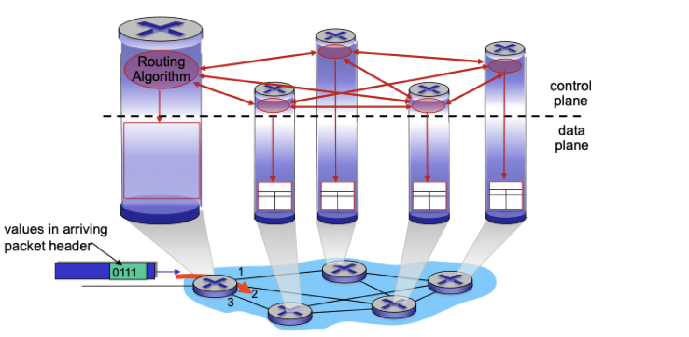
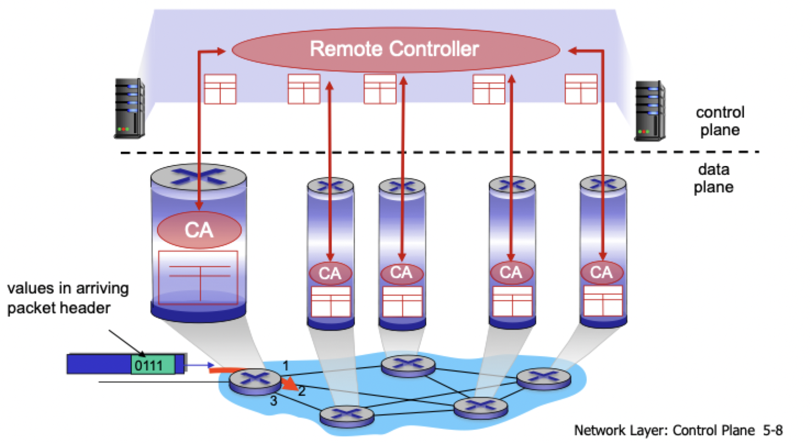
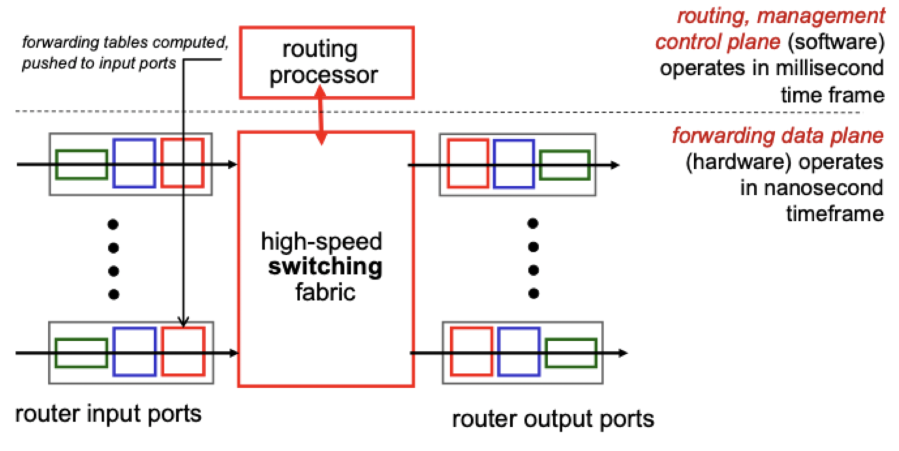
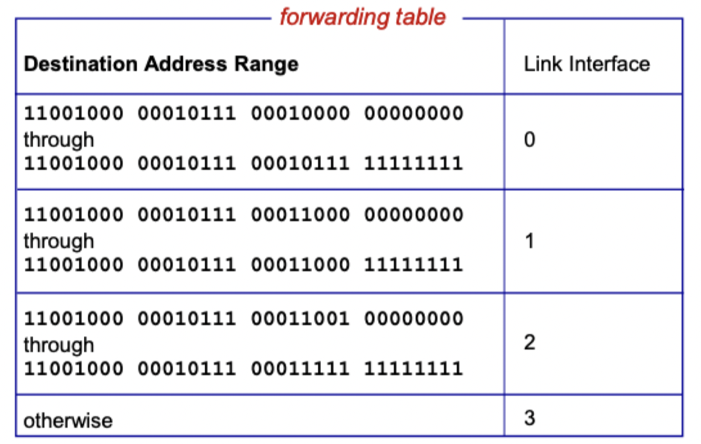
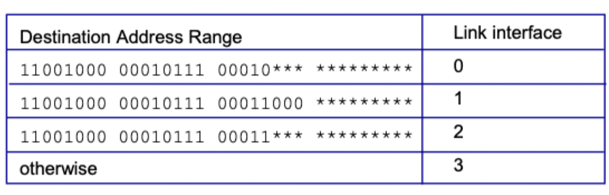
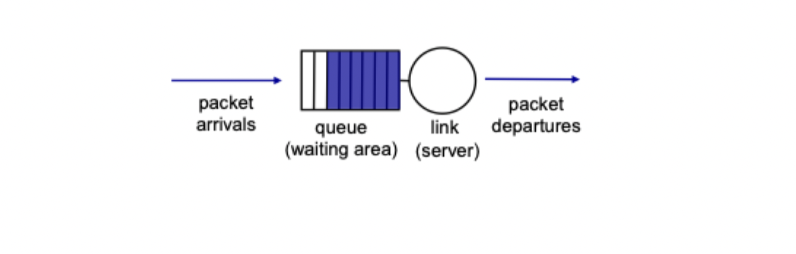
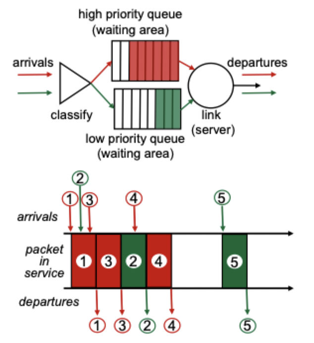
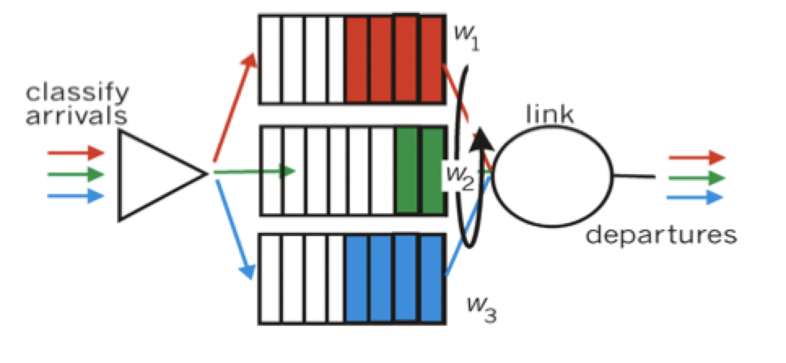

# Network layer overview

## The network layer

- Transport segment from sending to receiving host
- On sending side: encapsulates segments into datagrams
- On receiving side: deliver segments to transport layer
- Router examines header fields in all IP datagrams passing through it

### Functions

> Analogy: a trip in google maps

#### Forwarding

- Move packets from router's input to appropriate router output
- Process of getting through a single intersection

#### Routing

- Determine route taken by packets from source to destination
- Process of planning trip from source to destination

### Data plane

- Local, per-router function
- Determines how datagram arrives on router **input port** is forwarded to router **output port**
- Forwarding function

### Control plane

- Network-wide logic
- Determines how datagram is routed **among routers** along end-end path from source to destination
- Two control-plane approaches
	- Traditional routing algorithms implemented in routers
	- Software defined networking implemented in remote servers

### Service models

- IP is best effort
- No guarantees provided
- ATM have different service models to meet different guarantees
- Typically higher cost to use

#### Per-router control

> Individual routing algorithm components *in each and every router* interact in the control plane

#### Centralized control

> A distinct (typically remote) controller (e.g. SDN) interacts with local control agents (CAs)

## Inside a router

### Architecture overview

- Input ports
	- Manages its own queue
- Output ports
	- Packets out
- High-speed switching fabric
	- Routing processor
	- More specialized hardware than typical CPU
	- Data plane: operate in nanosecond time frame
	- Control plane: operate in millisecond time frame

### Input port functions

- Line termination: end of cable
- Link layer protocol (receives packets)
- Decentralized switching
	- Lookup: extract header value and lookup output link in forwarding table
	- Forwarding
		- Destination based forwarding: based only on IP address
		- Generalized forwarding: based on any set of header field values
- Line speed: input receives and output delivers at the same rate
- Queueing: arrivals faster than forwarding

### Forwarding

#### Destination based

> Destination address range maps to a specific link interface

#### Longest prefix matching

> When looking for forwarding table entry for given destination address, use *longest* address prefix that matches destination address

### Switching fabrics

- Transfer packet from input buffer to appropriate output buffer
- Switching rate: rate at which packets can be transfer from inputs to outputs
	- Often measured as multiple of input/output line rate
	- $N$ inputs: switching rate $N$ time line rate desirable
- Three types of switching fabrics
	- Memory: traditional computing to copy and push copy to output port (requires CPU intervention to copy)
	- Bus: connect input ports to output ports
	- Crossbar: organize input and output port in grid structure

#### Input port queue

- Fabric slower than input ports combined -> queueing may occur at input queues
- Queueing delay and loss due to input buffer overflow
- **Head-of-the-line blocking**: queued datagrams *at front* of queue prevents *others* in queue from moving forward

#### Output port queue

- Buffering when arrival rate via switch exceeds output line speed
- *Queueing (delay) and loss due to output port buffer overflow*
- Both depend on traffic patterns

### Output ports

1) Buffering: required when datagrams arrive from fabric faster than they depart
	- Datagrams can be dropped from buffers, due to congestion
	- *Active queue management*
2) Scheduling discipline: chooses among queued datagrams for transmission
	- Determines who gets best performance

### Scheduling policy

> Choose the next packet to send on link

#### FIFO

- Send in the order of arrival to queue
- The most commonly implemented one

#### Priority

- Send the highest priority queued packets
- Multiple *classes*, with different priorities
- Class may depend on marking or other header information

#### RR (Round Robin)

- Multiple classes
- Cyclically scan class queues, sending one packet from each class (if available)

#### WFQ (Weighted Fair Queueing)

- Generalized round robin
- Each class gets weighted amount of service in each cycle
- Queues have different weights
- Queues will get different service times