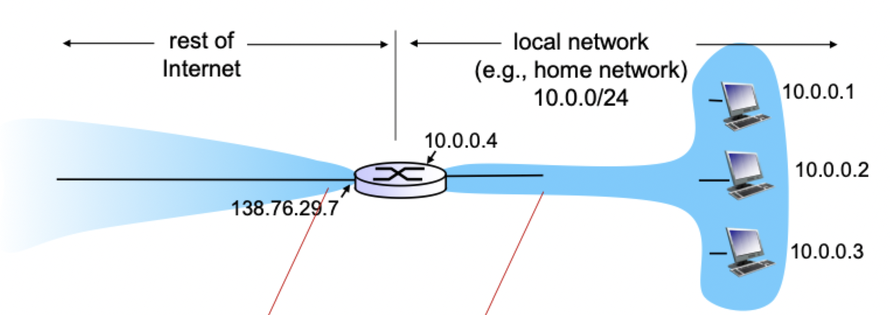
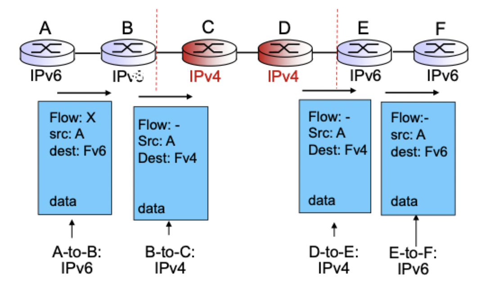
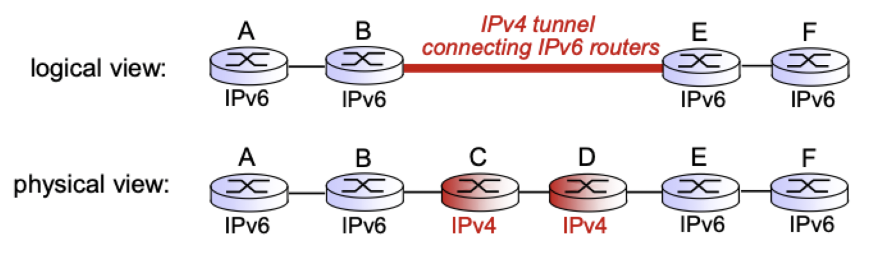

# Internet protocol (part 2)

## Network address translation

- Local network
	- Special address for private network
	- Should not leave first hub router
- Public internet
	- Router with **two** addresses
		- Local network address
		- Public address for rest of internet
- Translation
	- Change private to public address for outgoing datagrams

### Motivation

- Local network uses just one IP address as far as the outside world is concerned
- Range of addresses not needed from ISP: just one IP address for all advices
- Can change addresses of devices in local network without notifying outside world
- Can change ISP without changing addresses of devices in local network
- Devices inside local net not explicitly addressable, visible by outside world (a security plus)

### Implementation

- *Outgoing datagrams*: replace (source IP address, port number) of every outgoing datagrams to (NAT IP address, new port number)
	- Remote client/server will respond using (NAT IP address, new port number) as destination address
- *Remember* (in NAT translation table) every (source IP address, new port address) to (NAT IP address, new port number) translation pair
- *Incoming datagrams*: replace (NAT IP address, new port number) in destination fields of every incoming datagram with corresponding (source IP address, port number) stored in NAT table

### Address translation

- 16 bit port number field
	- About 60,000 simultaneous connections with a single public address
- NAT is controversial
	- Routers should only process up to layer 3
	- Address shortage should be solved by IPv6
	- Violates end-to-end argument
	- NAT possibility must be taken into account by app designer (P2P apps in particular)
	- NAT traversal: how to connect to server behind NAT

### Traversal problem

- Client wants to connect to server with address `10.0.0.1`
- Server address `10.0.0.1` local to LAN (client can't use it as destination address)
- Only one externally visible NATed address: `138.76.29.7`

#### Solution 1

- Statically configure NAT to forward incoming connection requests at given port to server
- `(138.76.29.7, 25000) -> (10.0.0.1, 25000)` always 

#### Solution 2

- Universal plug and play (PnP) internet gateway device protocol. Allows NATed hosts to
	- Learn public IP address
	- Add/remove port mappings (with lease times)
- Automatic static NAT port map configuration

#### Solution 3

- NATed client establishes connection to **relay**
- External client connects to **relay**
- **Relay** bridges packets between two connections

## IPv6

### Motivation

- The 32 bit address space is soon to be completely allocated
- Header format helps speed processing/forwarding
- Header changes to facilitate QoS

### Datagram format

- Fixed length 40 byte header
- No fragmentation allowed

- **Priority**: identify priority among datagrams in flow
- **Flow label**: identify datagrams in the same "flow" (flow is not well defined)
- **Next header**: identify upper layer protocol for data
- **Checksum**: Removed entirely to reduce processing at each hop
- **Options**: allowed, but outside of header, indicated by "next header" field
- **ICMPv6**: new ICMP (additional message types)
- Address notation
	- Written in hexadecimal
	- Broken into 8 sections
	- Each byte is two hex digits

### Transition from IPv4

- Cannot be done to all routers at the same time
- Don't want to cut service for just an upgrade
- Typically have to operate with mixed IP versions

#### Dual stack

- Have both IPv4 and IPv6 addresses
- Talk IPv4 <-> IPv4 or IPv6 <-> IPv6 
- Can convert IPv6 -> IPv4 to allow IPv4 routers to talk to IPv6 routers
- Cannot go other way because of data loss

#### Tunneling

- Treat IPv4 routers as a single link

### Adoption

- Existed for decades
- Not yet widely adopted, mobile devices are most compatible
- More application level in last 20 years

## Generalized forwarding and SDN

- Destination based forwarding
	- Central routing controller is the routing table
	- Tables pushed back to individual routers
- Each router contains a *flow table* that is computed and distributed by a locally centralized routing controller

### OpenFlow

- Match values in packet header fields
- Priority disambiguates overlapping patterns
- Expand actions to drop modify, match and send to controller
- Counter included for statistics

#### Table entries

#### Abstraction

- *Match + action*: unifies different kinds of devices
- Certain matches dictates action the router takes

| Device | Match | Action |
| ------ | ----- | ------ |
| Router | Longest destination IP prefix | Forward out a link |
| Switch | Destination MAC address | Forward or flood |
| Firewall | IP addresses and TCP/UDP port numbers | Permit or deny |
| NAT | IP address and port | Rewrite address and port |