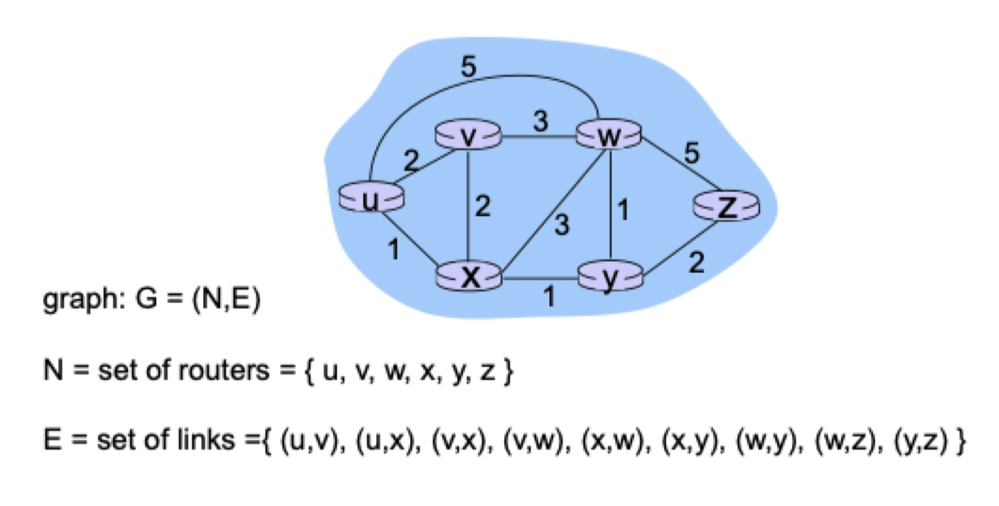
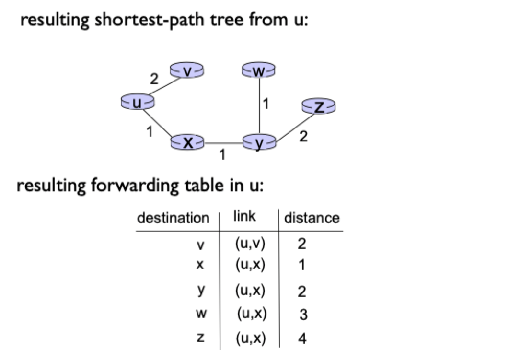
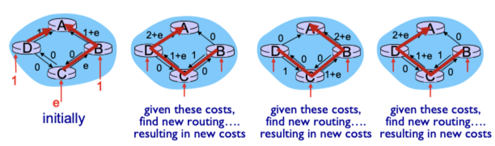

# Routing

## Routing protocols

> Routing protocol goal: determine "good" paths (equivalently, routes), from sending hosts to receiving host, through network of routers

- Path: sequence of routers packets will traverse in going from given initial source host to given final destination host
- Good: least cost, the fastest, or least congested
- Routing: a difficult networking challenge

### Graph abstractions

- Internet as a graph
	- Routers are nodes
	- Links between router's outport port to another router's input port is an edge



- Costs
	- The cost required to traverse an edge
	- Less cost is better
	- Path cost is the sum of the cost of traversing each edge
	- Cheapest path is a nontrivial problem
- Key question: what is the least-cost path between $u$ and $z$?
- Routing algorithm: algorithm that finds that least cost path

### Algorithm classification

- Global
	- All routers have complete topology link cost info
	- "link state" algorithms
- Decentralized
	- Router knows physically-connected neighbors, link costs to neighbors
	- "distance vector" algorithms
- Static
	- Routes change slowly over time
	- Caused by human intervention
- Dynamic
	- Routes change more quickly
	- Periodic updates
	- Responds to link cost changes
- Load sensitive
	- Link cost reflects the current level of congestion
	- Complex implementation
	- Today's internet routing algorithms are insensitive

## Link state algorithms

### Dijkstra's algorithm

- Centralized: network topology, link costs known
	- At controller or
	- To all nodes
		- Accomplished via "link state broadcast"
		- All nodes have the same information
- Computes least cost paths from one (source) node to all other nodes
	- Gives *forwarding table* for that node
- Iterative: after $k$ iterations, know least cost path to $k$ destinations
- Notation
	- `C(x, y)`: link cost from node $x$ to $y$. Infinite if not direct
	- `D(v)`: current value of cost of path from source to destination `v`
	- `p(v)`: predecessor node along path from source to `v`
	- $N'$: set of nodes whose least cost path is definitively known

### Implementation

```
N' = { u }
for all nodes v:
	if v adjacent to u:
		D(v) = c(u, v)
	else:
		D(v) = infinity

Loop until all nodes in N':
	find w not in N' such that D(w) is a minimum
	add w to N'
	D(v) = min(D(v), D(w) + c(w, v))
	if changed: p(v) = w
```

### Example



### Complexity

- Add all nodes to $N' \to n$
- Each iteration: find `w`
	- Check all edges from $N'$ to `w` (not in $N$): $\frac{n(n+1)}{2} = O(n^{2})$
	- More efficient implementations maintain a priority queue by `D(w)`: $O(m \log_{2}(n))$

### Oscillations

- Cost changes will lead to route changes
- Make link cost not depend on traffic
- Randomize link ads



## Distance vector algorithms

### Bellman-ford algorithms

- Let $d_{v}(t) = \text{cost of shortest path from v to t}$
- Then $d_{v}(t) = \text{min(c(v, \, w)} + d_{w}(t))$
- Enumerate the neighbors
- Compute cost from v -> w
- Compute cost from w -> t
- Recursive algorithm

### Single node operation

- `v`'s local view
	- `v` knows the cost `c(v, w)` to all neighbors `w`
	- `v` **exchanges updates** with this neighbors $d_{w}(t)$
- `v` locally computes: $d_{w}(t) = min(c(v, \, w) + d_{w}(t))$
- `v`'s forwarding table entry
	- $(t, \, w^{*}, \, d_{v}(t))$
	- $w^{*}$: the next hop after `v`, on the shortest path to `t`
	- $d_{v}(t)$: length of shortest path from `v` to `t`
- Does the same for all possible destinations $t \in N$
	- `v` maintains a **distance vector**: $d_{v} = \left[ d_{v}(t): t \in N \right]$ for all $t \in N$

### Implementation

```
For each node v:
	exchange d(v) with all neighbors
	Recompute min(c(v, w) + d(w))
	Repeate until estimate stabilize
```

### Link cost changes

- Node detects local link cost change
- Update routing info, recalculates distance vector
- if $D(v)$ changes, notify neighbors
- Good news (better routes) travel fast
- Bad news (worse routes) travels slow
	- Poisoned reverse: advertise distance as infinite so node is not reused
	- Enforce a maximum hop count
	- Maintain path states

## Link state vs distance vector

> Link state: each node broadcasts to all other nodes information about its **neighborhood**
> Distance vector: each node talks only to its neighbors and tells them its estimates of path costs to **all other destinations**

### Message complexity

- With $n$ nodes and $E$ links
- LS: $O(nE)$ messages send
- DV: exchange between neighbors varies

### Speed of convergence

- LS
	- Naive: $O(n^{2})$
	- Efficient: $O(n \log_{2}(m))$
	- Oscillations for load-dependent wieghts
- DV
	- Efficient implementation: $O(mn)$ time and $O(m + n)$ memory
	- Changes may cause routing loops

### Robustness

- LS
	-  Node can advertise incorrect **link** cost
	- Each node computes only its *known* table
	- More robust under attacks
- DV
	- DV node can advertise incorrect **path** cost
	- Each node's table used by others
	- Errors propagate through network