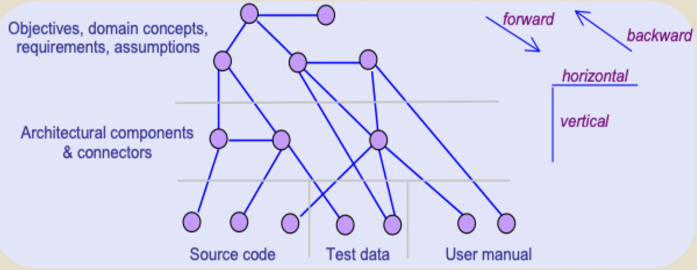
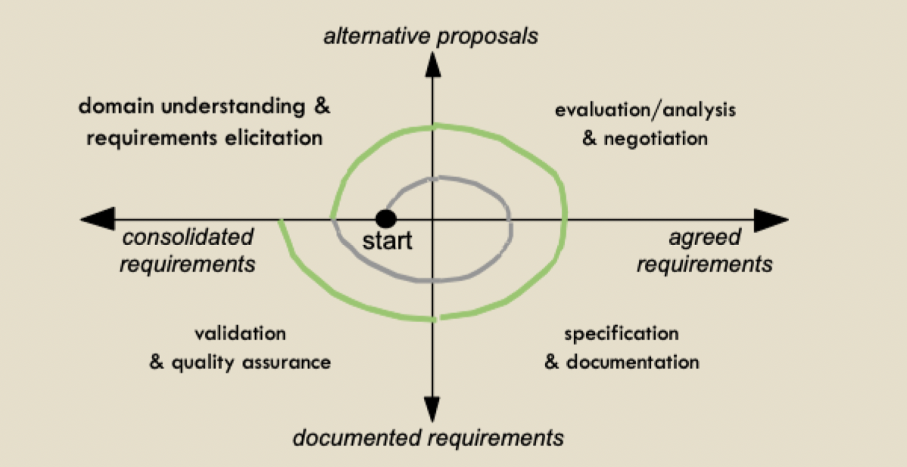

# Requirements traceability

## Preparing for change

- Why so much change?
	- The problem world keep changing
	- Stakeholder form a better understanding of the system at time goes on
- A new RE cycle
	- Facilitated by **change anticipation** and **traceability management**
- Information management problem
	- Consistency maintenance
	- Change propagation
	- Versioning
- Requirement (change) management: the process of anticipating, evaluating, agreeing on, and propagating changes in requirements documentf

### Sources of change

- Requirements errors, conflicts and inconsistencies
- Evolving customer / end-user system knowledge
- Technical, schedule or cost overruns
- Changing customer priorities
- Environmental changes
- Organizational changes

### Features, revisions, variants

- Feature: change unit
	- Functional/non-functional sets of requirements
- Feature changes yield new system version
	- Revision: to correct, improve single-product version
	- Variant: to adopt, restrict, extend multi-product version

### Analyzing likely changes

1) Group cohesive sets of requirements statements sharing same stability level and addressing same system objective
2) To identify the highest stability level: group features that will be part of **any** extension or variant of the system
3) Intentional and conceptual aspects are more stable than operational aspects and assumptions
4) Functional aspects meeting key objectives are more stable than non-functional constraints
5) Choices among alternatives options are less stable

## Traceability management for supporting requirements evolution

- An item is traceable if we can figure out
	- WHERE it comes from
	- WHAT/HOW it will be used (for)
	- WHY it is there
- Traceability management
	- Identify, document and retrieve the rationale and dependencies/impact of RD items
	- Assess impact of proposed changes
	- Easily propagate changes to maintain consistency
		- Among RD items
		- Between RD items and downstream software items

### Traceability links

- Traceability links must be identified, recorded, and retrieved
- Bidirectional: for accessibility from
	- Source to target (forward traceability)
	- Target to source (backward traceability)
- Within same phase (horizontal) or between phases (vertical)

- Backwards traceability
	- Why is this here?
	- Where does it come from?
- Forward traceability
	- Where this taken into account?
	- What are the implications of this?
- Localize and assess impact of changes along horizontal and vertical links

### Traceability management techniques

- Cross referencing
- Traceability matrices
- Feature diagrams (for variant link type)
- Traceability databases

### The TM process

1) Define traceability policy
	- What will be traced?
	- Don't trace *everything*
2) Establish links
	- What should be traced?
	- Link types
3) Exploit traceability links
	- Retrieve items
	- Rationale for something
4) Maintain links
	- Update along requirements document

## What is requirements management?

- The process of managing requirements with focus on change to the requirements for a system
- The principal concerns of requirements management
	- Managing changes to agreed requirements
	- Managing the relationships between requirements
	- Managing the dependencies between the requirements document and downstream documents produced
- Requirements cannot be managed effectively without requirements traceability

### Managing evolution

## Tools for requirements management?

- Requirements management involves the collection, storage, and maintenance of large amounts of information
- There are tools specifically for requirements management
- Other tools such as configuration management and issue tracking systems may be adapted for requirements engineering

## Change management

- Change management: procedures, processes and standards used to manage changes to requirements
- Change management policies cover
	- The change request process and the information required to process each change request
	- The process used to analyze the impact and costs of change and the associated traceability information
	- The membership of the body that formally considers change requests
	- The software support (if any) for the change control process

### Change management process

1) Change initiation
	- Submission of change request
2) Change evaluation and prioritization
	- Review of requested change
3) Change consolidation
	- Approved changes trigger a new requirements engineering cycle

### Controlling scope creep

> Scope creep: new functionality and significant changes that are presented after the project requirements have been baselined

1) Document the vision, scope, and limitations of the new system as part of the business requirements
2) Evaluate every proposed new feature against the business objectives, product vision, and project scope
3) Engage customers in thorough elicitation so as to reduce the number of requirements that are overlooked
4) Prototype to help stakeholders and developers reach a shared understanding of the system
5) Use incremental/short development cycles to provide frequent opportunities for adjustment

> Most effective: just say NO!