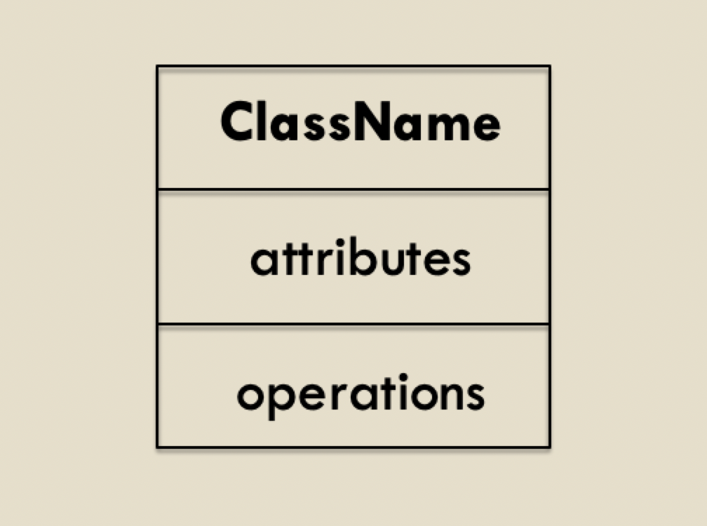
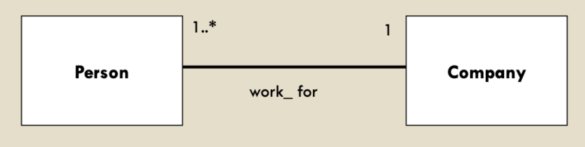
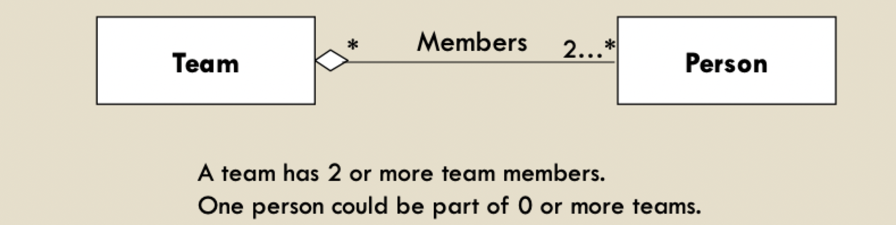
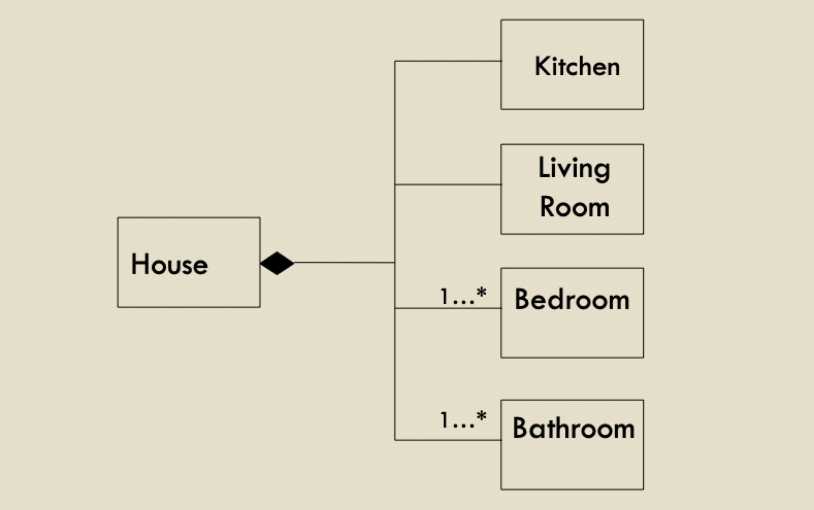
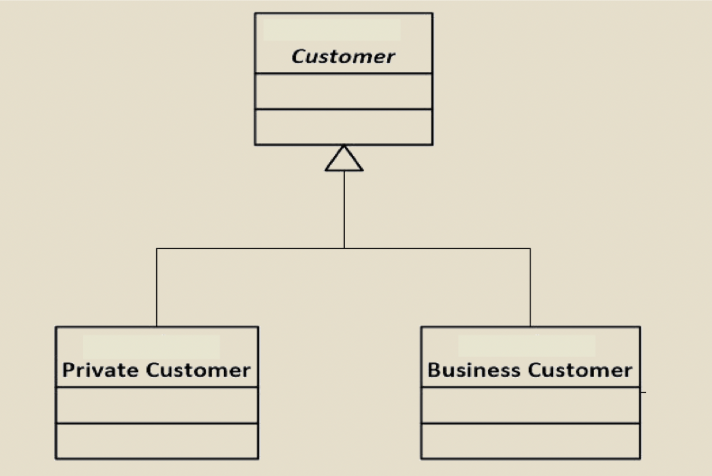

# Class diagrams (part 1)

## Domain modeling

- Purpose: to help team members develop a common understanding of the domain and requirements
- Involves
	- Collecting information about the application and/or application domain
	- Identifying application domain concepts
	- Classifying the domain concepts into modeling concepts
	- Visualizing the classification results in a UML class diagram

### The object model

- Structural view of the system being modeled (as-is or to-be)
- Conceptual perspective: diagram represents the concepts in the domain under study
	- **No** direct mapping to implementation classes
	- Model should be created with little to no regard for the software that might implement it
	- Only those objects shared by the software and its environment or owned by the environment are relevant
- Represented by UML class diagram(s)
	- "Objects" are **not** software objects
	- They are *actual* objects in the **problem world**
- Multiple uses
	- Precise definition of system concepts involved in other views, their structure and descriptive properties
	- Common vocabulary
	- Basis for generating a glossary of terms

### Entity

- Autonomous, passive object
- Instances **cannot** control of other objects
- Represented as a UML class

### Agent

- Active, autonomous object
- Instances have individual behavior that control state variables
- Represented as a UML class

### Event

- Instantaneous objects
- Instances exist in a single system state
- Represented as a UML class

### Association

- Object dependent on objects it links
- Instances are conceptual links among object instances
- Represented as a UML association

## Class diagrams

### Definitions and components

> A class diagram describes the types of objects in the system and the various kinds of *static relationships*
> A class represents a group of things that have common state or behavior

- Classes: consist of attributes and/or operations
- Relationships: explicit connection between classes
	- Type of relationship
	- Multiplicity
	- Navigability

### Representation and notation

- `ClassName`: usually a noun describing a system entity, agent or event
- Attributes
	- Data to be recorded in the class instance
	- Instances are described by the values of their attributes
- Operations
	- What the class can do or what services it provides
	- These are **not** methods as those are actual implementation of the service or behavior

### Relationships between classes

#### Association

- Indicates a meaningful or interesting connection between two classes
- Multiplicity indicates how many objects may participate in the given relationship
	- Ignore multiplicity closest to a class to easily understand this relation
	- If not specifies, implies a one-to-one relationship
- Common multiplicites
	- `0 .. 1` -> zero or one
	- `1 .. *` -> one or more
	- `*` -> zero or more
	- `1 .. x` -> between one and $x$
	- `x` -> exactly $x$
	- `x, y, z` -> exactly $x$, or $y$, or $z$

#### Aggregation

- A special case of association that indicates a "has-a" is "is a part of" relationship
- Can extend to multiple levels, but introduce a string a dependencies

#### Composition

- A variant of aggregation which adds the property of **existence dependency**
- The parts "live" inside the whole; they will be destroyed together with its whole

#### Generalization

- Relationship between classes where one class is the parent class of another (derived/child) subclass
- In OOP, this is know as inheritance
- The subclass/child inherits the attributes and operations of the super/parent class
- The subclass can add attributes or operations beyond those of the superclass

