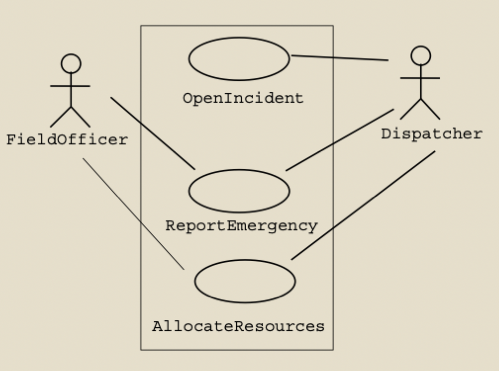

# Usage models (part 2)

## From scenarios to use cases

- Typically scenarios model *instances* of the interactions between the users/actors and the system use cases
- Use cases can be identified by analyzing scenarios for the different functions provided by the system
	1) Identify a single scenario/instance
	2) Develop use cases that specify all possible instances/paths/scenarios

### Warehouse fire scenario

> Field officer Bob, driving down main street in his patrol car, notices smoke coming out of a warehouse.
> His partner, Alice, reports the emergency from their car. She enters the address of the building, a brief description of its location, and an emergency level of 4. In addition to a fire unit, she requests several paramedic units on the scene given that the area appears to be relatively busy. She confirms her input and waits for an acknowledgement.
> John, the dispatcher, is alerted to the emergency by a beep of his workstation. He opens an incident, reviews the information submitted by Alice and acknowledges the report
> John allocates a fire unit and two paramedic units to the incident site and sends their estimated arrival time (ETA) of 5:34pm to Alice
> Alice receives the acknowledgement and the ETA

### Review of scenario

- Concrete scenario
	- Describes a single instance of reporting a fire incident
	- Does not describe all possible situations in which a fire can be reported
- Participating actors
	- Bob
	- Alice
	- John
- Simplify the scenario to what is relevant to the system
	- Alice reports an emergency by entering
		- An address of a building
		- A brief description of its location
		- An emergency
		- Requested resources (fire, paramedics, etc.)
	- John in **alerted to the emergency by a beep** of his workstation
		- Opens the reported incident
		- Reviews submitted information and acknowledges the report
	- John allocates appropriate resources and sends the ETA to Alice
	- Alice receives the acknowledgement and ETA

### Derive use cases

- Identify use cases that specify *all* possible instances (keep in mind the system boundary)
	- "Report emergency"
	- "Open incident"
	- "Allocate resources"
- Describe these use cases in more detail
- Identify the actors by **generalizing** the concrete names
	- Field officer -> Bob and Alice in the scenario
	- Dispatcher -> John in the scenario

### Use case diagram for incident management

## Use case descriptions

### What is a use case description?

- A textual description of a set of actions defining interactions between an actor and the system to achieve a goal
- Includes
	- Basic functionality and goal
	- Any preconditions
	- Flow of events
	- Any postconditions
	- Any error conditions and/or alternative flows

### Purpose of use cases

- To decide and describe the functional requirements of the system
- To clearly and consistently communicate the requirements to a wide variety of stakeholders
- To serve as a basis for further design modeling development or traceability between requirements and actual classes and operations in the system
- To provide a basis for performing system test later on

### Audience of use cases

- Customer (and/or end user)
- Developers
- Testers
- Anyone involved in activities connected to the functionality
	- Marketing
	- Sales
	- Support
	- Documenters

