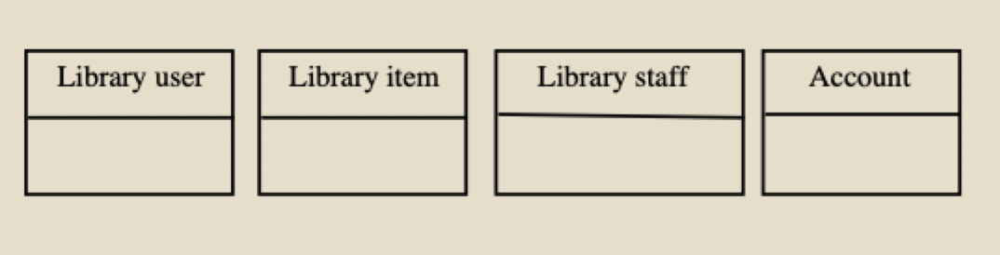
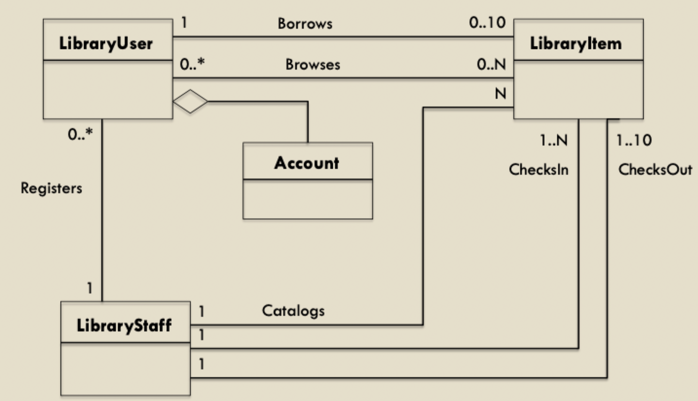
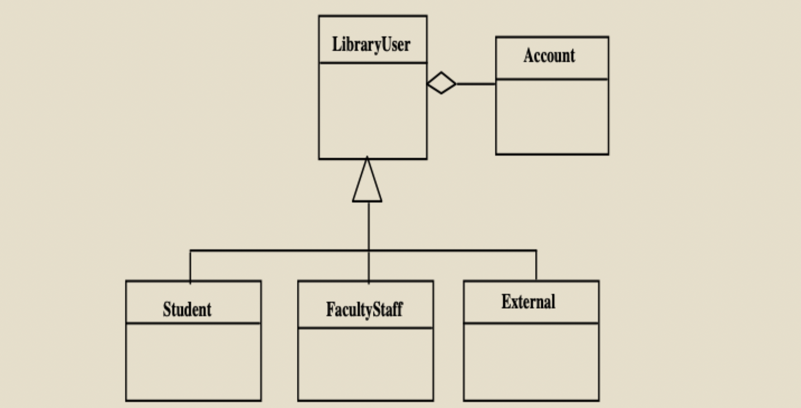
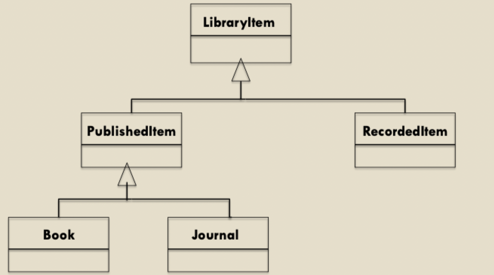
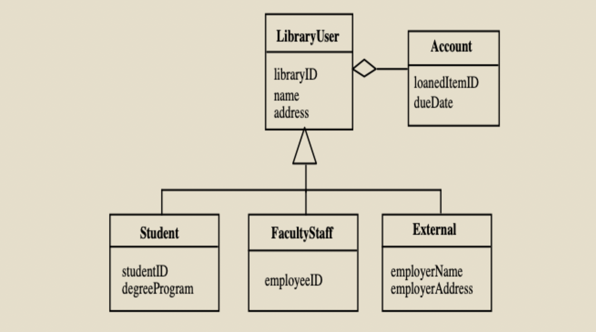
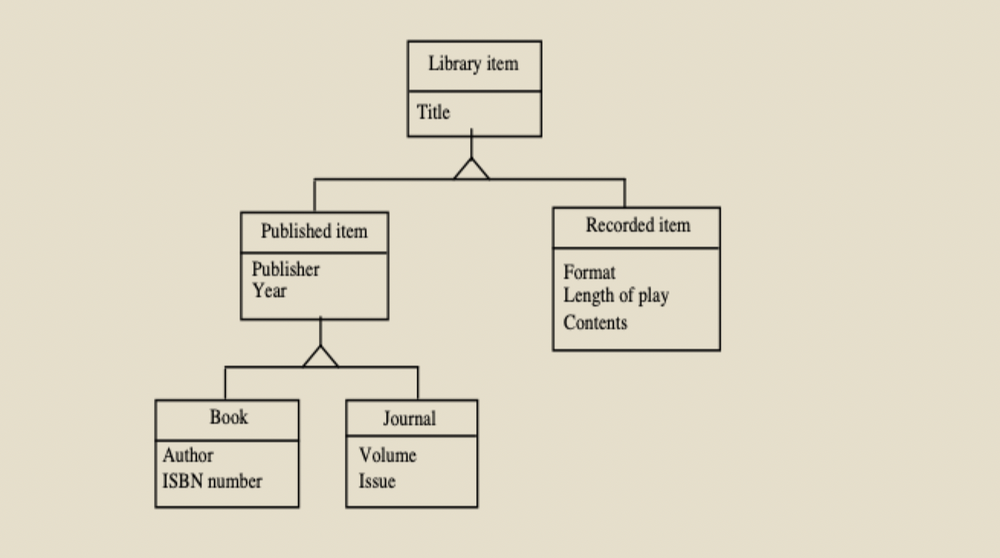
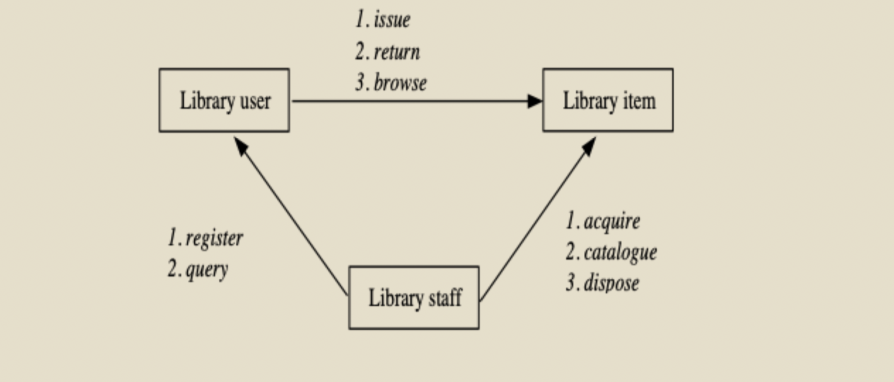
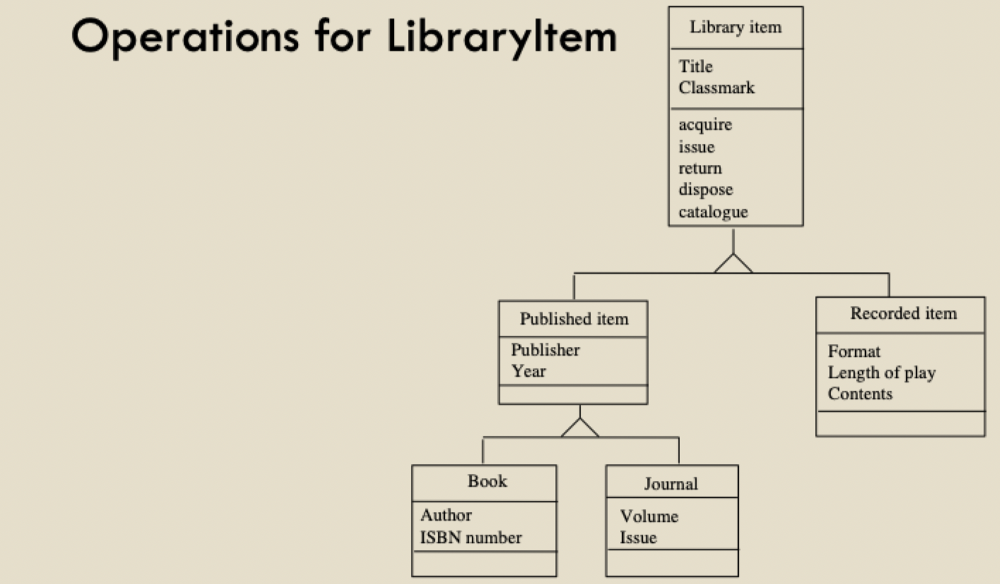

# Class diagram (part 2)

## Developing a class diagram: step-by-step

1) Identify core classes
2) Define associations between classes (including class generalization structures)
3) Define the attributes associated with each class
4) Define the messages that may be passed between classes to determine the relevant operations for each class
5) Refine the class model

## Developing a class diagram: example library system

### Specification

- A library system is intended to provide its users with the ability to automate the process of cataloguing, browsing, and borrowing library items
- Library items comprise of published and recorded materials
- The system will be administered by a member of the library staff, who will maintain a record of library items and users
- Library users must register with the system administrator before they can borrow library items
- No more than 10 items may be borrowed at the same time
- Library items are to be checked in and out by library staff
- Library users are drawn for 3 primary groups
	- Students
	- Faculty or staff
	- External users
- All library users have, as part of their registration
	- A library ID
	- Name
	- Address
	- An account
- In addition, the following information is required for registration
	- Students: degree program and student ID
	- Faculty and staff: employee ID
	- External users: employer details

### Step 1: identify core classes

- Find the nouns in the description to identify core classes
	- Library items
	- Library staff
	- Library users
	- Account

### Step 2: associations between classes

- A library user **borrows** library items (<= 10)
- System administrator **registers** the library user
- System administrator **catalogues** all library items
- The library assistant **checks in/out** library items to a library user

- Library user **are** student, faculty/staff, and external users

- A library item **is** recorded or published

### Step 3: identifying the attributes

- Attributes can be revealed by the analysis of the system requirements

- They may also be revealed by knowledge of the problem domain

### Step 4: operations and methods

- Describe the operations to be performed on the objects
- Certain operations are implicit from the object structure and need not be shown
- One way of identifying operations is by modeling the messages that may be passed between the objects

- Not all messages will become operations
- Operations belong to the class **at the end** of the arrow
- These are **NOT** methods
	- Do **NOT** specify type information
	- A high level view is sufficient

