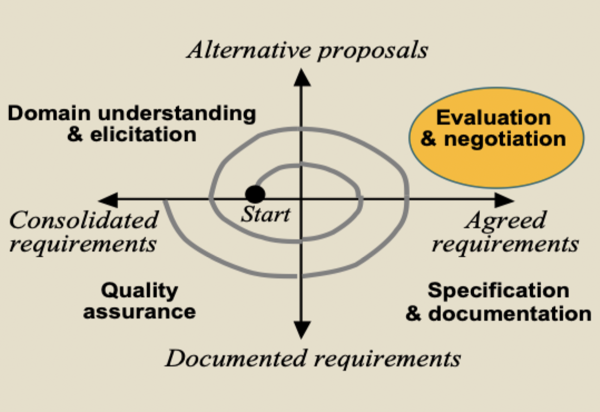

# Requirements negotiation

## Conflict arising

- Two stakeholders state requirements that contradict
- Two stakeholders have conflicting priorities for requirements
- One stakeholder considers a requirement correct, while another does not

### Conflict in RE process

### Hard negotiation

- Participants are adversaries
- The goal is victory
- Demand concessions as a condition of the relationship
- Be hard on the problem and the people
- Distrust of others
- Dig into your position
- Make threats
- Mislead as to your bottom line
- Demand one-sided gains as the price of agreement
- Insist on your position
- Search for the single answer: the one you will accept
- Try to win a contest of will
- Apply pressure

### Soft negotiation

- Participants are friends
- The goal is agreement
- Make concessions to cultivate a relationship
- Be soft on the people and the problem
- Trust others
- Change you position easily
- Make offers
- Disclose your bottom line
- Accept one-sided losses to reach agreement
- Insist on agreement
- Search for the single answer: the one they will accept
- Try to avoid a contest of will
- Yield to pressure

## Principled negotiating

- Negotiating issues based on their merits
	- **Merits**: the inherent rights and wrongs of a matter
	- Negotiate hard about the problem
	- But soft about the people
- Major points
	- **People**: separate the people from the problem
	- **Interests**: focus on interests, not positions
	- **Options**: generate a variety of possibilities before deciding what to do
	- **Criteria**: insist that the result be based on some objective criteria

### People

- Negotiators are people
- Separate substantive issues from psychological issues, and deal with each
- Put yourself in their shoes. How do they see ...
	- Their interests?
	- The problem?
	- Your interests?
- Remove emotions from the problem

### Interests

- Position: something *you* have decided on
- Interest: what *caused* you to decide
- Identify interests by asking why and why not questions
- Behind opposing positions lie shared and comparable interests, as well as conflicting ones

### Options

- Consider lots of options (ideas) to enable a really good solution everyone can agree on
- Look at the big picture: what is the problem or problems?
- Establish a context in which possibilities can be looked at without becoming positions
- Separate inventing possibilities from deciding
- DON'T
	- Think in terms of a"fixed pie"
	- Think that solving their problem is their problem
- DO
	- Broaden the options
	- Look for mutual gain
	- Identify shared interests

### Criteria

- Frame each issue as a joint search for objective criteria
- Separate the issues from the people
- Puts the focus on fairness
- More likely to produce a result that is acceptable in the long run
- Leads to better relationships for the future

## Keywords and phrases

- Simply stating facts -> puts participants on the defensive
- Wrong facts -> embarrassment
- Personal attacks -> does not separate people from problem
- Strict stances -> puts participants on the defensive
- Threats -> does not separate people from problem
- Imply reasons are nefarious -> does not separate people from problem
- Interrupting -> bad communication
- Demanding -> appears as mirrored justification for an arbitrary position
- Holding positions -> puts participants on the defensive