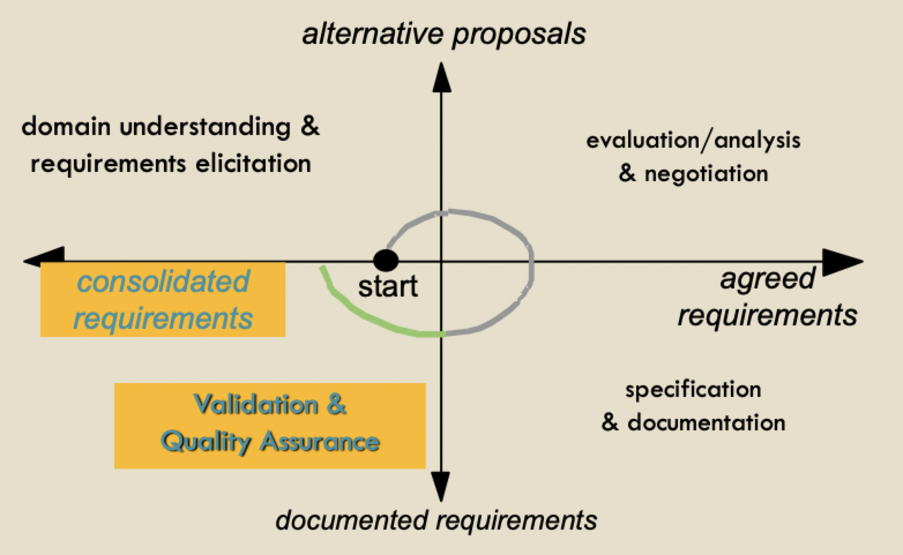

# Requirements validation

## Quality assurance during requirements engineering

### QA in RE process

### Validation vs verification

- **Validation**: "Are we building the right product?"
	- Check specification reflect requirements of stakeholders
- **Verification**: "Are we building the product right?"
	- Running system adheres to the specification

### Requirements analysis vs quality assurance

- Analysis works with raw requirements as elicited from the system stakeholders
- Validation works with a final (or near final) draft of the requirements document
- Validation complements the requirements evaluation/analysis and negotiation phase
	- Later, more accurate analysis
	- Among selected options
	- On more detailed models and specification

### Goals of validation

1) Detect errors/flaws in the requirements document
	- Omission
	- Incorrect information
	- Contradiction
	- Inadequacy
	- Ambiguity
	- Unmeasurability
	- Moise
	- Overspecification
	- Unfeasibility
	- Poor modifiability
	- Violation on standards
2) Check the adequacy of the requirements and assumptions
	- Certify that the requirements documents is an **acceptable** description of the system-to-be, prior to further development
	- Good enough to move forward at an *acceptable* level of risk

### Tasks of validation

1) Find as many of theses errors as possible in the RD by checking
	- Adequacy of RD items with respect to real needs
	- Completeness, consistency of RD models
	- Other target qualities
2) Report defects, analyze causes, and fix

## Requirements validation techniques

### Requirements reviews and inspections

- A group of selected personnel
	- Read and analyze the requirements
	- Look for problems
	- Meet and discuss the problems
	- Agree on actions to address these problems
- Can have various levels of structure
	- External reviewers
	- Well-prepared meetings
	- Inspection reports
	- Defect checklists
- Guidelines for inspections
	- Reports should be constructive and objective
	- Inspectors should by independent from author
	- Don't do it too soon / too late
	- Do short, repeated meetings since it is impractical to check entire document
	- Focus on parts with defects and critical parts of the system
- Strengths
	- Even more effective than code inspections
	- Wide applicability
- Limitations
	- Burden & costs of inspection process
	- No guarantees of not missing important defects

### Prototyping

- Take current understanding and make something to present to stakeholder for validation
- Stakeholder give feedback

### Model validation

- Validation of system models (goal, usage, domain)
- Objectives
	- Demonstrate consistency within itself
	- Demonstrate consistency with other models
	- Demonstrate consistency with the real requirements of stakeholders
- One technique: paraphrasing models in to natural language

### Testing

- Each requirements should be testable
- Requirements testing = inventing tests for requirements
- If difficult, reveals missing or ambiguous information
- Each functional requirement should have an associated test
- Some requirements are very hard to test
	- System requirements: those that apply to the system as a whole
	- Exclusive requirements: those that exclude specific behavior
	- Some non-functional requirements: may require a large test set (reliability)

### Formal checking

- Language checks
	- Correct syntax
	- Typing
	- Static semantics
	- Consistency and completeness
- Automated test derivation
- Property verification