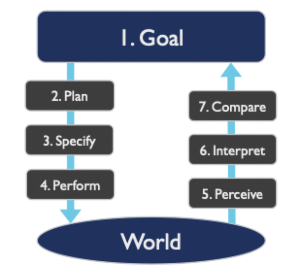
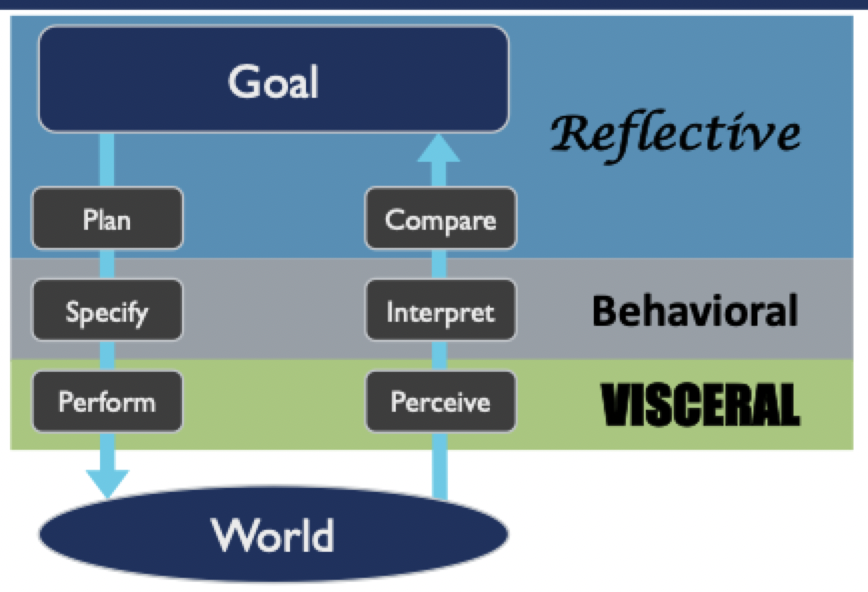

# Cognition, behavior, and mental models

## Metaphors and models

- Help us understand complex systems
- Provide predictions of behavior and outcomes
- Provide language and concepts
- All metaphors and models are simplification of theories

### Metaphors for humans

- Humans are usually thought of as the user
- Do not help determine what is going on in someone's head

### Humans as informational processors

- Humans have 3 systems to process information
	- Perceptual (vision)
	- Motor (muscle)
	- Cognitive (thought)
- Each has its own memories and processors
- Each has its own principles of operation

### Memory

- Declarative: remembering *what*
- Procedural: remembering *how*
- Gaining a memory is like encoding
- Using a memory is like repetition
- Limitations
	- We remember things differently based on how they are presented
	- *On average*, we tend to be able to remember about 7 items in short-term memory
	- We don't remember things very long without practicing them
	- Grouping and hierarchies can help with memorizing items
- Usability example: password requirements
	- A password for an account might have certain restrictions or requirements
	- A strong password is difficult to remember
		- Might need to be written down
		- Is it still secure?
	- A weak password is easy to remember
		- Can easily be cracked
- Memory for each system
	- Perceptual: visual and audio memory
	- Motor: muscle memory
	- Cognitive: short and long term storage

## Stages of action model

- A theory to explain how people *act* in the world (rather than how they think)
- Every action is a transition between the current state of the world and a future intended state of the world

### Gulf of execution and evaluation

- **Gulf of execution**: how do I make the world be as I want it to be? (requires a good mental model)
- **Gulf of evaluation**: is the world the way I want it to be? (requires good feedback)

### 7 stages of action

### System of cognition

- Acquiring knowledge and understanding through thought, experience, and the senses
- Thinking, but not just in the head
- Subconscious
	- Fast
	- Automatic
	- Multiple resources
	- Controls skilled behavior
- Conscious
	- Slow
	- Controlled
	- Limited resources
	- Invoked for novel situations (learning, danger, error)

### Levels of processing

- **Visceral**: fast, subconscious, often tied to the motor system
- **Behavioral**: trained actions that are largely subconscious
- **Reflective**: conscious cognition that tends to be slow

### Levels of processing + stages of action

### Norman's 7 principles + stages of action

- Gulf of execution
	- Discoverability
	- Conceptual model
	- Affordances
	- Signifiers
	- Mappings
	- Constraints
- Gulf of evaluation
	- Conceptual model
	- Feedback

> Norman's principles are meant to bridge the gap between the gulfs

#### Discoverability

- Users should always be able to determine what actions are possible in the current state of the system
- Relates to visibility
- Does what the user see suggest what the use can do?

#### Feedback

- Users should be able to easily determine whether/how the system has responded to their actions
- System should show some reaction or confirmation, do not leave user actions unrecognized

#### Conceptual models

- Good designs communicate a clear and practical understanding of how the system works
- This can come in the form of feedback (pressing a key causes that letter to be inserted in a text editor)

#### Affordances and signifiers

- Affordances (in the context of design) are "not property of objects", they are relationships
- Signifiers help us know what the affordances are (signifiers reveal affordances)
- Designs *suggest* what they do or how they work or their purpose

#### Mappings

- The relationship between controls and their actions or outcomes should be aligned
- Every game uses WASD for movement by default, most new players will try these keys and will *expect* movement to occur

#### Constraints

- Ways that action is guided or restricted that may ease interpretation
- Constraints can be
	- Physical
	- Cultural
	- Semantic
	- Logical