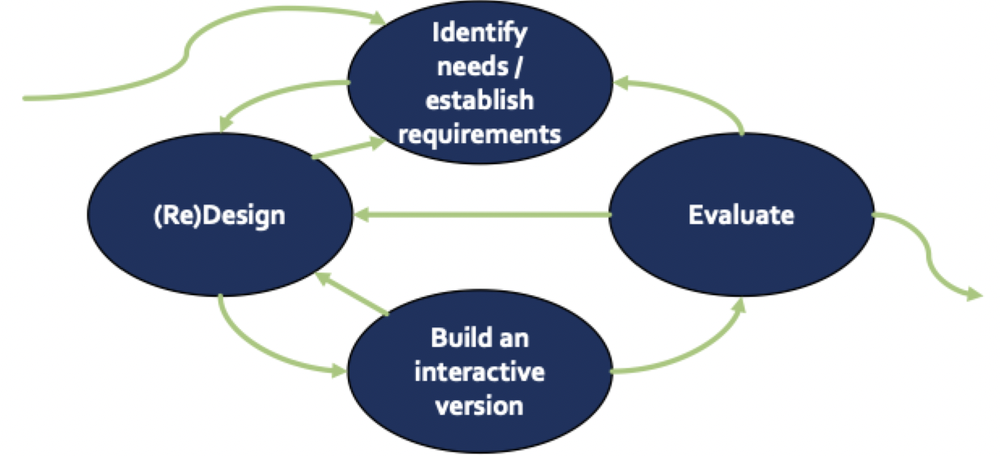

# Human centered design

## HCD

- Approach to design usable systems via direct user engagement
- Applied broadly in information and computer sciences
- Principles
	- *Holistic*: grounded in needs and context of, and address, the whole user experience
	- *Participatory*: users are engaged throughout
	- *Formative*: no "jumping to solutions" (premature or assumed and often prescriptive rather than grounded solutions)
	- *Iterative*: driven and refined in multiple stages
	- *Multidisciplinary*: design team included multiple perspectives

### Practical characteristics

- Early focus on users (cognitive, behavioral, attitudinal, characteristics) and tasks
- Actual measurement: observe, record, analyze users' reactions and performance
- Iterative design: find problems, fix them, test again
- User's involvement in process

### Why it matters

- Highly usable systems tend to be more successful both technically and commercially
	- HCD can improve user experience and system adoption
	- HCD may reduce software development cost in the long run
- Massive returns on investment
	- Reduces development inefficiencies (mistakes and rework)
	- Increases adoption
	- Comes in terms of reducing costs in other phases

## HCD design process

- Human centered design has the same process
	- Establish requirements
	- Develop designs
	- Implement the system
	- Evaluate and verify
- But structure is different
	- Not a straight line - iteration is inevitable
	- All aspects remain flexible

### Multiple perspectives

- Empathy: try to see problems and solutions from other people's perspectives
- Always incomplete: can never consider every perspective or fully understand how others see the world
- Designing *with* is better than designing *for*

### Design responsibly

> Design require deliberate practice. You must design *a lot* with *many* stakeholders, *in many* contexts, and get *a lot* of feedback throughout