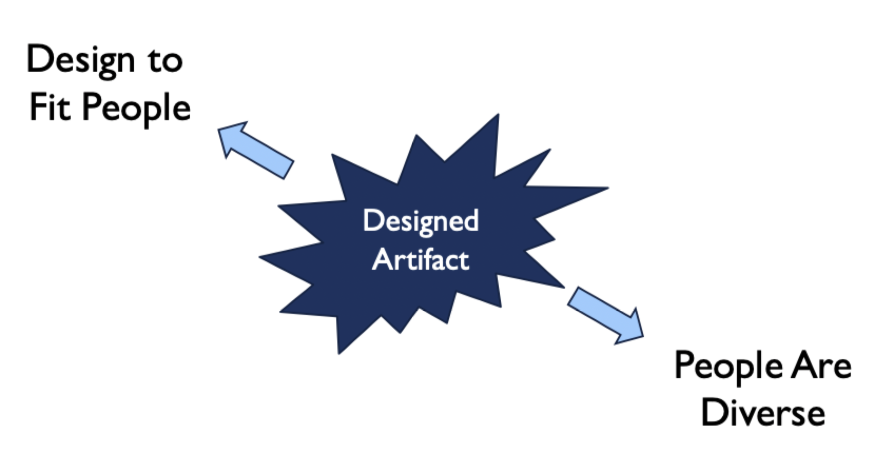

# Inclusive design

## Philosophy of design

- People
	- Human capabilities
	- Tasks and goals
	- Culture and society
- Technologies
	- Technical capabilities
	- Representation
	- Constraints and affordances

## Diversity

- Physiologies and physical form
- Cognitive, neurological, and perceptual
- Language
- Personality
- Cultural
	- Characters and numerals
	- Reading direction
	- Date and time formats
	- Numeric and currency formats
	- Weights and measures
	- Telephone numbers and addresses
	- Names and titles
	- Social security, national identifiers, and passport numbers
	- Icons, buttons, colors
	- Pluralization, grammar, spelling and punctuation
	- Etiquette, policies, tone, formality, and metaphors
- Legal
- Age
- Organization / work
- Infrastructure
- Socio-economic

## Accessibility and ability

- Disability *can be defined* as mismatched human interactions with surrounding phenomena
- If disability is centered on interaction that designers have the power to influence it
- Design can account for, decrease, or increase mismatch and/or accessibility
- The risk of creating additional mismatch can be mitigated by practicing human-centered design

### Disability stats

- 1 in 4 US adults have some type of disability
	- 2 in 5 adults age 65 or older
	- 1 in 4 women have a disability
	- 2 in 5 Non-Hispanic, American Indians/Alaskan Natives have a disability
- Percentage of adults with functional disabilities
	- 13.7% mobility
	- 10.8% cognition
	- 6.8% independent living
	- 5.9% hearing
	- 4.6% vision
	- 3.7% self care

### Disability types

- Permanent: no way to recover or adequately compensate
- Temporary: will eventually resolve through natural healing processes
- Situational: circumstantially affects way of living, can resolve with time or extra assistance

## Inclusive design principles

- Recognize exclusion: designing for inclusivity not only opens up our products and services to more people
- Solve for one, extend to many: everyone has abilities and limits to those abilities
- Learn from diversity: human beings are the real experts in adapting to diversity

### Why it matters

- Better products: easier to use, more efficient, more pleasant
- Increases market share: more customers for your products and services
- Decreases inequality and/or inequity: provides greater access
- **It's the law**: required to be compliant

### Universal usability

- Design for everyone, regardless of age, disability
- Universal designs are often better for everyone
- Strive for the HCI/interface equivalent of the "curb cut"

