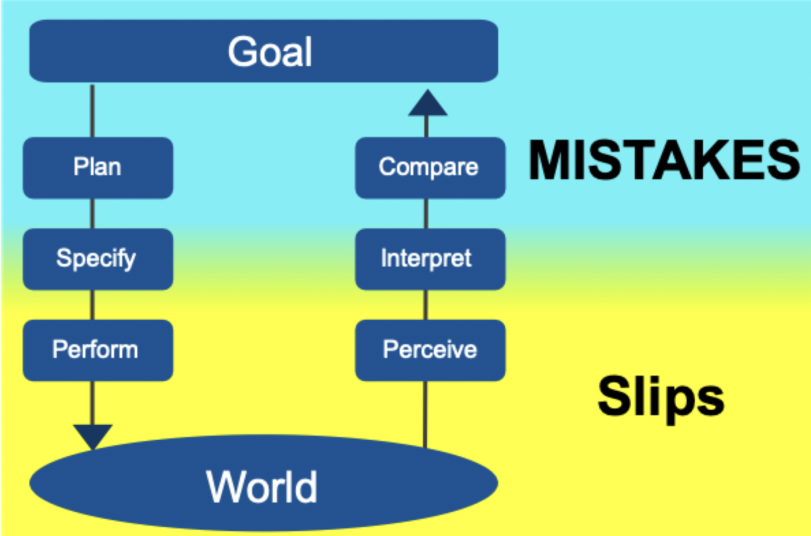

# Errors

## Types of errors

- We have a tendency to blame people: "human error"
- Once we blame a person, we tend to stop looking for other causes
- And we keep doing things the same way we did them before

### Slips vs mistakes

- Slip: the goal is correct, but the actions are not done properly
	- Errors of action
	- "I wanted to do X, but instead I did Y"
	- Action based or a memory lapse
- Mistake: the goal of plan is wrong
	- Errors of planning
	- "I wanted to do X, and I did X, but it turns out I should have done Y"
	- Rule or knowledge or memory based

### Causes of errors

- Slips
	- Capture slips
	- Description-similarity slips
	- Mode-error slips
	- Memory-lapse slips
- Mistakes
	- Rule-based mistakes
	- Knowledge-based mistakes
	- Memory-lapse mistakes

### Errors in the action cycle

> Memory lapses interrupt the flow between states and can happen anywhere in the process

### Swiss cheese model of accident

- Hazards slip through the holes in cheese blocks of error prevention
- Passing through all blocks of cheese leads to losses
- More layers of cheese
	- Add more safety system to decrease the likelihood that the hazard becomes a loss
	- May begin to have diminishing returns on resource/labor investment
- Smaller holes
	- Reduce likelihood that a hazard will get through a given layer
- Limitation
	- Only addresses error prevention/mitigation

## Error management

- Error mitigation
	- No such thing as perfect prevention - sometimes the holes line up in ways we cannot predict
	- Try to prevent/lessen impact of possible errors
- Error recovery
	- What happens after an error?
	- Goals
		- Stop error
		- Minimize harm/impact
		- Learn from mistakes

### Design to minimize/prevent/mitigate error

- Understand the causes of error and minimize them as much as possible
- Understand what is reasonable to expect of human capabilities
- Use the usability and design principles
- Build up layers of defense ("swiss cheese") across multiple layers of human and computer systems
- Build in sensibility checks

### Design for error

- Help people quickly recognize when errors have occurred
- Make it as easy to correct or undo errors as possible
- Don't treat the error as an error
- Many possible errors in a system - don't focus on just one or a few
- Recognize multiple causes
	- Ask whether technological/design solution is best
- Reducing one risk can sometimes make other errors more likely