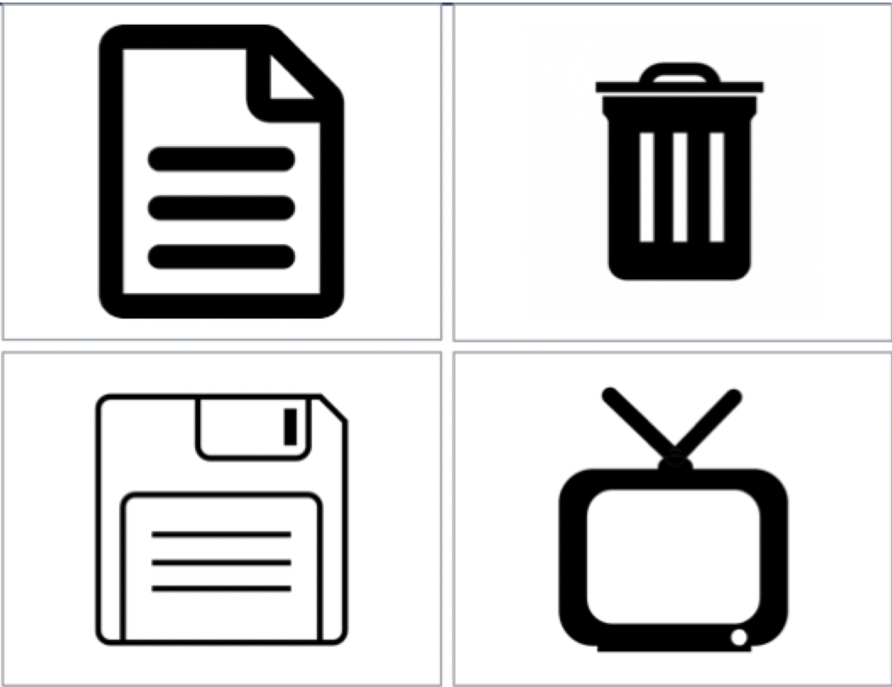

# Interaction styles

## Direct manipulation

> An interaction style in which the user feels like they are interacting directly with objects in the interface

- Icons instead of text labels
- Deleting a file
	- Grab the file icon
	- Drag it over the trash icon
	- Release the file icon and the file been discarded

## DM principles

### Continuous representation

- Continuous representation means always visible
- Can be visual, audible, or tangible

### Physical actions

- Physical actions are more intuitive
- Makes the computer "disappear": user *do* things rather than tell the computer what to do

### Rapid feedback, reversible actions

- Actions happen in real time
- We can see immediately if it is working
- Allows for mid-course corrections or stopping/undoing easily

## Differences between direct and indirect manipulation

- These are relative and not absolute categories
- Be able to explain why one interface is more or less direct than another
- Often when we say "intuitive" what we mean is "more direct"

## DM benefits

- Novices learn quickly, easy to retain concepts
- Users feel in control --  clear how to initiate action, can predict the interface's response
- Immediate feedback allows mid-course corrections
- Less anxiety for users -- actions can be reversed easily
- Error messages are rarely needed (in an ideal system, physical constraints would prevent that errors can be made)

## DM problems

- Harder to act on multiple objects (batch processing)
- Move navigation overhead
- More physical strain
- Feedback tends to be only positive
- Learnability depends on good design
- Direct manipulation is *slow*
- Can be repetitive tasks are tedious
	- Keyboard shortcuts
	- Macros
	- Automation aren't well supported
- Great for novices, less good for experts
- Accessibility may suffer
- Social acceptability may be low (as yet)

## Recognize the possibilities

- Level of direct manipulation is a design choice
- Don't get stuck in one mode of manipulation
- Increase directness can improve learnability of interface
- Think carefully about accessibility / universal usability of DM interfaces