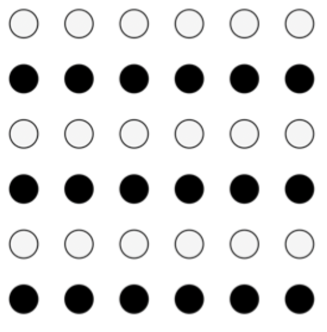
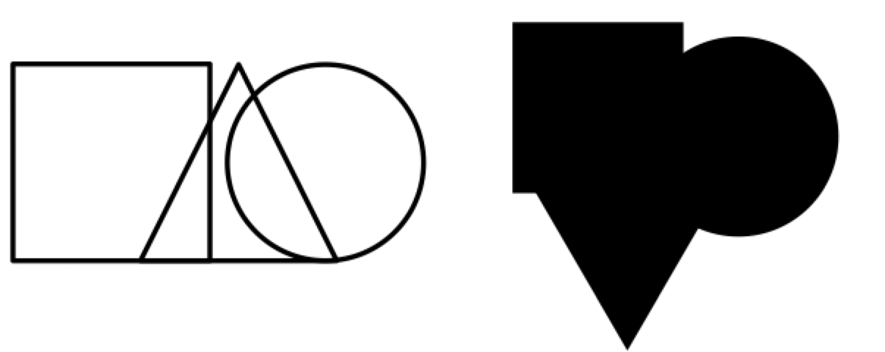

# Human perception

## Understanding perception

- Random and confusing stimuli
- We make sense of the world without even thinking about it
- Gestalt psychology: how do we interpret and make meaning from perceptual stimuli?

### Key concepts of Gestalt psychology

- **Emergence**: we see things in a whole, that are not represented by any individual parts
- **Reification**: the perceptual system tries to make sense of objects and fill in the gaps
- **Multi-stability**: ambiguous stimuli remains ambiguous, but tends towards one interpretation (foreground vs. background)
- **Invariance**: stimuli remain constant even when perspective changes

## Gestalt principles

### Proximity

> Things that are closer together are perceived as a group. Usually takes precedence over similarity

### Similarity

> Things that look alike (similar) tend to be grouped together. Usually considered after proximity

### Closure

> Objects are perceived as a whole even when not complete

### Continuity

> Lines that continue in the same direction are perceived as a whole

### Symmetry

> Symmetrical lines or objects tend to be perceived as a group. Often prioritized over proximity

### Common fate

> Things that move in the same direction are perceived as the same group

### Good form

> We tend to assume regular, simple, and orderly patterns

### Figure/ground

> We instinctively perceive objects within a foreground or background

## Why Gestalt matters

- These principles help us better understand how to use visual space to establish conceptual groupings
- These principles can also help avoid terrible errors