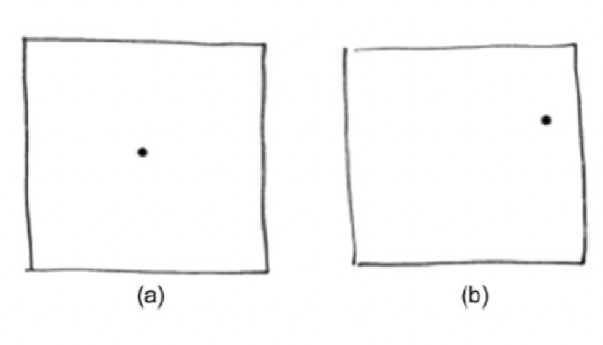
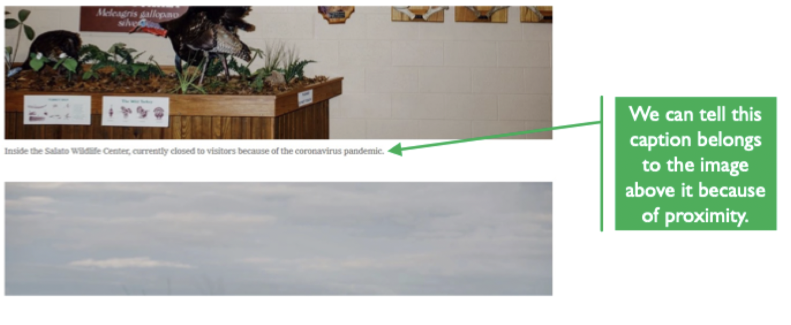
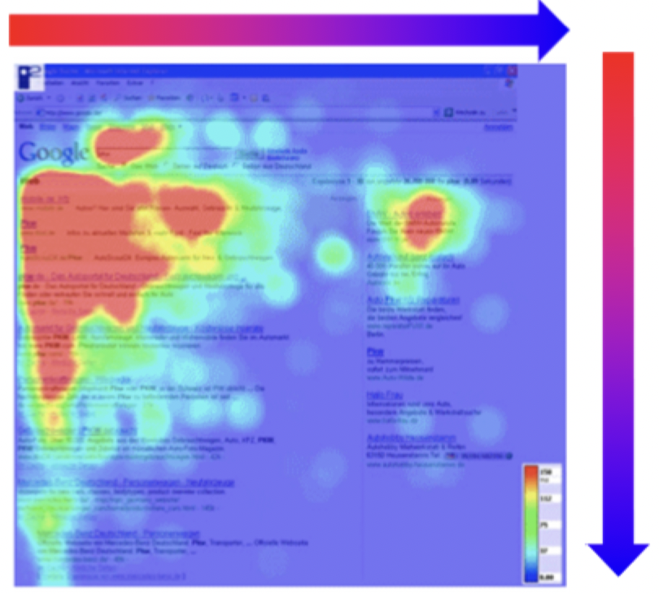
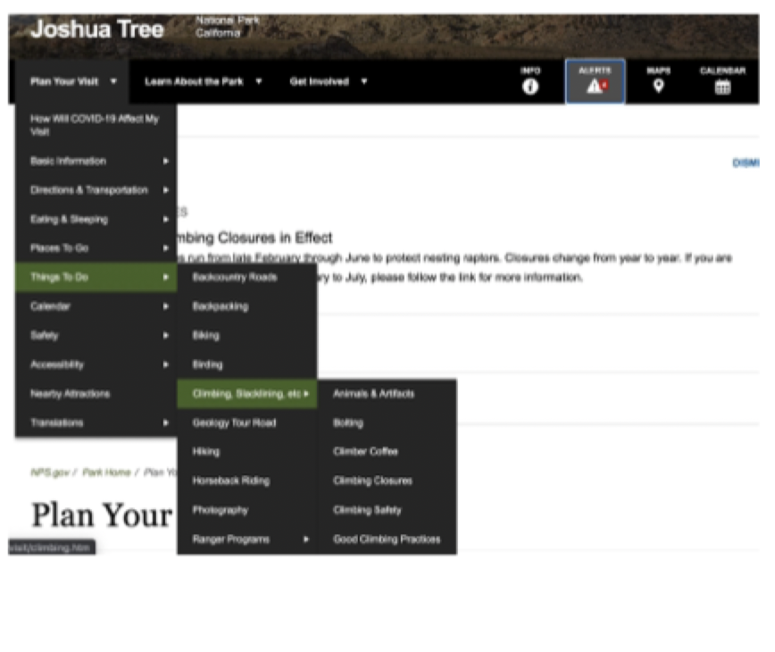
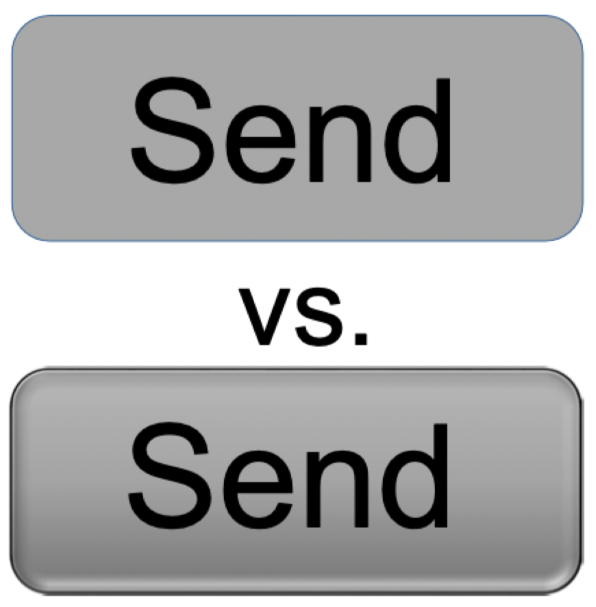

# Visual hierarchy

## Hierarchies

> In the context of design, hierarchies describes our "interpretation of **the relative importance of objects**"

### Visual hierarchies

- Using visual cues, we can communicate a hierarchical conceptual structure
- Visual hierarchy is a hierarchy visualization or information architecture visualization

### Gestalt principles

- Describes how we perceive groups of objects
- Can use visual indicators to show hierarchies to show
	- Which objects belong together
	- Which objects are more or less important

## Indicators

### Placement and proximity to frame

> Center screen elements are typically more important

### Placement and proximity of elements

> Objects remain close to their related elements

### Eye behavior

> More important elements are seen more than lesser important elements

### Nesting

> Placing certain elements contained within higher-level elements

### Overlap

> Item on top are more important

### Size

> Larger items are spotted first, then smaller elements are eventually exposed

### Color

> Lighter and saturated colors draw more attention

- Bet you saw the bottom-right square first

### Ornament

> Extra styles and ornament draw more attentions

### Finish

> An interactive element may have an effect to suggest interactivity

- The bottom button is raised, making it look like something that can be pressed