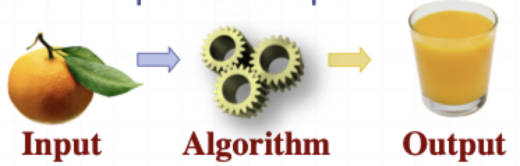
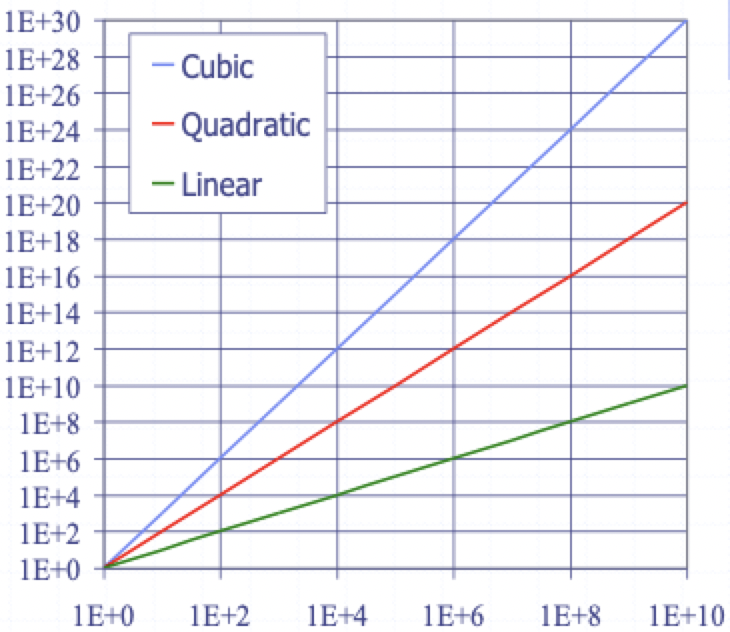

# Algorithm analysis

## Algorithms and data structures

- An **algorithm** is a step-by-step procedure for performing some task in a finite amount of time
- Typically, an algorithm takes input data and produces an output based upon it

- A **data structure** is a systematic way of organizing and accessing data

## Running times

- Most algorithms transform input objects into output objects
- The running times of an algorithm typically grows with input size
- Average case time is often difficult to determine
- We focus primarily on the **worst case running time**
    - Requires theoretical analysis
    - May not capture real-world performance

### Scalability

- Scientists often have to deal with differences in scale, from the microscopically small to the astronomically large
- Computer scientists must also deal with scale, but they deal with it primarily in terms of data volume rather than physical object size
- **Scalability** refers to the ability of a system to gracefully accommodate growing sizes of inputs an amounts of workload

### Experimental studies

1) Write a program implementing the algorithm (faithfully and correctly)
2) Run the program with inputs of varying size and composition, noting the time needed
3) Plot the results
4) Observe if a curve can match the trend (best fit) of the plotted times

### Seven important functions

- Seven functions that often appear in algorithm analysis
    1) Contant: $1$
    2) Logarithmic: $\log n$
    3) Linear: $n$
    4) N-Log N: $n\log n$
    5) Quadratic: $n^{2}$
    6) Cubic: $n^{3}$
    7) Exponential: $2^{n}$
- In a **log-log chart**, the slope of the line corresponds to the exponent in the growth rate
    - $f(n) = n^{c}$
    - $\log(f(n)) = \log(n^{c})$
    - $\log(f(n)) = c\log(n) \text{ looks like } y = cx$

### Why growth rate matters

| If runtime is... | Time for $n + 1$ | Time for $2n$ | Time for $4n$ |
|:----------------:|:-------------:|:-----------:|:-----------:|
| $c\log n$ | $c \log(n+1)$ | $c(\log (n+1))$ | $c(\log(n+2))$ |
| $cn$ | $c(n+1)$ | $2cn$ | $4cn$ |
| $cn\log n$ | $cn\log n + cn$ | $2cn\log n + 2cn$ | $4cn\log n + 4cn$ |
| $cn^{2}$ | $cn^{2} + 2cn$ | $4cn^{2}$ | $16cn^{2}$ |
| $cn^{3}$ | $cn^{3} + 3cn^{2}$ | $8cn^{3}$ | $64cn^{3}$ |
| $c2^{n}$ | $c2^{n+1}$ | $c2^{2n}$ | $c2^{4n}$ |

### Constant factors

- The growth rate is *minimally* affected by
    - Constant factors
    - Lower order terms
- Examples
    - $10^{2}n + 10^{5}$ is considered to have linear growth
    - $10^{5}n^{2} + 10^{8}n$ is considered a quadratic function

## Big-Oh notation

> Given a function $f(n)$ and $g(n)$, we say that $f(n)$ is $O(g(n))$ if the are positive constants $c$ and $n_{0}$ such that $f(n) \le cg(n)$ for $n \ge n_{0}$

### Big-Oh rules

- If $f(n)$ is a polynomial of degree $d$, then $f(n)$ is $O(n^{d})$
    1) Drop lower-order terms
    2) Drop constant terms
- Use the smallest possible class of functions
- Use the simplest expression of the class

### Relatives of Big-Oh

> $f(n)$ is $\Omega(g(n))$ if there is a constant $c > 0$ and an integer $n_{0} \ge 1$ such that $f(n) \ge cg(n)$ for $n \ge n_{0}$

> $f(n)$ is $\theta(g(n))$ if there are constant $c' > 0$ and $c'' > 0$ and an integer constant $n_{0} \ge 1$ such that $c'g(n) \le f(n) \le c''g(n)$ for $n \ge n_{0}$

### Intuition for asymptotic analysis

- If $f(n)$ is asymptotically **less than or equal to** $g(n)$, use big-O notation
- If $f(n)$ is asymptotically **greater than or equal to** $g(n)$, use big-$\Omega$ notation
- If $f(n)$ is asymptotically **equal to** $g(n)$, use big-$\theta$ notation

