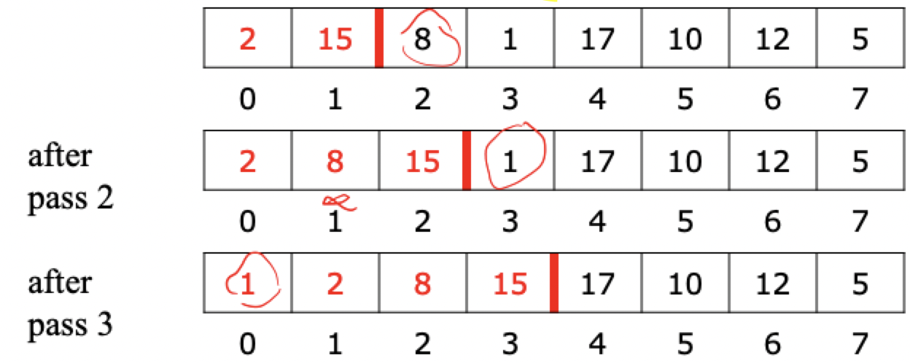
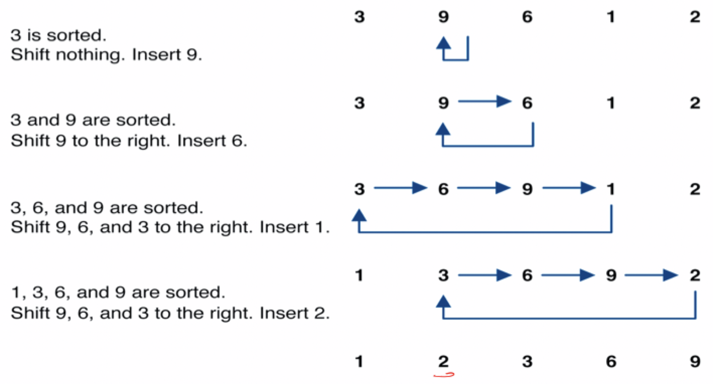
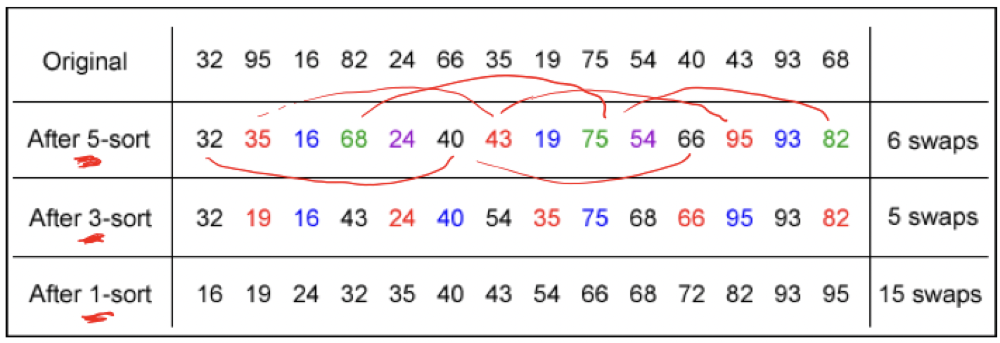
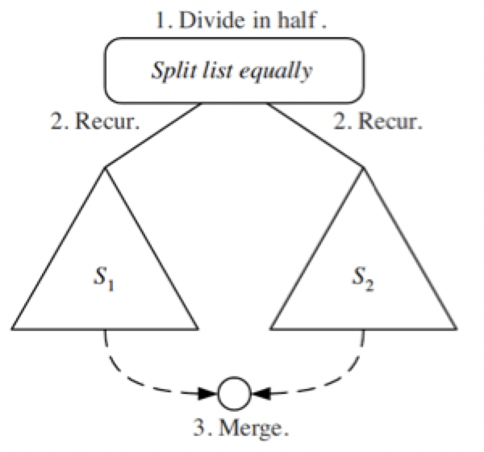
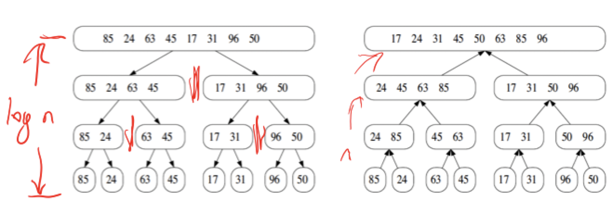
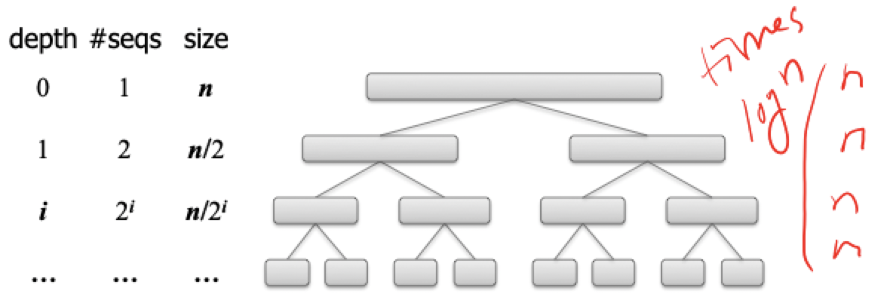

# Selected sorting algorithms

## Sorting

### Why sorting

- A very practical application
    - People by last name
    - Countries by population
    - Search engine results by relevance
- Fundamental to other algorithms
- Different algorithms have different asymptotic and constant-factor trade offs
    - No single "best" sorting algorithm for all scenarios
    - Knowing one way to sort just isn't enough
- Many to approaches to sorting which can be used for other problems

### The problem statement

> There are $n$ comparable elements in an array and we want to rearrange them to be in increasing order or non-decreasing order if duplicates exist

- Pre-algorithm state
    - An array `A` of data records
    - A value in each data record
    - A comparison function exists to compare data records
- Post-algorithm state
    - For each distinct position $i$ and $j$ of `A`, if `i < j` then `A[i] <= A[j]`
    - `A` has all the same data it started with

## Insertion sort

### Description

> Orders a list of values by repeatedly inserting a particular value into a sorted sublist of the list

1) Consider the first item to be sorted sublist of length 1
2) Insert the second item into the sorted sublist, shifting the first item if needed
3) Insert the third item into the sorted sublist, shifting the other items if needed
4) Repeat until all values have been inserted into their proper positions

### Walkthrough





### Implementation

```C
static void insertionSort(int[] a, int len) {
    for (int i = 0; i < len; i++) {
        int temp = a[i];

        // Slide elements down to make room for a[i]
        int j = i;
        while (j > 0 && a[j - 1] > temp) {
            a[j] = a[j - 1];
            j--;
        }
        a[j] = temp;
    }
}
```

### Analysis

- An **inversion** in a permutation is the number of pairs that are out of order, that is, the numbers $(i, j)$ such that $i<j$ but $x_{i} > x_{j}$
- Each step of insertion sort *fixes* an inversion or stops the while loop
- Thus, the running time of insertion sort is $O(n + k)$, where $k$ is the number of inversions

#### Worst case

- The worst case for the number of inversions is 

$$
    1 + 2 + 3 + \dots + n-1 = \sum \limits_{i=1}^{n-1} i = \frac{n(n-1)}{2}
$$

- Simplifying the expression, the running time is $O(n^{2})$
- This occurs for a list that is in reverse sorted order

#### Average case

- The average case for the number of inversions is

$$
    E(I) = 0 * \frac{1}{n} + 1 * \frac{1}{n} + 2 * \frac{1}{n} + \dots + (n - 1) * \frac{1}{n}
    = \frac{1}{n} \sum \limits_{n=1}^{n-1} i = \frac{1}{n} \left( \frac{n(n-1)}{2} \right)
$$

- If we remove the smallest element and reinsert it

$$
    A(n) = A(n - 1) + \frac{n - 1}{2}
     = \frac{1}{2} \sum \limits_{i=1}^{n-1} i 
     = \frac{1}{2} \left(\frac{n(n-1)}{2} \right) = \frac{n(n-1)}{4}
$$

- Simplifying the expression, the running time is still $O(n^{2})$

## Shell sort

### Description

> Orders a list of values by comparing elements that are separated a gap of more than 1 index

- A generalization of insertion sort
- Based on some observations about insertion sort
    - Insertion sort runs fast if the input is almost sorted
    - Insertion sort's weakness is that it *swaps each element one step at a time*, taking many swaps to get the element into its correct position

### Walkthrough

1) Sort all elements that are 5 indexes apart
2) Sort all elements that are 3 indexes apart
3) And so on...



### Implementation

```C
static void shellSort(int[] a, int sz) {
    for (int gap = sz / 2; gap > 0; gap /= 2) {
        for (int i = gap; i < sz; i++) {
            // Slide element i back by gap indexes
            int temp = a[i];
            int j = i
            while (j >= gap && temp < a[j - gap]) {
                a[j] = a[j - gap];
                j -= gap;
            }
            a[j] = temp;
        }
    }
}
```

### Analysis

- Harder to determine that insertion sort
- But certainly no worse than insertion sort
- Worst case is $O(n^{2})$, but the average case would require experiments to determine

## Merge sort

### Divide and conquer paradigm

- Divide-and-conquer is a general algorithm design paradigm
    1) Divide: divide the input data $S$ in two disjoint subsets $S_{1}$ and $S_{2}$
    2) Recur: solve the subproblems associated with $S_{1}$ and $S_{2}$
    3) Conquer: combine the solutions for $S_{1}$ and $S_{2}$ into a solution for $S$
- The **base case** for the recursion are subproblems of size $0$ or $1$



### Walkthrough

1) Divide the input sequence into two disjoint sequences, each containing about $n/2$ elements
2) Recursively sort the two subsequences
3) Merge the two subsequences into a unique sorted sequence



### Implementation

```
define mergeSort(S):
    if |S| > 1 then
        S1, S2 := partition(S, |S|/2)
        mergeSort(S1)
        mergeSort(S2)
        S := merge(S1, S2)

define merge(S1, S2, S):
    i := 1
    j := 1
    while i <= |S| and j <= |S| do
        if S1[i] <= S2[j] then
            S[i+j-1] := S1[i]
            i := i + 1
        else
            S[i+j-1] := S2[j]
            j := j + 1

    while i <= |S| do
        S[i+j-1] := S1[i]
        i := i + 1

    while j <= |S| do
        S[i+j-1] := S2[j]
        j := j + 1
```

### Analysis

- The height $h$ of the merge-sort tree is $O(\log n)$
    - Each recursive call divides the sequence in half
- The overall amount or work done at the nodes of depth $i$ is $O(n)$
    - We partition and merge $2^{i}$ sequences of size $n/2^{i}$
    - We make $2^{i+1}$ recursive calls
- Thus, the best/worst/average running time of merge-sort is $O(n \log n)$



## Hybrid sorting algorithms

- A **hybrid** sorting algorithm is a blending of two different sorting algorithms, typically a divide-and-conquer algorithm, like merge-sort, combined with an incremental algorithm, like insertion sort
- The algorithm is parametrized with hybridization value $H$ and an example the merge-sort and insertion sort would work as follows
    - Start out performing merge-sort, but switch to insertion sort when the problem size goes below $H$