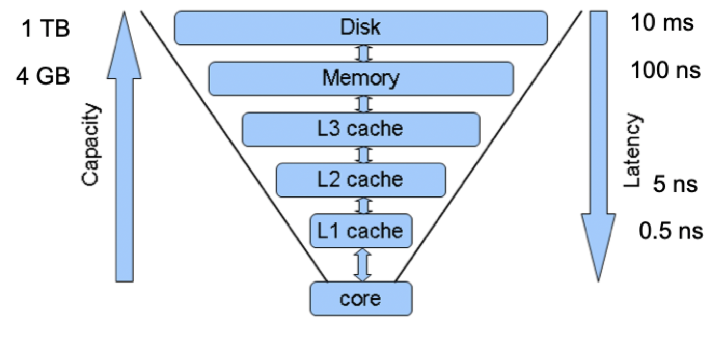

# Principles of experimental algorithms

## Experimental algorithmics

- **Experimental algorithmics** studies algorithms and data structures by joining experimental studies with the traditional theoretical analysis
    - Scientists do experiments because they have no choice
    - In experimental algorithmics, experiments are combined with theoretical analysis
- Experimentation can prove to be indispensable for the following tasks
    - The assessment of heuristics for hard problems
    - The characterization of asymptotic behavior of complex algorithms
    - The comparison of competing designs for tractable problems
    - The formulation of new combinatorial conjectures
    - The evaluation of optimization criteria
    - The transfer of results from paper to production code
- Questions worth asking
    - New problems
    - New algorithms
    - New types of input distributions
    - New types of computer hardware

## Testing the quality of solutions

> Find a parameter that can be *effectively* tested experimentally

- Waste in bin packing
- Closeness to a *known* lower bound

### Measuring actual performance

- Use random instances that are motivated by real-world data
- If available, use actual real-world data

### Experimental setup

1) Have clear objectives
2) Gather data to answer the questions posed
3) Choose hardware appropriately
4) Code solutions consistently to allow for good conclusions
5) Generate useful problem instances
6) Analyze your data

### Understand your hardware

> Memory hierarchy: trade-off size and speed

### Ensure reproducibility

- Unless it is truly confidential, post your code for others to use
- For random data, specify how you generate it
- For real-world data, point to where you got it

### Ensure comparability

- Perform all experiments on the same hardware
- Report the type of hardware used
- Code all algorithms with the same level of code optimizations and tuning

## Presenting results

- Typically presented as tables of plots
- Tables should only be used for *small data sets*
- Graphs should be used for most cases