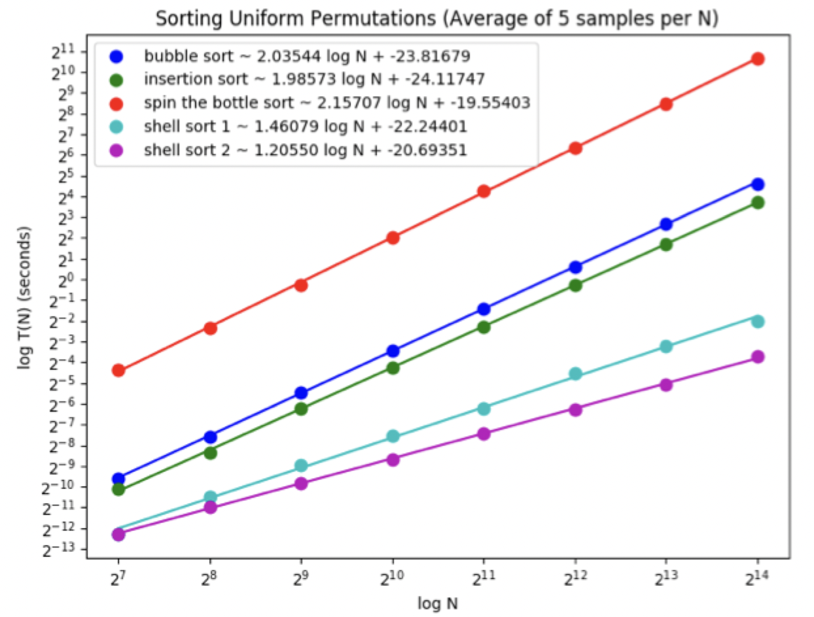
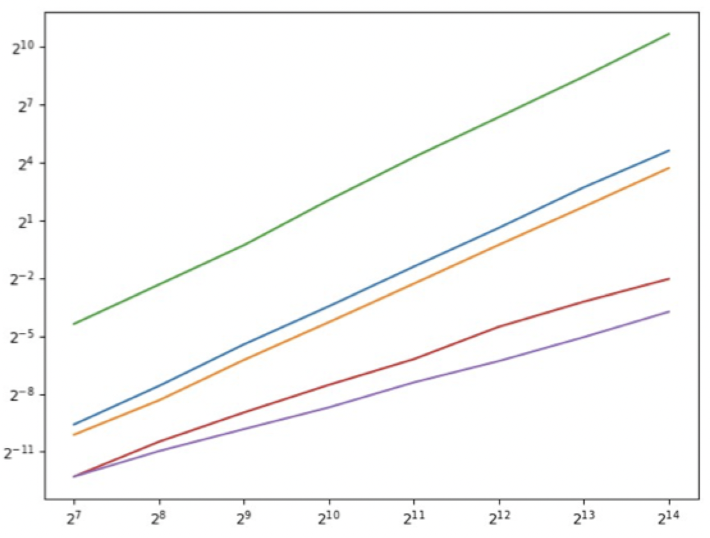
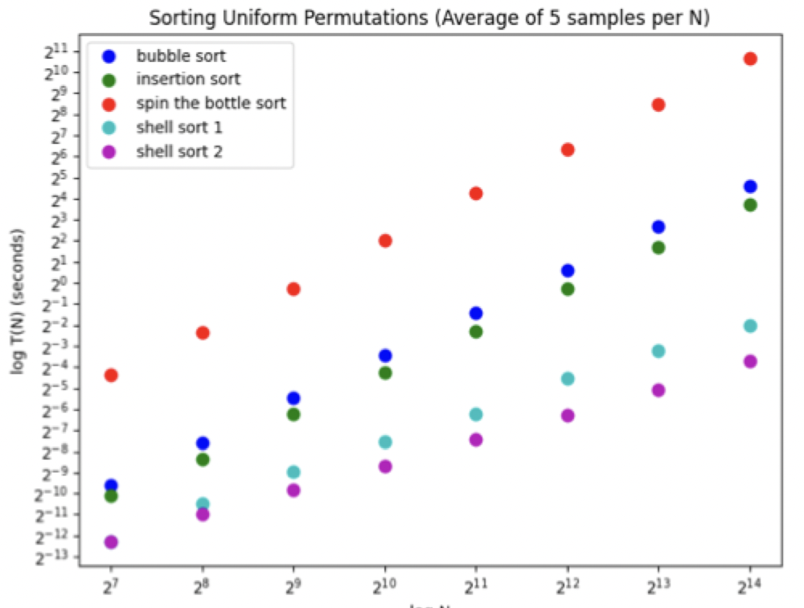
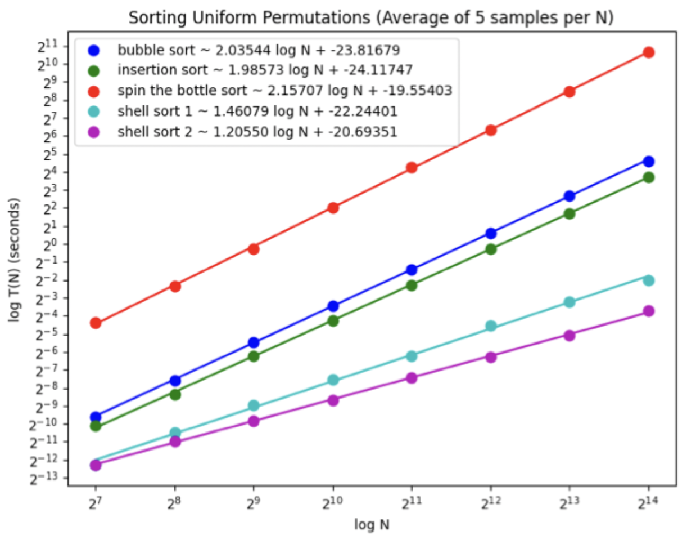

# Plotting timing data

## End goal



## The `matplotlib.pyplot` package

The basic workflow consists of the following steps

1) For one or more sets of $(x,\,y)$ coordinate pairs represented as a separate array of values, call a plotting function
2) Call a function to either display the resulting plot in a new window or save it as a file

### Plotting functions

The following function are provided by `pyplot` to create (but not display) a plot

- `plot`: do not apply log to either $x$ or $y$ values
- `loglog`: apply log to both $x$ and $y$ values
- `semilogx` and `semilogy`: apply log to only $x$ or $y$ values respectively

### Default behavior

```python
plt.loglog(x, y, basex=2, basey=2)
```



### Various tweaks later

- For each set of coordinates, call

```python
plt.loglog(
           x,
           y, 
           '.', 
           basex=2, 
           basey=2, 
           label=y_label, 
           markersize=markersize,
           color=color
           )
```

- Once for the whole plot call to set these properties

```python
plt.xlabel = ''
plt.ylabel = ''
plt.yticks = 1
plt.title = 'timings'
plt.legend = ...
```



### Adding regression lines

```python
m, b = np.polyfit(x, y, 1)
plt.loglog(
           x, 
           y, 
           '.', 
           basex=2, 
           basey=2, 
           label=f'{y_label} ~ {m} log N + {b}',
           markersize=markersize,
           color=color
           )
```

