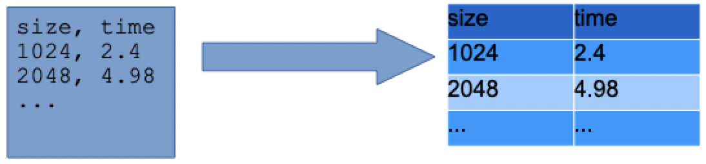

# Processing timing data

## Tools

- Pandas: loading CSV data into a data structure we can manipulate in python
- Numpy: a scientific computation package for regression line coefficient calculation and various vectorized computations

### Installation

Using the python package manager `pip`, get all the required packages as they are **not** part of the standard Python library

```sh
$ pip install numpy pandas
```

## Pandas

- A pandas data frame is analogous to a relational database table or excel spreadsheet, consisting of columns and rows
- Each row has a data entry for each of one or more columns
- Each column has a value for every row



### Loading dataframes

- To create a pandas dataframe from a CSV file, use `read_csv`

```python
import pandas as pd
df = pd.read_csv('timings.csv', sep=',')
```

### Working with dataframes

- Individual columns can be extracted by indexing `[]` with the desired column name

```python
# extract all size values in one variable
sizes = df['size']

# extract all times in one variable
times = df['time']
```

- To select only those rows satisfying a certain condition, use a boolean expression in the index operator

```python
merge_sort_rows = df[df['algorithm'] == 'merge_sort']
```

## Numpy

### Regression line fitting

- We can perform linear regression in order to approximate a line that closely fits the data
- To compute the necessary slope and intercept for plotting the line, we need two columns from a data frame as our $x$ and $y$ values

```python
import numpy as np
x = df['size']
y = df['time']
# The third argument is the degree of the polynomial
# We will use 1 for linear
m, b = np.polyfit(x, y, 1)
```